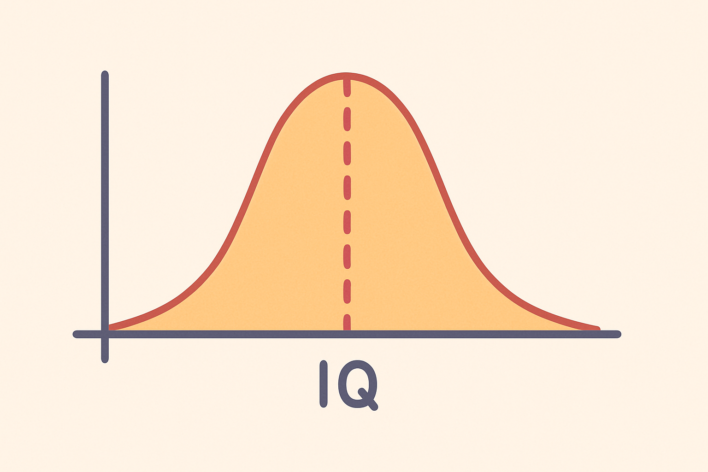
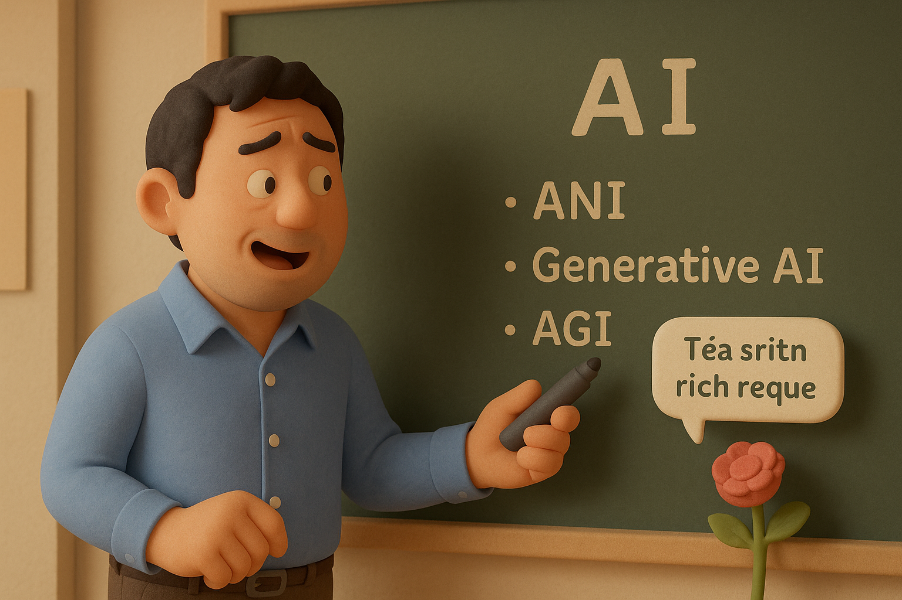
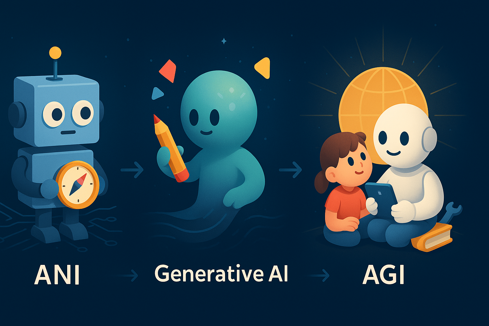

# 【AI】小白话系列——什么是人工智能（AI）（五）

什么是人工智能（AI）系列要告一段落了。

我们聊过了：

1. [什么是人工，什么是天工](20250520【AI】小白话系列——什么是人工智能（AI）（一）.md)；
2. [什么是榆木疙瘩，什么是智能](20250521【AI】小白话系列——什么是人工智能（AI）（二）.md)；
3. [什么是人工智能](20250522【AI】小白话系列——什么是人工智能（AI）（三）.md)；
4. [什么不是人工智能](20250523【AI】小白话系列——什么是人工智能（AI）（四）.md)

今天争取收个尾，稍微掰开来聊一下：

### 「**人工智能**」和「人工智能」有什么不一样？

我们应该都听说过「[智商](https://zh.wikipedia.org/wiki/%E6%99%BA%E5%95%86)」这个词吧？这就是近代科学家们想出来衡量人类智能水平的一种办法。

我们都知道，人和人的智商是不同的。大部分人，比如我都在下面中间这一块儿，超级聪明和超级笨的都是少数。

通常来说随着年龄的增长和持续地学习，人类的智商会逐步增加，然后稳定在一定水平。

所以，有时候，我们也常常听到这样的说法：

聪明的小狗，比如边牧，金毛等等，拥有相当于人类2、3岁小孩的智商。个别成年章鱼，智商相当于人类3、4岁的小孩，而它们的寿命也只有3、4岁而已。

人类的年龄，成了动物智商的「标尺」。

当然了，据我观察，小孩子2岁时已经可以流利地说普通话，4岁时就能开始画画了。但我还没见过哪只边牧流利地说过普通话，也听说过哪只章鱼会画画。

这说明，智能不仅仅有高低之分，在具体领域也会各有千秋。

生物的智能是有区别的，那么人工智能呢？

也是一样的。

[吴恩达教授](http://andrewng.org/)把人工智能分成以下三大类：

* ANI 特定领域人工智能
* Generative AI 生成式人工智能
* AGI 通用人工智能

ANI 就是那些能够解决某种具体问题的人工智能，比如自动驾驶汽车，可以和你简单对话的智能音箱，网络搜索，工厂、农场里的智能设备等等……

第一个战胜人类的围棋程序 Alpha Go，也属于这一类。

然后，随着技术发展，AI 的能力继续增强，领域继续扩张，出现了Generative AI 生成式 AI 。比如Chat GPT、DeepSeek、Mid Journey这些能和你真正对话、写文章、做各种题目，甚至画画、做视频的由「大语言模型」驱动的网站和程序。

至于 AGI 通用人工智能，科学家们还没有完全达成共识。一个大部分人都接受的观点是：

通用人工智能，将能够做大部分成年人类可以做的任何事情。典型的，比如：

* 花几个月时间，学会驾驶汽车，或者任何一种新的交通工具；

* 花上3、5年时间，获得博士学位。这意味着，把人类的知识边界向着未知的方向再推进一步

按照这个标准，通用人工智能还在路上……

好了，以上所有这些，就是关于「什么人工智能」的小白话解释。不知道，你会怎么向别人解释这个问题呢？

更进一步的，你想知道，计算机、或者说计算机程序究竟是怎么拥有了现在这种程度的「智能」吗？

待续……

----

以上参考了 吴恩达的[AI for Everyone](https://www.deeplearning.ai/courses/ai-for-everyone)，[Generative AI for Everyone](https://www.coursera.org/learn/generative-ai-for-everyone)，MIT [Day of AI](https://dayofai.org/)，以及Gemini、GPT为我生成的一些报告等等…… 