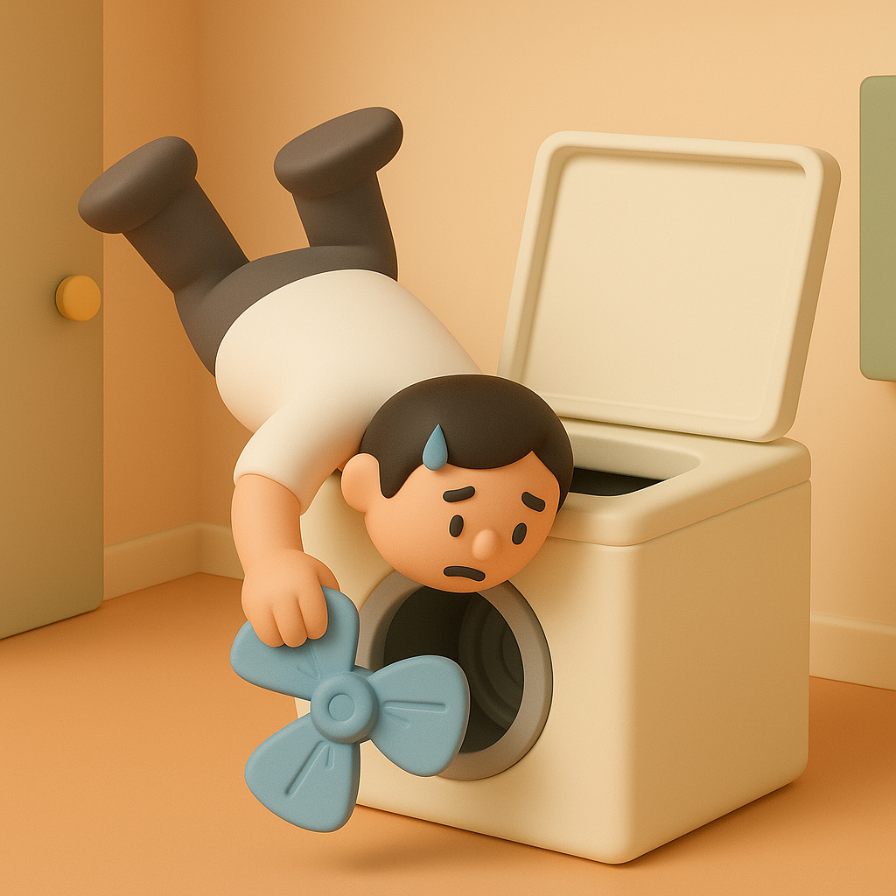

# 【随笔】从软件工程师到硬件维修工

家里的大洗衣机坏了！

这已经是一个多月前发生的事情。

而且，不是第一次！之前请售后推荐的维修人员上门来修过，但是很明显，那个家伙不靠谱——他总是让我们换很多东西，几百块钱花出去，没多久又坏了！

只能说，那是一个水平和人品双差的家伙。

大宝问我，要不要自己修，我想了想，自告奋勇地答应了。

房东留给我们的洗衣机是小天鹅波轮洗衣机。没办法，虽然我早就不喜欢「波轮」洗衣机了，但房东说这是新的，我们只好继续用。

这洗衣机是个脑残设计——之前总是坏的地方，是它的触控板。那玩意儿不防水，一沾水就坏！

可是，房东的洗衣机放在阳台，而且，洗衣机想不沾水，实在是有点难。坏过几次后，我们只好小心翼翼，随时用塑料布把洗衣机盖得好好的。

可是，这个劳模又坏了。每次衣服洗完，上面总是布满白色的洗衣粉。据大宝说，它每次「假装洗」，但实际上，压根儿就不转。

我从毕业起就只干过程序员、软件测试、DBA这些纯软件工作的活。这次主动请缨，实在觉得，自己做了这么多年的软件工程师，为什么不能转型当一名硬件工程师呢？

至少，从硬件维修工干起吧！

我打开洗衣机盖子，摸了摸波轮，不明白它为什么转不动。于是，用手推动着它转了一下——没卡着呀？

我纳闷地关上洗衣机盖子，重新打开试了一下。

几分钟后，我重新回来看它时，发现了新情况——波轮飘起来了！

> 原来是波轮松了呀！

我恍然大悟，那么是不是重新装回去就好了呢？放干净洗衣机的水，我把波轮放回去，使劲儿拧了几下，感觉已经很紧了。然后再试，过了一会儿，波轮又飘了起来！

我彻底困惑了，好在家里还有一台过去给孩子们洗衣服的小型洗衣机。我们只好让那个小小个子的家伙，承担起了家庭全部的重担。

上网搜索了一阵子，没找到任何线索，于是，我只好暂时把「转型硬件工程师」这件事情搁置了下来。

就这样，又过了很多天，大宝给我发来一篇文章《[亲历|波轮式洗衣机底盘脱落维修记](https://mp.weixin.qq.com/s/OTBA4NOqdtykd7X1c9MMtw)》。

我一看，大喜过望——这不是和我们家洗衣机一模一样的型号，一模一样的毛病吗？

文章作者说那大概率是螺丝滑丝，只不过波轮上的螺丝藏在小盖子里，不好取出来。

我从洗衣机拿出波轮研究了一下，波轮正中间是个小塑料片，旁边还有一个专门留出的缺口。我轻轻用螺丝刀一撬就开。里面是一枚螺丝，黑色的塑料垫圈已经老化，但看起来螺纹都好好的。

那篇文章的作者说他换了螺丝，打了加固胶才修好。我心想，说不定我这个直接装上去就能好呢？

安装之前，我又研究了一下被拆开的波轮。反面是一个有很多齿的螺孔，看上去，齿已经有点磨平了。我脑子里念头一闪：

> 搞不好，我这个得换波轮？

不过，万一不用呢？我决定先安装那篇文章介绍的方法修一修。

我把波轮安装了回去，又用螺丝刀使劲儿拧紧了螺丝，最后盖上那个小盖子。

打开洗衣机防水，我用手机的电筒透过洗衣机的透明盖子观察了一下，波轮转了起来，水被搅动了！

我开心地告诉大宝——「洗衣机修好了！」。

然后还跑到那篇文章下，激动地给作者留言，说自己照着他的文章，修好我们自己的洗衣机。

然后，我把积攒了很久，放在在阳台好几天的床单扔进了洗衣机。倒上洗衣粉，就去睡觉了。

第二天早上，我拿着洗好的床单到楼顶天台去晾，却惊奇地发现，床单上依旧有大片大片的白色洗衣粉的痕迹。

等晚上我回到家再检查洗衣机，它又变成了空吼不转的情况！

我只好再次拆开洗衣机，再次使劲儿地拧紧螺丝。

再观察，波轮又转了！

这次，我只放了两三件脏衣服进去。告诉大宝说：

> 要是还不行，我只好像那个作者一样，换螺丝，打螺纹加固胶试试了！

第二天，衣服上依旧是大片的白色洗衣粉痕迹。

我们无奈地挑了一个周末，人工洗完了所有积压的床单。

然后，我开始采购洗衣机的波轮紧固螺丝。

但是，换了螺丝还是不管用。

我又买回来螺纹紧固胶。

抹上了胶也不行，试了两三次，波轮该不转就不转。

我实在没办法，捧着波轮心想——看样子，是这波轮的轴套磨平了。

取下这个轴套估计不容易。我想了想，还是在网上买了一个整个替换装的波轮。

新波轮，新螺钉，再加上一点螺纹紧固胶——这一次，终于修好了！

由于每次更换维修方案，我都会磨磨蹭蹭地等了好几天。再加上网购的时间，忙起来没空折腾的时间……于是，从自己下定决心修洗衣机，到它被完全修好，一个多月已经过去了。

但我依然很满意——自己终于完成了从软件工程师到硬件维修工转型的第一步！

回头看，其实我早一点相信自己的判断，直接把磨损的波轮换掉，会节省不少时间。

那十多块的螺钉钱也不用冤枉花。毕竟，买波轮时，人家就送了一颗新螺钉给我。

波轮虽然不是原装，看起来质量要差一些，但胜在小店儿服务态度好，最后装上能用。

总之，加起来不过几十块钱，好过让那个不靠谱的维修员坑我们了。

我终于有点明白，房东大叔为啥家里啥玩意儿坏了，都是自己修了！

自己如果能修，又何必让人坑呢。

