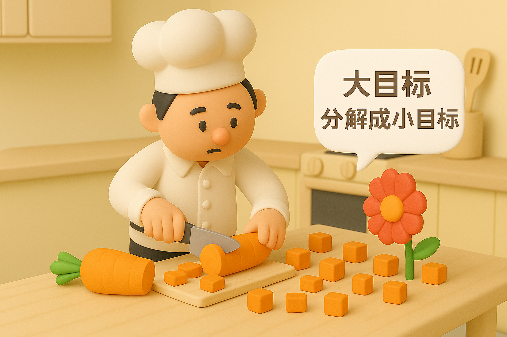

# 【生命⋅修行】分解大目标的能力

这次写《[【AI】 小白话系列——什么是人工智能](20250520【AI】小白话系列——什么是人工智能（AI）（一）.md)》，让我发现了自己在一个老生常谈的问题上——将大目标分解成小目标——做得还是不够好。

第一天尝试写开篇文章时，虽然之前已经盘算许久要把这一个问题拆成若干篇连载文章，但是对着电脑上的各种素材近一个小时过去了，我还是没能动笔。

而且，在那之前周末的早上，我也已经瞪着电脑上的各种素材两个小时，最终放弃只憋出来一篇想写又觉得[困难重重的感想](20250519【随笔】又一个看似难以完成的主意.md)。

就这样，痛苦了两天，直到开始写[第三篇](20250522【AI】小白话系列——什么是人工智能（AI）（三）.md)，我才找到了那种平衡感——想写的主题内容终于被切割到了早上一个小时左右能够完成的范围以内——打开电脑，开始打字；一个小时左右结束；配图，发表到公众号；再花二十分钟左右。

[Pieter Levels在Lex Fridman的访谈中，提到生产效率](https://lexfridman.com/pieter-levels-transcript#chapter19_productivity)时说：

> There’s a lot of distractions. Your girlfriend asks stuff, people come over, whatever. So, I’m very fast now. I can lock in and lock out quite fast. And I heard people, developers or entrepreneurs with kids have the same thing. Before, they’re like, “Ah, I cannot work.” But they get used to it and they get really productive in short time because they only have 20 minutes. And then shit goes crazy again. So, another constraint, right?
>
> 有很多干扰。女朋友问这问那，有人来串门，诸如此类的。所以我现在的节奏非常快，我可以很快进入状态，也能很快退出。我听说有孩子的程序员或创业者也是这样。一开始他们觉得“啊，我根本没法工作”，但后来慢慢习惯了，在短时间内反而变得非常高效，因为他们只有 20 分钟的时间——然后情况又开始一团糟了。所以这其实是另一种限制，对吧？

当只有一个小时，甚至只有20分钟可以专注工作的时间，他不得不学会把工作拆解成许多20分钟可以完成的段落，然后迅速地完成。

我甚至还想起这两天读过的一篇文章开头，也是说某位疑似ADHD的企业家，小时候学习一团糟，因为自己无法集中注意力超过15分钟而极度困扰。直到大学时某一天，忽然开窍，安排自己每次只学习、工作15分钟，从此解脱、开挂！

这些，都是在直面外在、内在的限制之后，接受、改变、练习，反而获得了更高的效率。

而我自己，至今还是习惯于有大段大段的时间让我慢慢进入状态，然后再慢慢出来，甚至7、8个小时，上10个小时不出来。

这样当然很爽。但是，现在我终于认识到，其实有更多的时候，我不可能有7、8个小时的整块时间来做一样工作。而我习惯于把任务拆解成至少5个小时起才能完成的「大块」，就会不停地在这种情形下遭遇困扰。

不管早晚，好歹现在越来越意识到了自己的这个局限。

这就是很好的开始，继续多加练习这种「拆解」能力吧。

