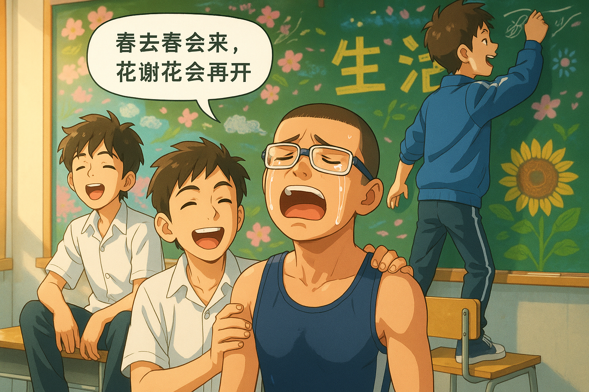

# 【生命•故事】（135）谁说少年不识愁滋味

高一的时候，有一个好友名字里有个「波」字，我总是戏谑地称他为「三皮」。当然，他并不喜欢这个外号，一度对我吹胡子瞪眼。

他黑黑、瘦瘦却极为精干，留一头极短的头发，整天穿着运动服，黑汗水流。虽然戴着一副眼镜，却依旧不改运动健将的模样。

他也确实是一名运动健将——我们班的体育委员，学校田径队队全能明星。

有一天放学后，我们几个留在教室里准备黑板报，他运动完后回到教室和我们一起聊天。

那天，不知道为何，我们又在教室里唱起歌来。我记得，他唱了一首[周华健的《花心》](https://music.apple.com/cn/album/%E8%8A%B1%E5%BF%83/151290612)，然后唱得泪流满面。

我们惊呆了，不知道应该如何安慰他，只好陪着他一起，在他的抽泣着的歌声中，一起唱完了这首歌的后半段。

然后，我们都敞开心扉，聊了很多很多私密的感受。这个像钢铁战士一样的小伙子，和我们分享了他很多痛苦、柔弱的时刻。

他到底也没有说，究竟曾经发生了什么事情，会让他经常那么痛苦。他只是告诉我们，在田径队里拼命奔跑，是他对抗这苦痛的解药。

从那之后，我们关系亲密了许多。但是，像那天下午，在教室后面的黑板前，流着眼泪，唱着歌，相互吐露心扉的时刻，倒是再也没有过了。

这是不是，所谓「少年不识愁滋味，为赋新词强说愁」呢？

仔细回想，其实并不是。

那时候，那位少年的心中的苦与痛，我们感同身受。虽然，在之后的生命中又经历过许多类似级别的痛苦，但那愁苦的感受，与年少时感受，其实在伯仲之间。

虽然，我们现在会觉得，当年触发那些情绪的事情，如今看来不过是些微不足道的小事儿。但对于当年青春期的我们来说，那就是世界的全部，都是天大的事情。

高中后来的岁月里，又有另一个也同样擅长长跑的好友告诉我——他缓解学习压力大办法，也就是在课间冲到操场上，飞奔10几分钟，大汗淋漓，心情就好了。

----

现在那些自杀的可怜孩子们，是不是被逼得连这样和伙伴们一起大声唱歌，在操场狂奔的出口也没有了呢？

「春去春会来，花谢花会再开」——一代又一代的年轻人，终究会在懵懂青春中跌跌撞撞的长大。