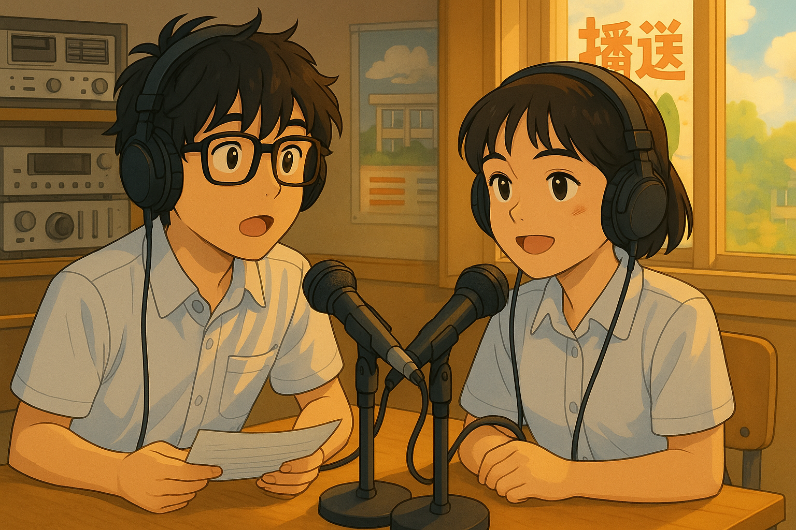

# 【生命•故事】（136）播音员

初中同学ZK 和他女朋友是学校广播室播音员，这当时就让我有点羡慕。

毕竟自己小时候跟着倪萍的汉语拼音节目打下的基础还算不错，一向都有老师同学说我普通话标准。

于是乎，当高中的广播台开始招募新人时，我第一时间报名了。

面试时间是午饭后的午休时段，面试的题目就是朗读一段文字。我看见挤在广播室外面熙熙攘攘的同学们都在紧张的练习着。有的朗读散文，有的朗读诗歌。

我灵机一动，心中立刻有了一个好主意。当时手边正好有一份刚买的《参考消息》之类的报纸，报纸夹缝里有很多广告。我挑了其中一条，稍微熟悉了一下内容。等到面试开始时，我拿起报纸，出其不意地以噼里啪啦，极其快速的语气，模仿着广播里广告时段的播音员，播报了一段广告。在大家还没反应过来时，我的播报，就已经结束了。

不出意外，我被录取了。

或许因为我面试时那超级快速的语调，让大家想起来体育节目的主持人宋世雄，我被安排主持某一周的体育节目。

我们那个小组有三个人，其中一个是和我一样的高一新生，我记得自告奋勇要录制一个片头。然而，毕竟没有专业设备，他在家里尝试许久也没成功。另一个是高二的学姐，留着一头短头发，面容清秀，脸上有一块小小的疤痕，声音温柔而甜美。

虽然当上了学校的播音员，也有了一个温柔的女孩做我的搭档，但播音的日子，却没有在我的高中岁月留下太多痕迹。学校的播音室运作得并不是太好，我们曾经还一起讨论过，怎么把节目搞得更受学生欢迎。隔壁幼师的广播，经常让我们觉得自惭形秽。

也很可能是因为学校装修，播音室所在的教学楼后来被拆了重建，高二之后，似乎就没有再播音了。

我还记得，高一那年运动会，我和我的搭档作为主持人，坐在主席台上。

4x100米接力时，我们班的体育委员跑最后一棒，就是那位田径队的「明星」。我们已经落后很多了，他接过棒的一刹那，我激动地以权谋私，对着话筒一个劲儿地大喊「高一六、加油！XX、加油」。

我的搭档也帮着我喊了许久加油，等到我们班的体育委员第一个冲过终点，大家一阵欢呼之后。我的搭档转过头来，有些忿忿不平地悄悄对我说：

> 我觉得裁判太偏心了，你们班的XX在转弯时明明抢了内道，那么明显的犯规，就因为他时田径队的，裁判老师都装作没看到。

说实话，抢道时就在主席台下面，我也清清楚楚地看见了，但这是我们班的冠军，我不置可否地嘿嘿一笑。

后来我也参加了一个400米跑步跑步。我在内道，起跑排在最后。毫无400米跑步经验的我，在响亮的加油声中（谁让我的搭档在主席台拿着话筒呢……），如显眼包一般，在前250米用百米速度冲到了队伍最前面，赢得满场观众的惊讶和喝彩，接着迅速力竭，痛苦地挣扎完最后150米，在一片嘘声中，以最后一名的成绩结束了比赛。

回到主席台，我抓起话筒继续主持运动会。我的搭档贴心地递给我一瓶水，说：

> 你快喝点水，歇会儿吧。你的声音都变了！

我惊讶极了：

> 真的吗？我自己都不觉得……

……

也不知道从哪一天开始，我的短暂播音员生涯，就悄无声息的结束了。我的搭档也开始忙碌地备战高考，我也渐渐和她失去了联系，连她后来考上了哪所大学都不知道，或者不记得了。