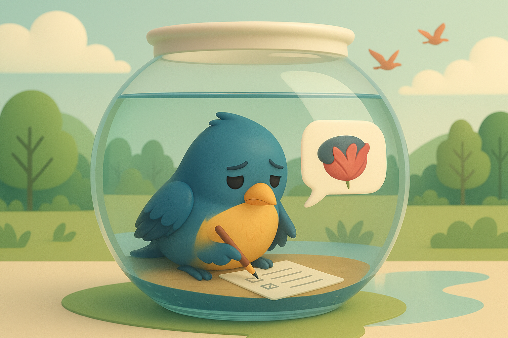

# 【随笔】作业的难题

这个问题自从出现，虽然[为之痛苦地思考和尝试](20250410【随笔】教育的迷思)，但却一直没能得到根本的解决。而最近，我和大宝因此而产生的困扰显然变得更加严重了。

阿宝越来越不愿意做作业，并且，她也反复地念叨，她不愿意上学。

即便是某一天和爸爸妈妈相处得非常开心，晚上临睡前她还是告诉我说：

> 今天真开心！
>
> 除了白天在学校的时候……

我问她为什么，她说：

> 从上二年级开始，就是这样了。

我继续问：

> 是不是因为二年级换了一个严厉的班主任？

她躲在被窝里使劲儿地点头。

……

大宝去参加阿宝学校的开放日，还没回来，就发信息告诉我说：

> 我觉得敏感的孩子好痛苦啊，看着我都觉得难受[捂脸]
>
> 我们还是在家对她好一点吧！

大宝告诉我，她坐在旁边，就能感受到阿宝和整个学校环境的格格不入。除了偶尔和同学聊聊天能让她放松一点，几乎大部分事情都让她别扭和不舒服。

甚至，在距离上体育课前二三十分钟，她就开始不开心了。直到上体育课她扭扭捏捏、磨磨蹭蹭地去集合，大宝才发现她之前是为此不开心。

我很纳闷，运动不是让人开心吗？

大宝告诉我，一开始孩子们要排队跑步。阿宝夹在队伍中间，周围全是无法快跑，磕磕绊绊的同学们，显得无比别扭。直到后来踢球时可以自由奔跑了，她才又慢慢开心起来。

这就是一个和别人不一样的孩子，可我们忍不住地就会想要让她和别的孩子们一样乖巧、听话、成绩好、大方地和人说话、主动在课堂上回答问题。

甚至，还期望她将来能读一所好大学，在社会上有所成就，等等……

可是，这一切与她本性相违背的期望，只会徒增我们自己和阿宝的烦恼。

……

但是，我们自己常常很摇摆！

有些人告诉我们，孩子必须得管，不然就会变成废柴。

有些人告诉我们，孩子不能瞎管，不然长大会出问题，还是废柴，且不快乐。

这两种声音让我们很是纠结。

总体而言，上次在郝景芳的「拾光同行」群里，听一位妈妈分享。

她说，她只是用心享受和孩子在一起的快乐时光。

那种放松，真诚欣赏孩子成长中每一个瞬间的心态，真的是我们想要做到的。

……

但是，我们却得面对，孩子在体制内学校里，遇不到体贴的老师时，那种格格不入的痛苦。

甚至还得面对，孩子二年级，远视储备就已经耗尽，但却依然只能整天在那逼仄的学校里，耗过白天最重要的时光。

……

或许，这不只是作业的难题。

我心目中，对于理想的教育，有着自己的蓝图和想象。

但是，我们的资源，我们所处的环境给不了孩子们这些。

我们没办法找到一个更因材施教、让孩子个性成长的空间；也没缘遇到一个像她一年级班主任那样有教无类，有爱心的老师。

如果不上学，我们更没信心给她这个年龄所需要的基本的教育和引导。

于是乎，在如今这环境之下，我们究竟该怎么做才对，成为了我们面对作业难题时，真正的焦虑和困扰。

