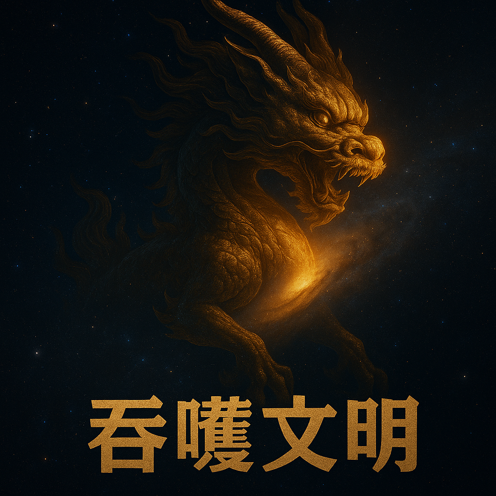

# 【随笔】被卡住的是我还是她？—— 初评《吞噬文明》

读完最后一个字，关掉微信读书，一时间我竟然彷徨犹豫起来——到底还要不要兑现承诺，写这篇书评呢。

毕竟景芳老师提前把书发来，让我先睹为快，只要求写一篇千字书评，总还是为了要配合宣传她的新书。可此时此刻，我的感受，却是一种欲说还休的苦闷与纠结。

对，被「卡住」了——大概就是这个词，更能描述我通篇读完后身体和心理的感觉。更重要的是，我觉得，这被「卡住」的，是作者，是郝景芳老师。

在《折叠宇宙》六部曲的宏大构想之下，我通篇却只看到了一个人，一个既普通，又不普通的人。

无论是渴望救世却陷于虚无的江流，还是坚强独立却困于内心迷茫的云帆，抑或是自律严谨却孤独压抑的齐飞，温暖体贴却迷失自我的常天，我看到的似乎都是郝景芳老师内心的不同影子。

***《一个被卡住的科幻作家》***——如果这么为题写一篇书评，似乎不太利于宣传，也对不住景芳老师吧？于是，就这么一犹豫、一彷徨，两个星期就过去了。

写科幻小说，真是一个很好思想实验室，作者可以肆意地构筑一个虚拟世界，在其中推演探索关于脑海中所有这个世界、关于人类、关于自己的问题与答案。

景芳老师一口气把她面对的问题，全都悉数扔进了这系列小说的构思中：

不管是宏观世界层面的大国博弈、战争阴云、文明冲突，抑或是信息扭曲和极端主义的狂热；

不管是具体到个体层面的身份归属、理想与资源的矛盾，抑或是善意付出却遭遇网络暴力的痛苦；

乃至于深入灵魂深处的自我怀疑与人生意义的追问，抑或是内心的孤独与世界之间无法言说的疏离感……

都能在小说的字里行间，江流、齐飞、云帆甚至卡莱母子的挣扎中看到她对于这些问题的苦苦思索与追寻。

但不幸的是，直到这篇文章结束，我也没能看到景芳老师给出的答案。或者说，我只看到了一个极为草率，让我颇为不满意的答案——依赖最强大的力量，构建暂时的秩序。

 甚至，在引入这最强力量的过程中，都没有像《三体》里罗辑那样，竭尽巧思，挖掘人类智计的极限。

等于说，这些问题引发了我强烈的共鸣，我看到了困扰、无奈、痛苦与孤独，我看到了上下求索，却发现作者似乎也依旧陷在这困境中，没有找到出路！

到了昨天，我才意识到，我在这小说里看到的，原来不仅仅是景芳老师。

因为我自己「卡住」在这里，所以，我看到的只不过是自己的影子。

这个世界没有别人，诚如所言！

好了，回到书评本身。我决定还是说话算话，写一篇至少千字的书评。

打算依旧如同上次[初评《宇宙跃迁者》](../初评《宇宙跃迁者》.md)那样，结合我自己的习惯，还有景芳老师在科幻小说写作课上提及的几个维度来

## **好看 🌟🌟🌟（3星）**

- 优点：不管咋说，一口气读完这篇小说没有任何困扰。有些时候还是挺引人入胜的。
- 缺点：有些地方，明显的变成了说明，而不是讲故事。那感觉，有点像《冰与火之歌》第五季之后，编剧跳出来讲这个情节为啥要这样这样，那样那样的感觉。不过，马丁老爷子的水准，确实不是一般人能达到的（他自己也是因此而一直拖稿吧）……

## **启发 🌟🌟🌟（4星）**

- 上面提到过了，所有那些问题，都是我正在困惑、挣扎的问题，感同身受。当然，除了被网暴，我毕竟是个小人物，幸运地未曾如景芳老师一样曾经深处漩涡中心。
- 只不过，依旧如上面所说，展开了问题，看到了挣扎与求索，却没有看到新的方向和希望，这是让我感受到憋闷和卡住的地方。但或许，这也是这小说的优点——换一个人来看这面镜子，或许看到的又不一样呢？

## **科幻创意弧线 🌟🌟🌟（3星）**

- 月球爆炸、地外文明干涉、精神异变、折叠宇宙，这些设定都算得上是硬核科幻的要素。但可惜的是，这些创意在设定层面有野心，在展开上却显得仓促。
- 比如月球的异常事件，其背后的文明逻辑、科学推理与技术细节都没有得到足够的展开，而折叠宇宙的设定也更像是一个背景，而非推动故事的真正引擎。
- 科幻设定成为了一种点缀，而非结构。它支撑起了某种氛围，却没有真正成为叙事的骨架。甚至，这些要素太多了，会有一种堆砌的感觉！以至于科幻没有融入故事中，小说最后作者还不得不跳出来对各种技术进行解释，感觉很是生硬。

## **人物故事弧线 🌟🌟🌟（3星）**

- 人物设定都很有潜力，每一个都有丰富的背景与心理动因：江流的虚无与理想、云帆的创伤与执着、齐飞的冷静与壳、常天的温柔与迷失。
- 但他们最终的成长或冲突，显得略有滞缓。许多人物似乎停留在对抗自我的原地徘徊，像是刚刚触碰成长的门槛，又转身躲回安全的壳里。
- 在这些人物中，有景芳影子的那些，还算相对丰满。其他的人物，就显得分外单薄了。

## **科幻 & 人物二者结合度 🌟🌟🌟🌟（4星）**

- 本书最动人的地方，恰恰是当宏大叙事和个体困境交错时，迸发出的微妙张力。
- 科幻设定未必多么炸裂，但它作为人物心理与处境的外化手段却非常精准，比如“外星人精神污染”几乎就是内心撕裂的隐喻。

## **中华传统文化结合 🌟🌟🌟🌟（4星）**

- 这是我最喜欢的一点，景芳老师在这方面做得很不错。
- 虽然整体背景是未来世界和外星文明，但其中的价值观、美学乃至人物命运的设计，都深受传统文化的影响。
- 无论是齐飞的“修身齐家治国平天下”，还是江流的“兼爱非攻”、云帆的“内观求道”，都流露出郝景芳一贯的人文理想与文化气质。

## 总体 🌟🌟🌟（3星）

值得一读的小说，或许你能从这面镜子里看到些不一样的东西。

[景芳的公众号正在连载]()，可以直接去先睹为快！

