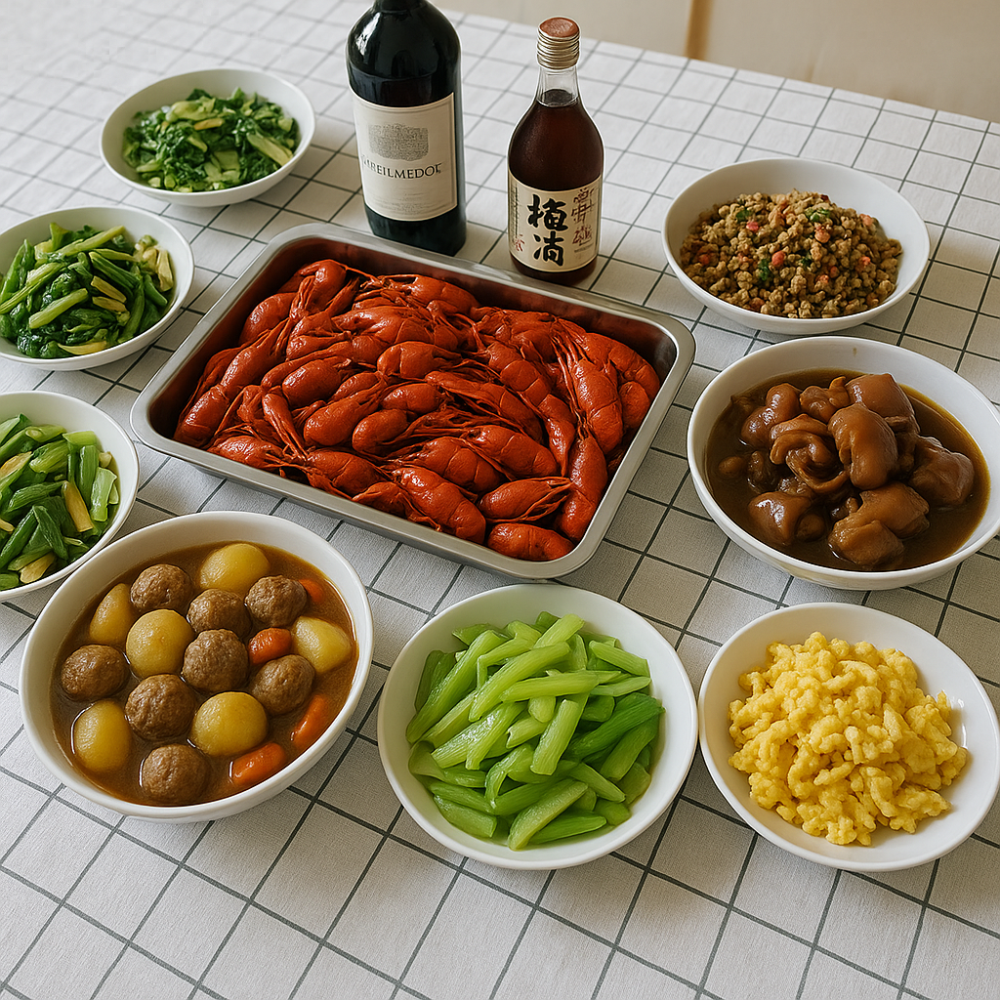

# 【随笔】家宴

五月初五，早上去到拳场，给师傅拿了几个大宝手包的粽子。然后中午在朋友家享受了一顿她亲自准备的美食。

然后，我们又邀请了师傅，还有几个好朋友们过两天来我们家吃饭。

自从搬到蛇口后，还没有同时邀请过这么多人来家里。于是乎，我们把六一儿童节变成了劳动节。带着孩子们，把家里仔仔细细，尤其是客厅好好收拾、打扫了一遍。

看着灿然一新，整齐漂亮的房间，大宝和我都由衷地感叹——哎呀，原来收拾干净了，我们家还挺舒服的！

大宝的主意，是来一个小龙虾为主菜的家宴。提前一天，她就写好了一张菜单。猪脚姜需要一天的时间，所以是「六一劳动节」那天就需要动手准备的菜肴——我参与的部分，只限于给生姜刮皮和剥鸡蛋壳。

小龙虾在当天早上就送到了。可是，我还得再收拾、并且再拖一遍地——因为两个娃娃把家里又搞乱了——只能把刷虾、去虾线的活儿全部扔个大宝。

我一面拖地，收拾被弄乱的客厅，一面感慨：家务真是永远做不完。经常是费了极大的力气，只不过保持家里是勉强过得去的原貌而已。我想，大部分人，可能都严重低估了需要一边带孩子，一边操持家务的全职妈妈，每天实际上有多大的工作量。

因为，她辛苦一天的工作成果，甚至目标，常常只是让你——看不出变化来！

我刚刚再拖完一遍地，大宝已经把虾处理得差不多了。她得意地把我叫进厨房，问我：

> 你从小在武汉吃小龙虾，知道怎么去虾线吗？

我摇摇头，说：

> 不会。不过，我在网上看过，好像是要用牙签，从倒数第二节虾尾巴壳的缝隙里把它挑出来。

大宝拿起最后一只小龙虾，把它刷干净，递到我眼前说：

> 喏，你看！

说着，她用另一只手，掐住小龙虾尾巴上的某个地方，一拉，虾线就被扯了出来！前后不到一秒钟的时间，我根本就没来得及看明白。

我问她从哪里学会的，她说研究了一下小龙虾的结构，就发现了这个办法。我只得感慨，大宝在美食这方面，实在是名天赋型选手。

就这样，几乎没让我动手，等到朋友们一一到齐时，大宝已经整治了满满一桌子菜肴，除了猪脚姜、清蒸小龙虾、还有土豆烧肉丸、泰式炒肉末，以及几个青菜。虽说都是简简单单的家常菜，可看上去、吃起来都相当不错。

大人们爱吃猪脚姜和小龙虾，孩子们则尤其喜欢肉丸子。

热热闹闹，开开心心，不知不觉就到了下午……

等朋友们都离开，大鱼趴在垫子上竟然就睡着了，阿宝在一边自己读着书，两只小猫一只趴在沙发下面，一只趴在沙发扶手上。

我和大宝简单收拾完，在客厅坐下来。

看着家里刚刚还热火朝天，这会儿已经变得安安静静，

大宝对我感慨说：

> 能做几个好吃的菜，还真是一件很有用的本事呢。
>
> 这样，可以邀请朋友们来家里吃点美食，聊聊天，感觉真好！

我赶紧对大宝竖起大拇指，说：

> 可不，超级厉害！

