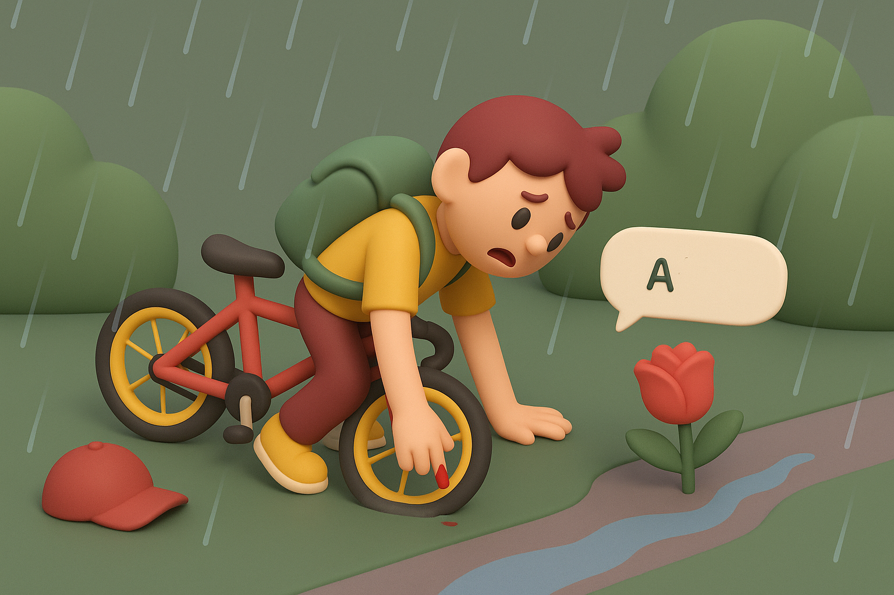

# 【随笔】又摔跤

这几天总说要下雨，不过等我从公园运动完出来，雨还只是轻飘飘的有那么一点意思，我决定还是骑自行车去公司。

街这边没车，过了马路，正好让我找到一辆崭新的青桔，于是乎我一如既往地踩得飞快，心想着只需要几分钟时间，就可以在雨彻底下大之前赶到公司。

眨眼间，我到了办公楼附近。这里，是我曾经来回丈量过，距离办公室最近的一个停车点。我熟练地右转，过了马路，再右转。

如往常一样，一个保安站在哪里，阻止着想要进入步行区域的电动车和自行车。我再右转，打算把车就停在这里。可是，前面有一辆电动车插了过去，也是要停车。我捏了捏刹车，却发现车子瞬间失去了控制，向左边倾倒过去。

我想要抬起左脚支撑一下，可是还没来得及做出反应，我已经连人带车重重地摔在了地上。左腿、左臀和左边的肩膀着地，太阳帽飞出去老远。

我一骨碌爬起来，捡起太阳帽，扶起自行车。四下看看，自己背包里应该没什么东西扔出去了。我看了看自己，地面虽湿，但裤子并没有被打湿。我正在庆幸，却发现太阳帽上有被雨水晕开的两大块血迹。

仔细观察，才发现左手中指不知被什么磨破了皮，正在汩汩地冒血。伤口可能还不小，眨眼之间就殷红一片。我赶紧用大拇指掐住中指根。扶起自行车，推到一边停好。

停电动车的小伙和保安站在那里，目瞪口呆地看了我一会儿。见我没啥大碍，保安关心地说了一声：

> 还是要慢一点哦！

我点点头，灰溜溜地赶紧离开。现在再慢，上班打卡就要迟到了……

到了办公室，收拾才发现，放在背包里的玻璃午餐盒已经被摔碎了。我有些心疼地告诉大宝，自己摔跤，美味午餐被毁的事情。她说，人没事就好。

是的，人没事就好。

大宝总是嘱咐我骑车要慢一点，注意安全。

这回又摔一跤，恐怕会听进去了吧。

