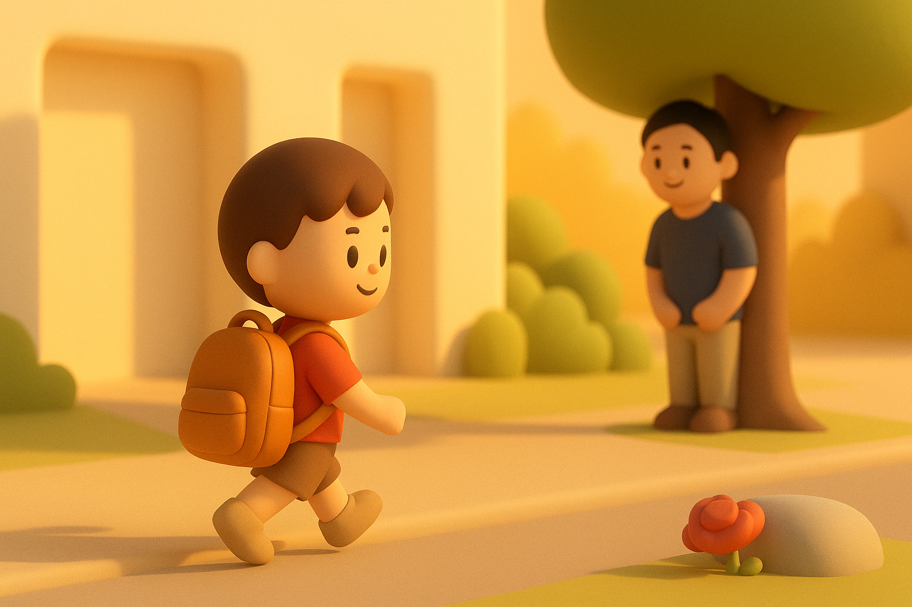

# 【随笔】我要送爸爸——大鱼趣事儿

早上准备送阿宝上学的当口，我问大宝：

> 今天还要不要去锻炼呢？

大宝说：

> 去呗，随便活动一下。

我说：

> 那然后怎么去公司呢？

大宝问：

> 你不能骑自行车了？

我摇了摇头。

大宝说：

> 那就骑电动车吧。

我问：

> 那你骑什么车回来？

大宝说：

> 我送你去呗。

我嘻嘻笑着，开心地说：

> 好啊，好啊，你一直送我到公司楼下啊！

谁知道，这句话喊得太大声，让在一边吃早饭的大鱼听见了。

不一会儿，阿宝收拾好了上学的书包。大宝带着她打开房门，对大鱼说：

> 妈妈先去送姐姐，一会儿让爸爸送你下来，我们再送你去幼儿园。

大鱼坚决地说：

> 不，我要送爸爸！

> 可是，爸爸上班好远，你没法送他呀！

大宝温柔地告诉他。

大鱼毫不妥协：

> 不行，我就要先送爸爸！！！

说着，他就大哭起来，早餐的面包也不吃了，跳下餐椅，脱掉鞋子和裤子，抱着妈妈开始大哭大闹。

但是，阿宝要迟到了。妈妈可没时间慢慢安慰大鱼，只好把大鱼和我留在屋里，嘱咐说，大鱼要换的衣服都在沙发上了，就和阿宝赶紧出发，关上门，上学去了。

妈妈走了，大鱼哭得更大声了。我怎么安慰都不管用，他坚决地嚷嚷着：

> 我要和妈妈一起，先送爸爸！

我说让他送我到幼儿园门口，送我到地铁口，都不管用。他只是一直哭，一直哭。

哭了好久，我发现扔在沙发上的键盘盒子，便拿起来哄他：

> 这个键盘盒子你不是要的吗？爸爸送给你啊？

他终于接茬儿，但还是哭着说：

> 不行，键盘也要送给我！

我说：

> 可是，键盘已经被我拿到公司去用了呀……

> 不行，就要把键盘也送给我！

大鱼不依不饶地继续哭着。

我一看，没有办法，只好放弃，不再说话。

然后，反正等着他也是无聊，我把键盘盒放在膝盖上，假装敲键盘的动作，把盒子敲得咚咚直响。

大鱼被这响声吸引，不哭了。回头一看，我在煞有介事地假装敲键盘，哈哈大笑，把桌子上剩下的面包一把抓起，冲到我身边，塞到我嘴里。

我连忙问他：

> 那爸爸给你穿衣服，送你去幼儿园啊？

他说：

> 不！

然后，光着屁股跑回到卧室里。

过了好一会儿，卧室里安安静静的。我打开门一看，他正光着屁股，站在床位看床上的一本漫画书呢。我赶紧又问他：

> 爸爸给你穿裤子、衣服，我们去上幼儿园啊？

他转过身，把我赶出卧室，说：

> 我不去上幼儿园，我就要在家里。

我只好又退回客厅。

没多久，大宝的电话来了：

> 你们还没出门吗？

我一边回答着：

> 没呢，不肯让我帮他穿衣服，不肯出门。

一边重新打开卧室门查看情况。

咦？他已经拿起一条裤子，正使劲努力地自己穿呢。我对着电话里的大宝说：

> 他自己找了一条裤子穿。

大宝说：

> 那他想穿啥，就让他自己穿啥吧。

挂了电话，我问大鱼：

> 你是要自己穿好衣服、袜子和鞋子，自己下楼去和妈妈碰头吗？

大鱼说：

> 爸爸，你先走！

然后又把我赶出了卧室。

我赶紧把其他东西全部拿好，正在犹豫要不要先出门呢。大鱼蹭蹭蹭光着脚从卧室里出来，到客厅边拿了鞋子又跑回卧室，我探头一看，他已经跑到装袜子的柜子边去找袜子了。

因为不放心他能不能关好卧室门，到时候万一把猫咪放进去了在我们枕头上拉尿就早了。我拿起自己的包，悄悄进到阿宝的房间，关上门。心想等他以为我已经出门了，跟着出去后，我再检查一下。

谁知道，我正躺在阿宝床上等着呢，大鱼嘎吱打开房门进来了。我赶紧一骨碌坐起来，他却要把我重新推倒：

> 你就待在这里，躺着不许动！

然后，他关上阿宝的房门。我听见外面吱嘎一声，大门打开，又砰的一声，大门关上了。

我赶紧从阿宝房间出来，他已经拿上自己的小书包出发了。

果然，卧室门并没有关好，还留着一条小缝。

我庆幸自己的英明，关好所有房门，追了出去。

大鱼速度很快，已经不在楼道里，自己进了电梯。正好大宝的电话过来，问：

> 你们还没出门吗？

我告诉她：

> 大鱼自己下楼找你了，我在后面慢慢来。

……

大宝骑电动车把大鱼送到幼儿园之后，又转头来接我。

我告诉他大鱼因为不能送爸爸上班，自己给自己找补的这一整出趣事儿。大宝也告诉我说，大鱼这次到幼儿园门口后，还特地强调呢：

> 妈妈，今天你送完我就回去，不要在门口看我。
>
> 立刻就转头回去啊！

这才刚满四岁呢，真是个独立又可爱的小宝宝呀！

