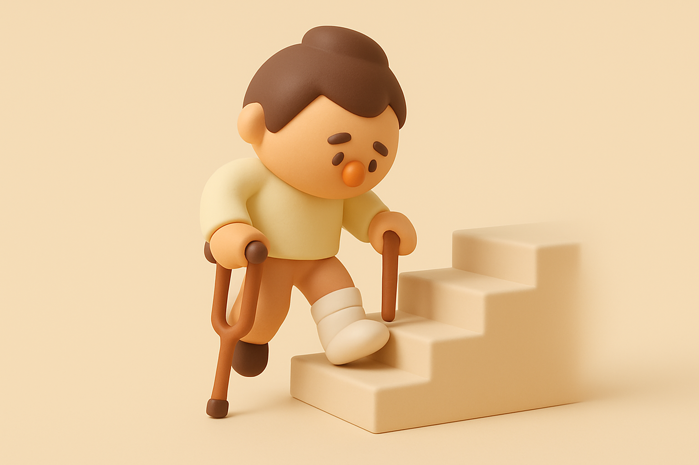

# 【生命⋅修行】健康的身体

很多东西，到失去的时候，才知道可贵。健康的身体，就是其中这一样。

前两天骑自行车摔了一跤后，当时还只觉得左腿被摔到，略略有点痛，并无大碍。等在公司坐了一会儿再起身，发现腿痛得走路都困难了。

于是乎，实在不得已要去哪里，只能一瘸一拐地慢慢晃过去。

第二天，瘸得更厉害了。外表看不出来，但就是疼。

自行车肯定是不能骑了，左脚一用力，小腿肌肉就痛得厉害。于是，即便是走路，也只能在左脚接触地后的一瞬间，赶紧把右脚挪到前面去，撑住地面，尽可能缩短左脚用力的时间。

下地铁楼梯时，看着其他人从身边快速地走过。而自己只能慢慢地、一瘸一拐地往前挪。

我想起之前半月板手术后，刚刚扔掉拐杖时，大约也是现在这个样子。和朋友们吃完饭，一起聊着天去坐地铁。走平路时，我还能勉强跟上大家的脚步。到了下楼梯的地方，说一句话的功夫，朋友们已经下到楼下，而我还在第一级台阶那里扶着扶手，艰难地挪动着伤腿。

这么几年过去了，如果不是这次摔跤，我几乎又忘记了拥有健康的身体是多么难能可贵的事情。可以跑，可以跳，可以爬山，可以徒步，可以骑自行车骑到飞快，感受中学时代那种肆意和畅快。

但其实，拥有健康的身体，并不是一件理所当然的事情。

这一次摔跤，身体用剧烈的疼痛和不适提醒着我——你现在所拥有的一切，包括这副还算健康的身体，都是无价的珍宝，千万要珍惜！

