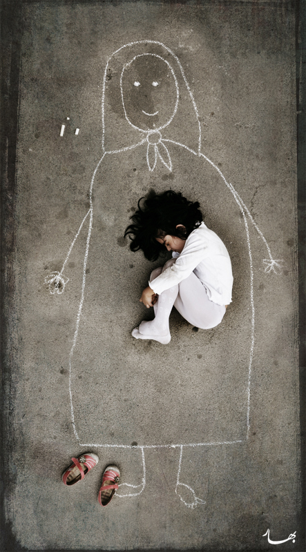
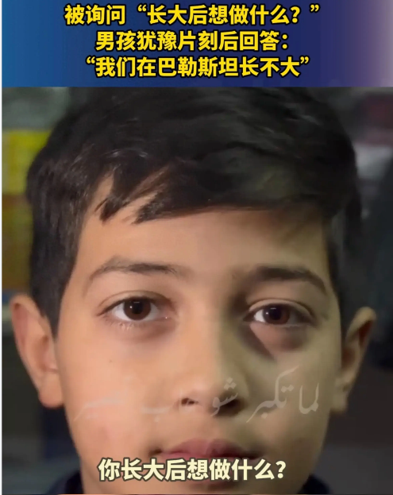
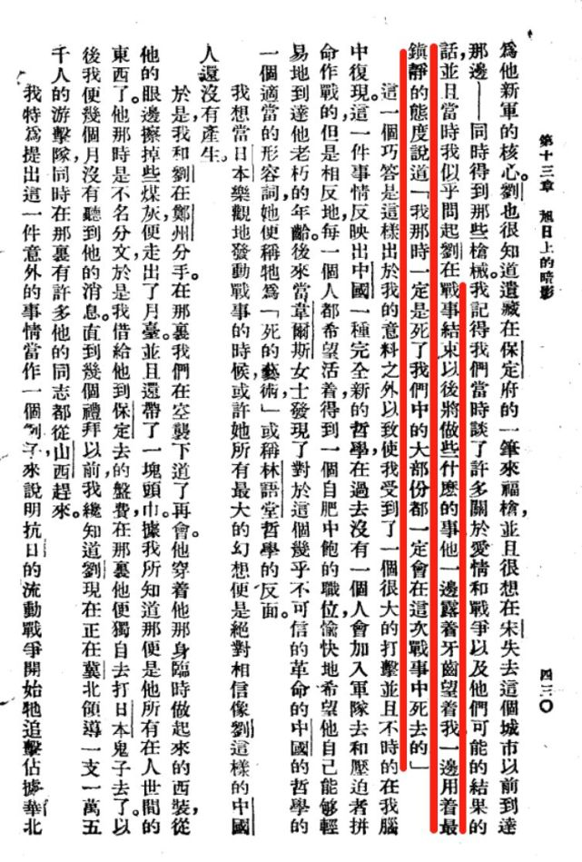

# 【随笔】没法讲完的故事

昨天一家人在餐桌边吃着饭，我见孩子们「妈妈」、「妈妈」叫个不停，便说，我给你们讲个故事。

> 在中东，有一个小女孩。她的家人都在战争中都去世了。她想妈妈的时候，就只能用粉笔在地上画一个妈妈，然后躺在粉笔画的妈妈的怀里。

我说的，是摄影师[Bahareh bisheh在2012年6月21日，拍摄于伊朗的那组照片](https://www.flickr.com/photos/khatt-khatti/7577505576/in/photostream/)里的故事。

刚讲到这里，大宝示意我看看大鱼。

原来，他捕捉到了这个故事里的伤感情绪，不说话了，蜷在妈妈身边，默默地吃着东西。

阿宝远远的听我讲完，哈哈笑着说：

> 这个小女孩真搞笑……

我对她说：

> 这其实是一个悲伤的故事。
>
> 你想想，你们多幸福啊。可以一直在妈妈身边叫「妈妈」，想妈妈抱了，就可以缩到妈妈怀里去，让真正的妈妈抱着你们。
>
> 而不是躺在粉笔画的妈妈怀里……

说到这里，我想起最近听说的一篇新闻，便忍不住又继续讲道：

> 最近还有一篇新闻，之前有一位记者，采访一个孩子，正在打仗的地方，加沙那边的一个巴勒斯坦的孩子，问他长大后想做什么。那个孩子曾淡淡的回答：

> 我们在巴勒斯坦，长不大！

> 最近的新闻说，这个被采访过的孩子，已经在战火中死去了……

我一面说着，一面脑海里浮现出最近听过的那些新闻，那发生在发放食物的救助点，一次又一次的开枪事件。每一次都是几十个孩子被打死，几百人受伤。

我对大宝说，和这些正处在战争中的孩子们比起来，我们那些曾经为我们现在的生活，浴血奋战过的先辈们其实要幸运得多。

至少他们坚信，胜利一定会到来，自己的民族一定有一个光明的未来。

我有点想，继续给孩子们讲那个网上流传的故事。便对孩子们说：

> 在很多很多年前，中国也在和日本打仗。
>
> 很多十几岁的年轻人都要上战场，有一次……

我忽然哽咽起来，尝试着平静自己的情绪，但还是没办法清晰地说出下一个字，只好停下来，默默地扒拉自己那一碗拌了被我称之为大宝制作的小炒皇（韭菜炒鱿鱼）的菜汁儿，还有许多大宝最爱的酸辣米，变得极其美味的米饭。

大宝看我半天不说话，理解地轻轻笑了笑。

吃完饭，开始收碗的时候，我听见大宝轻轻地在哼唱王菲的那首歌曲

> ……
>
> 如果說你曾苦過我的甜
> 我願活成你的願
> 願不枉啊願勇往啊
> 這盛世每一天
>
> ……

说是任何情绪的痛苦，总有与事实相违的部分，今天上网找了找，才知道那个我因为伤感，未能讲完的故事，其实略有讹传。

这个故事的原型出处，应该是来自于[斯诺的文章《**旭日上的暗影**》](https://news.qq.com/rain/a/CRI2019071000200304)，原文是这样的：

去年（1937年）九月间，……我跟一个姓刘的北方佬相识——一个露齿而笑的**红小子**——一同在山东和河南的赤裸的棕色平原上旅行了几天。这个姓刘的，从前曾在冯玉祥的‘国民军’中当过军官，后来变成了一个‘红军’指挥，而最近则在日军占领区中干党务工作。现在他是要到河北北部去组织一支别动队。…**…我记得，在当时我们曾大谈恋爱、战争及其可能的结果；有一次我问刘，他在这场战事结束后，预备干什么。他依旧露齿微笑着，十分泰然地望着我说道：‘那时我已经死了，我们大半都将死在这场战争中。’**

只有「那时，我已经死了」这句坦然、朴实的大实话，在渐渐讹传的故事中，被完整保留了下来。

这，就是我们父辈的父辈们，所真实经历过的生命与心路历程吧。

我们是幸运的，他们也是。

但愿我们人类，都是同样幸运的！

愿大家都能拥有黑暗苦难之后的旭日东升！