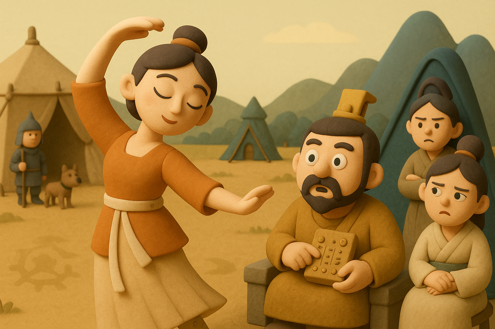

# 【AI】小白话系列——人工智能简史（一）

本来想继续讲讲人工智能 AI 为什么「智能」，却发现应该要讲讲最近几十年人工智能的发展历程才能说清楚。

等到想要梳理 AI 最近几十年的历史，却又想起了一些更古老的传说与故事，不如索性，就从这些遥远的源头讲起吧……

## AI 的起点（从上古到上个世纪）

### 公元前11世纪：偃师的传说

> 周穆王西巡狩，越崑崙，不至弇山。反還，未及中國，道有獻工人名偃師，穆王薦之，問曰：「若有何能？」偃師曰：「臣唯命所試。然臣已有所造，願王先觀之。」穆王曰：「日以俱來，吾與若俱觀之。」越日偃師謁見王。王薦之，曰：「若與偕來者何人邪？」對曰：「臣之所造能倡者。」

> 穆王驚視之，趣步俯仰，信人也。巧夫顉其頤，則歌合律；捧其手，則舞應節。千變萬化，惟意所適。王以爲實人也，與盛姬內御並觀之。技將終，倡者瞬其目而招王之左右侍妾。

> 王大怒，立欲誅偃師。偃師大懾，立剖散倡者以示王，皆傅會革、木、膠、漆、白、黑、丹、青之所爲。王諦料之，內則肝、膽、心、肺、脾、腎、腸、胃，外則筋骨、支節、皮毛、齒髮，皆假物也，而無不畢具者，合會復如初見。

> 王試廢其心，則口不能言；廢其肝，則目不能視；廢其腎，則足不能步。穆王始悅而歎曰：「人之巧乃可與造化者同功乎？」詔貳車載之以歸。

> 夫班輸之雲梯，墨翟之飛鳶，自謂能之極也。弟子東門賈禽滑釐聞偃師之巧以告二子，二子終身不敢語藝，而時執規矩。
>
> —— 《列子•湯問》

这是在[《列子•湯問》](https://zh.wikisource.org/zh/%E5%88%97%E5%AD%90/%E6%B9%AF%E5%95%8F%E7%AF%87)里记录的，发生在大约公元前 11 世纪，周穆王的故事。

周穆王是个喜欢到处玩的人。有一次他狩猎游玩，西出昆仑，返程还没回到中国时，遇到有人推荐一个叫做「偃师」的工匠。

「偃师」带来了她制作的一个歌舞姬，穆王左看右看，发现「它」长得和真人一样，跳起舞来更是千变万化。穆王觉得好玩，便让自己的老婆、小老婆一起来看。谁知道，这「歌舞姬」跳完舞，竟然顺便给在一旁观看的穆王小老婆抛了个媚眼。

穆王也是眼尖，发现了这一幕，醋意大发，当时就大怒，准备把偃师杀了。吓得偃师赶紧把「歌舞姬」拆掉，告诉穆王，这就是一个假人。看到散落一地的木、皮、胶、漆，穆王这才平息怒火。

试着一一复原，「歌舞姬」就又可以动了。

穆王把歌舞姬带回国，然后好好地 Diss 了一下当时著名的两位能工巧匠——会制作云梯的鲁班，会制作机器飞鸟的墨翟（说实话，这两样东西也很了不起啊）。两人都服气闭嘴，再也不敢得瑟自己在工程技术方面的本事！

这段如同神话一般的记载，描述了古老的中国人，对于人工智能的最早想象：

* 长得像人，仔细看也分辨不出
* 能像人一样走路、跳舞，甚至抛媚眼挑逗女孩子
* 但是，全都是用人工材料制成
* 和人一样，有着类似分区分功能的逻辑控制组件（心负责管理说话功能；肝负责视觉输入功能；肾负责运动功能……）

这是真的吗？或许上古时代，真的遗留有一些来自「神」——更高等级文明的遗作也说不定呢？

谁知道呢？毕竟在西方也有类似的传说，虽然时间上略晚一点。

### 公元前4世纪：赫淮斯托斯的仆人

<待续……>

