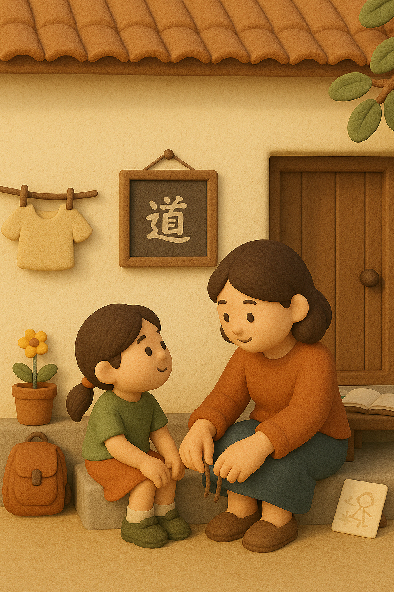

# 【随笔】教育的术与道

昨天，大宝又被其他妈妈打击到了，她给我发微信说：

> 我发现我不会学习，所以也不知道带他们怎么学习。只会带他们玩……

不过，我在外面参加一个会议，拍照拍到手机没电了，当时没看到这条消息。

在晚饭时聊天，大宝再次说起这个话题，我才意识到。原来，是遇到其它妈妈，告诉了她一些应该要引导孩子学习、提问，等等等等，一些所谓「妈妈应该做的事情……」

这让她很难受，因为她觉得自己不擅长这些，做不了这些！

正巧，昨天我给她分享了一位我很是钦佩的教育工作者——曾经的[云南楚雄美丽小学](http://www.leadfuturefoundation.org/lide/contents/367/2898.html)校长 Meowhole——写的公众号文章[《翻出一笔财富》](https://mp.weixin.qq.com/s/dSlsSU0usT4b0DsQvFo8UA)。

文章中提到 关于教育的「道」——

> 那「道」是什么呢？是师生关系、是真心关切、是关注个体、是有教无类、是深入浅出、是实打实的进步给学生带来的实打实的成就感。

我告诉大宝，其他妈妈告诉你的，大多只是某种「术」——适合某些孩子、某些妈妈、某种场景，然而「道」是最重要的。

* 亲子关系
* 真切关心
* 关注个体
* 有教无类
* 实打实的进步给孩子带来的实打实的成长与成就感

我甚至觉得，「真切关心、关注个体、有教无类」其实都是一回事，真正发自内心地用「爱」去关心，就会看到这个「具体的孩子」，这个「独一无二」的个体，自然就会找到他 / 她最需要，同时也最适合教育者（或老师或家长）和当下情境最匹配的教育方法，自然而然就会做到「有教无类」。

而「深入浅出」，也只是一种「术」而已。那是教育者自己能力在某种情形下的自然体现。

而最终是否能带来「实打实的成长与成就感」则是这一切的真正落脚点与试金石。

我告诉大宝说：

> 甚至更玄学一点，我们的孩子选择来到我们家，说明他们最最需要的，就是我们这样的父母。
>
> 我们真真切切地做了自己，就是最最适合他们的。

其实，AI 的迅猛发展，已经明显的看到过去关于「知识」的教育正在开始变得落伍。在每个人都拥有一位通晓全人类古今中外所有知识的AI 小助理的时代，学习现在那些课业的核心目的和作用何在呢？

我认为，同样需要在这些学习方法中，找到一些「不变」的东西。

大宝时常会认为她自己不会学习，我却觉得她掌握了关于「学习」和「教育」最为精髓的道：

* 看准方向，就踏踏实实地从基本功一招一式地练起来。无论是太极拳，练字，还是最近正在深入的「价值投资」，她自己就是一个可以以身作则的好榜样。
* 真正地关注、爱孩子，真正地看到并了解他们独一无二的地方。

我问大宝：

> 你想想看，你的奶奶教会你的那些做各种事情的能力，有哪些是可以穿越历史的底层能力？

大宝说：

> 怎么做事，不管是什么样的事情，怎么组织、安排各种相关的许多事情是相通的。

我又问：

> 那奶奶是怎么教会你的呢？

她说：

> 其实，还是因为奶奶一直在身边，耳濡目染，不停地言传身教。

我说：

> 所以，你其实知道怎么学习。
>
> 也知道怎么用最适合你的方法，来教育我们的孩子们。

我真切地觉得，只要守住我们最最看重的基本道德——善良、有爱心；对自己对别人真诚。其他一切都不重要，孩子们自然会找到他们与这个世界的相处之道。

毕竟，教育最终的目的，是让他们能够独立地在这个世界生存，找到自己生命的目标与道路并为之付出一辈子的生命。

早一点让他们去探寻自己内心想要的东西，早一点找到不是更好的事情吗？

我们到了三、四十岁才懂得王阳明说的[「听自己内心良知的声音，然后存善去恶」](https://zh.wikipedia.org/wiki/%E8%87%B4%E8%89%AF%E7%9F%A5)道理，孩子们要是能早一点在自己的实践中明白这些，岂不是一件更幸运的事情吗？