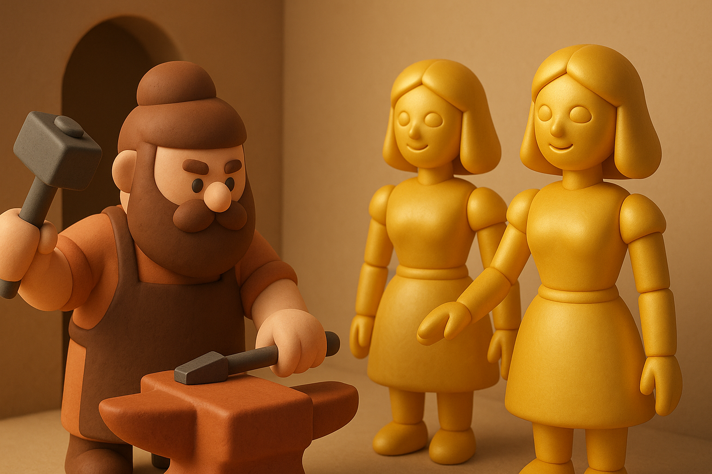
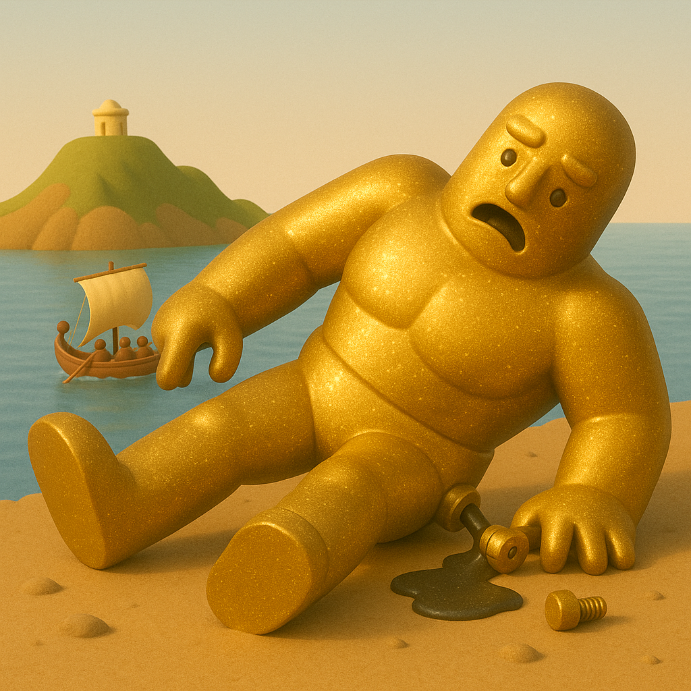
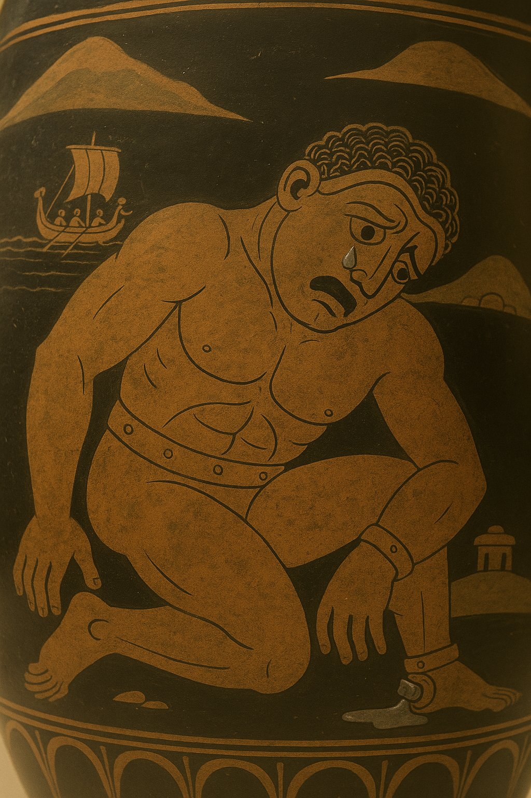

# 【AI】小白话系列——人工智能简史（二）

上回介绍了来自[《列子•汤问》的偃师传说](20250610【AI】小白话系列——人工智能简史（一）.md)。接下来，让我们看同一时期，哦，是几百年后，遥远的西方。

### 公元前4世纪：赫淮斯托斯的仆人

在古希腊神话里，[赫淮斯托斯](https://zh.wikipedia.org/wiki/%E8%B5%AB%E6%B7%AE%E6%96%AF%E6%89%98%E6%96%AF)是火神与匠神。传说，火山就是他为众神打造神兵利器的工匠炉。传说，赫利奥斯驾驶的日车、厄洛斯的金箭银箭、宙斯的神盾都是他铸制的。

不仅如此，他还制作了一对黄金女仆。

在[史诗《伊利亚特》](https://zh.wikipedia.org/wiki/%E4%BC%8A%E5%88%A9%E4%BA%9A%E7%89%B9)中，荷马说：

> 她们有智慧、声音与力量，能帮神主日常操作。

据说，[巨人塔罗斯](https://www.ted.com/talks/adrienne_mayor_the_greek_myth_of_talos_the_first_robot/transcript?language=zh-cn&subtitle=en)，也是他为克里特岛国王米诺斯制造的巨人形态全自动防御系统。[艾德丽安·麦耶在 TED 上的课程](https://ed.ted.com/lessons/the-greek-myth-of-talos-the-first-robot-adrienne-mayor)里这么说：

>  巨人由闪闪发光的青铜制成， 并拥有超人的力量， 
>
> 并由众神的生命流体“灵液” 提供动力， 
>
> 他是与赫菲斯托斯以前锻造的 任何东西都不一样的自动机器。

不过，麻烦的是。这个传说中的「机器巨人」显然不止拥有「智能」（不管是来自人工还是神工），它还想要像人一样想要不朽。

于是，女巫美狄亚骗它，说可以帮助它永生不死，条件是拧下它脚踝上的螺栓。

它同意了，果不其然。螺栓被拧下后，灵液像熔化的铅一样流了出来。动力耗尽，巨人塔罗斯轰然倒下。

在古希腊人的思考中，「自动人」是属于「神的技术」，是人类无法触及的「活的工具」。

并且，「自动人」和人究竟有什么区别，也是古希腊人在苦苦思索的不确定之处。

有许多希腊艺术家在硬币，花瓶，壁画中讲过这个故事。在公元前5世纪的一个花瓶上，一位画家用青铜面颊上滚落的一滴泪，描绘了濒死机器人的绝望。

也不知，这只是古人的脑洞，还是上古时代，真有人见过来自高等级文明的自动化人工智能机械。

关于这个神话，好莱坞的雷·哈里豪森还拍过一个经典电影——[《伊阿宋与阿尔戈英雄 Jason and the Argonauts (1964)》](https://movie.douban.com/subject/1293724/)，有空可以去找来看看……

### 公元9世纪：伊斯兰世界的自动机械人

<待续……>
