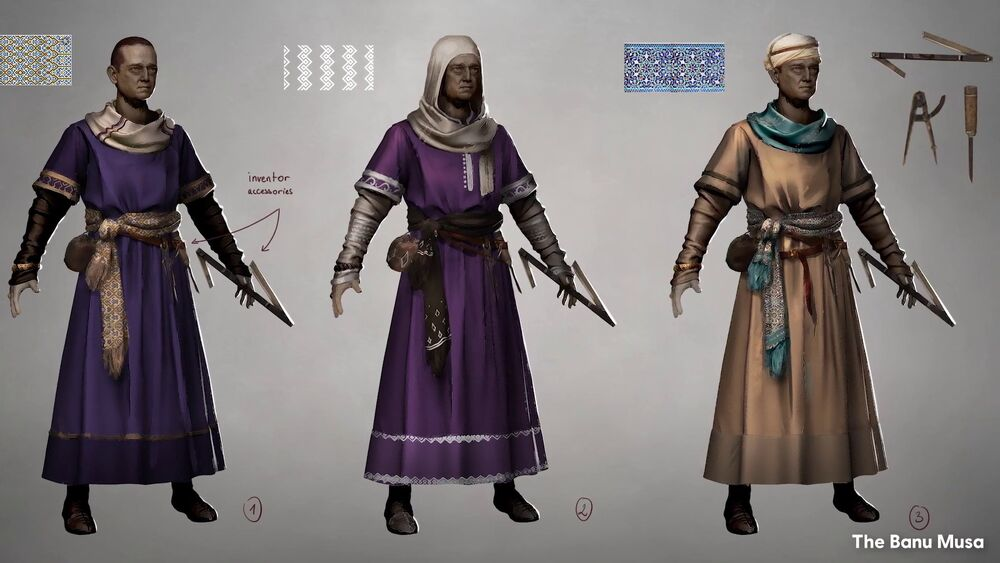
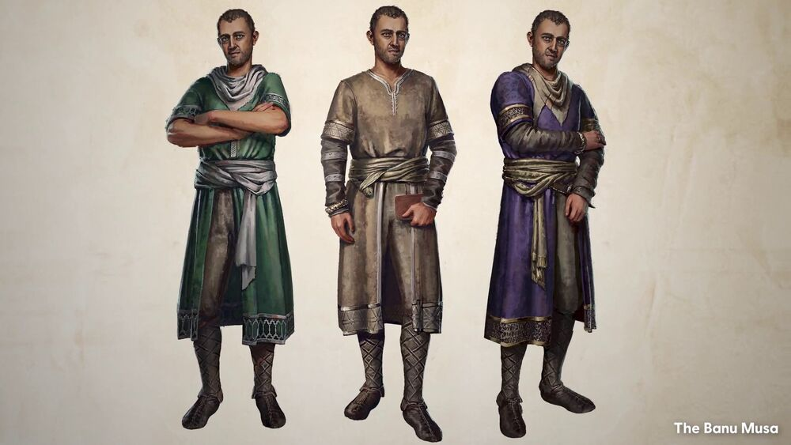
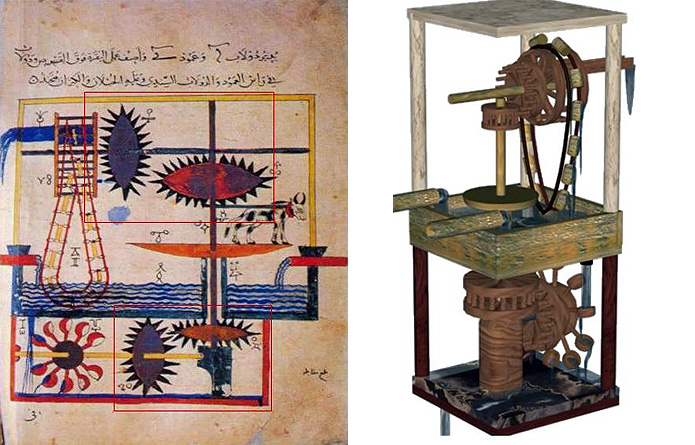
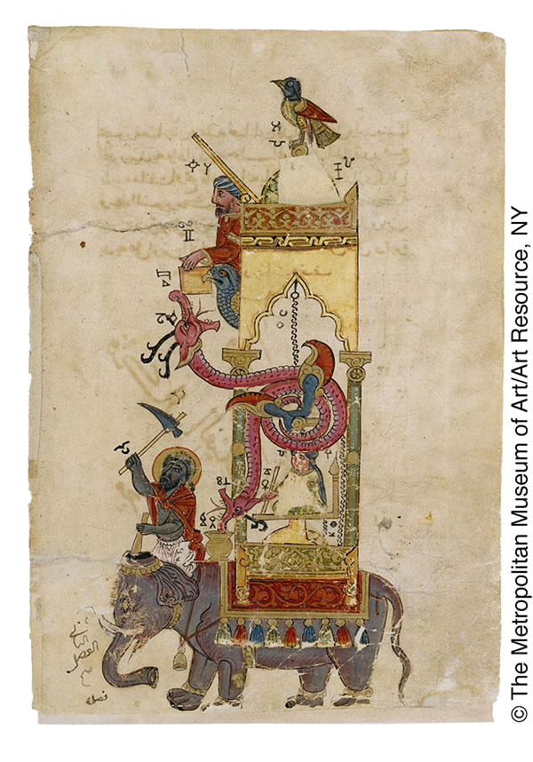
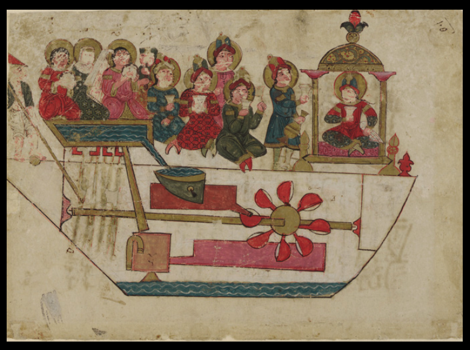

# 【AI】小白话系列——人工智能简史（三）

聊过来自[《列子•汤问》的偃师传说](20250610【AI】小白话系列——人工智能简史（一）.md)，以及[古希腊神话中赫淮斯托斯的机器人](20250612【AI】小白话系列——人工智能简史（二）.md)。接下来，让我们把时间再往后划拉几百年，看看东方与西方中间的那块伊斯兰世界：

### 公元9世纪：伊斯兰世界的自动机械人

[**巴努·穆萨兄弟（Banū Mūsā brothers）** ](https://en.wikipedia.org/wiki/Ban%C5%AB_M%C5%ABs%C4%81_brothers) 是三个学者，就是这三位：

三兄弟是[无形者](https://assassinscreed.fandom.com/zh/wiki/Hidden_Ones)的成员，他们为兄弟会提供了大量发明和知识。或者，他们可能应该长下面这样：

> 他们常说——「科学不等人」

> 心灵手巧的[巴努·穆萨兄弟](https://assassinscreed.fandom.com/zh/wiki/巴努·穆萨兄弟)设计了不少道具，让[无形者](https://assassinscreed.fandom.com/zh/wiki/无形者)在与不公的斗争中占据优势。他们长相相似，但性格却迥然不同：[艾哈迈德](https://assassinscreed.fandom.com/zh/wiki/艾哈迈德·伊本·穆萨)为人冷淡，[贾法尔](https://assassinscreed.fandom.com/zh/wiki/阿布·贾法尔·穆罕默德·伊本·穆萨)很踏实，[哈桑](https://assassinscreed.fandom.com/zh/wiki/哈桑·伊本·穆萨)则对神灵之物很着迷。和大多数兄弟一样，他们也经常吵架。然而，他们确实验证了兄弟齐心、其利断金这句话。

好吧，这些图片和介绍其实都来自著名游戏[《刺客信条》](https://zh.wikipedia.org/wiki/%E5%88%BA%E5%AE%A2%E6%95%99%E6%A2%9D%E7%B3%BB%E5%88%97)。当然，游戏中的原型，在历史上也真有其人。

三兄弟于9世纪期间在巴格达生活和工作。他们是[穆萨·伊本·沙基尔](https://en.wikipedia.org/wiki/zh:Mūsā_ibn_Shākir)的儿子，他们写了 20 多本书，传世的有三本，其中[《*** 聪明的机器书 Book of Ingenious Devices***》](https://en.wikipedia.org/wiki/Book_of_Ingenious_Devices)里，介绍了各种自动机械设备，包括自动书写装置、会倒酒的机器人、自动乐器等。

据说，他们制造过一个[「茶姑娘」](https://wol.jw.org/cmn-Hans/wol/d/r23/lp-chs/102012415)，既可以端茶，也可以吹笛子。这个机器人“很可能是第一个可预先设定程式的自动机械”。

著名历史学家伊本．赫里康（Ibn Khallikān）评价三兄弟的书时说：“巴努．穆萨的书是少见的奇书。它记载的都是新奇的发明，是最好的书籍之一……“

在三兄弟之后几百年，1206年，工程师阿尔·贾扎里（Al-Jazari）在其著作《精巧机械装置之书》介绍了各种机械装置，比如下面这些自动化水车的详细设计。

 还有，上面这张图里是象钟的设计图。

同时，他还描绘了一个“会自动打鼓的机器人船员”，这是[世界上最早的编程鼓手概念](https://www.historyofinformation.com/detail.php?id=237&utm_source=chatgpt.com)。

 阿尔·贾扎里的水力驱动系统被视为现代自动化控制的雏形。他提出了“机械程序控制”的概念（通过阀门、滑轮设置流程），这与今天的if-else逻辑思想有原型上的关系。

显然，在伊斯兰科学盛世时期，科学家们就造出了“自动倒酒机”和“自动演奏鼓手”，而且他们开始尝试给机器编“流程” —— 真正意义上的早期“程序化控制”。

这时候的「机器人」，虽然功能和神奇程度上，比起上古时期的传说要退化许多。但却是现代工程技术的真正雏形。

很快，西方世界黑暗的中世纪就要过去了，文艺复兴时期的传奇人物即将登场。

### 1495年：达·芬奇的机械骑士
