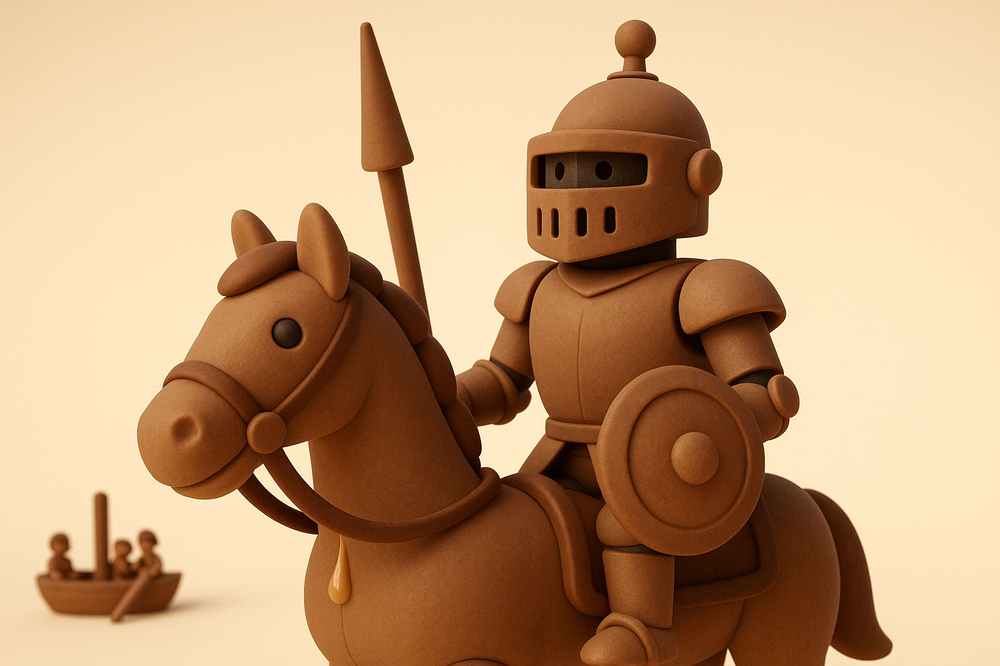
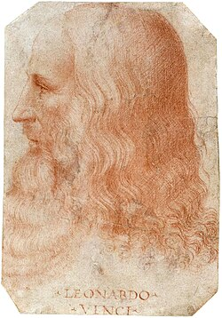
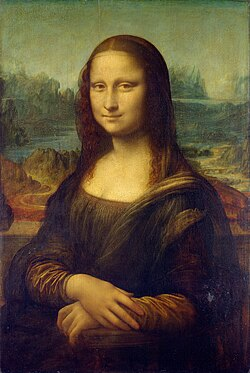
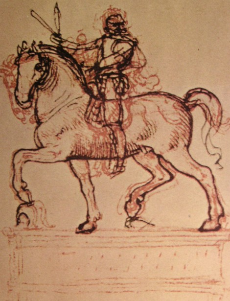
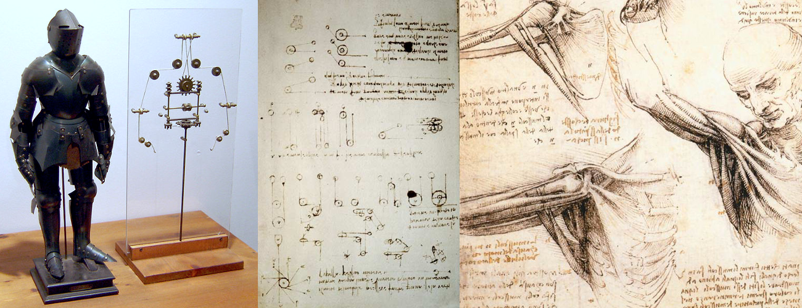

# 【AI】小白话系列——人工智能简史（四）

从[《列子•汤问》的偃师传说](20250610【AI】小白话系列——人工智能简史（一）.md)，到[古希腊神话中赫淮斯托斯的机器人](20250612【AI】小白话系列——人工智能简史（二）.md)，再到[公元前9世纪伊斯兰世界的机器人](20250613【AI】小白话系列——人工智能简史（三）.md)，两千多年就这么过去了。

西方世界经过漫长的黑暗中世纪，终于迎来了文艺复兴的曙光。

### 1495年：达·芬奇的机械骑士

公元1452年4月23日，意大利佛罗伦萨共和国的公证员皮耶罗•达芬奇和农民妇女卡泰丽娜生下了一个私生子。

这个孩子在弗洛伦萨一个叫做芬奇的地方出生，成长。跟着[安德烈·德尔·韦罗基奥](https://zh.wikipedia.org/wiki/安德烈·德尔·韦罗基奥)学画画，终于成为了著名的[**列奥纳多·迪·塞尔·皮耶罗·达·芬奇**](https://zh.wikipedia.org/wiki/%E5%88%97%E5%A5%A5%E7%BA%B3%E5%A4%9A%C2%B7%E8%BE%BE%C2%B7%E8%8A%AC%E5%A5%87)（[意大利语](https://zh.wikipedia.org/wiki/義大利語)：Leonardo di ser Piero da Vinci，意为“芬奇城的皮耶罗先生之子列奥纳多”）——横跨绘画、音乐、建筑、数学、几何学、解剖学、生理学、动物学、植物学、天文学、气象学、地质学、地理学、物理学、光学、力学、发明、土木工程等无数学科的博学者；文艺复兴时期的代表人物；与[米开朗基罗](https://zh.wikipedia.org/wiki/米开朗基罗)和[拉斐尔](https://zh.wikipedia.org/wiki/拉斐尔)并称[文艺复兴三杰](https://zh.wikipedia.org/wiki/文艺复兴三杰)；人类历史上最著名的传奇艺术家之一！

说到达芬奇，我会不由自主地想起自己慕名走进卢浮宫那个人头攒动的展览室的那个下午。一进门，越过挤挤挨挨的人群，我一眼就看见了那幅著名的肖像——比想像中要小很多，但却远远地、一眼勾住了我的注意力——因为她的目光，分明越过了人群，盯着刚刚进门的我。

那眼光似乎在轻轻地揶揄：

> 你还是来了？你终究还是只能随大流，和这呜呜泱泱的众人们一起，来看个稀奇呵……

那种震惊、羞愧、被几百年前的天才一眼洞穿内心的震撼至今难以忘怀。

后来才知道，据说这是达芬奇在[蒙娜丽莎](https://zh.wikipedia.org/wiki/%E8%92%99%E5%A8%9C%E4%B8%BD%E8%8E%8E)创作中，使用了一些独特的技巧，因此画像中人物的眼神，始终会盯着观众。

扯远了，这个文艺复兴时期的全才、天才的故事，怎么说都说不够。

传说在大约1495年，达芬奇在为米兰公爵卢多维科·斯福尔扎（Ludovico Sforza）的宫廷庆典设计中，设计了这么一个东西：

按[computer-timeline.com](https://www.computer-timeline.com/timeline/the-robots-of-leonardo-da-vinci)和[medium.com](https://medium.com/@ststw/leonardos-robot-leonardo-da-vinci-s-mechanical-knight-and-other-robots-c2f31742c959) 上一些文章的说法，他是为了充分展示了机械与艺术的结合。也不知道当时到底有没有人能够把这个神奇的机械骑士制作出来。

[维基百科上达芬奇的机器人](https://en.wikipedia.org/wiki/Leonardo%27s_robot)这一词条里介绍了一些它的结构与设计：

* 利用**滑轮、齿轮、绳索**等机械元件模仿人体肌肉和关节动作：胸腔内有控制器驱动手臂，外部传动系统活动腿、头和胸甲。

* 动作能力包括：**站立/坐下、挥臂、抬面罩、活动头颈和下颚**，甚至可能发出声音（通过机械敲击）。

* 达·芬奇的解剖学研究，如《维特鲁威人》和 Cadex Huygens，提供了机械骑士动作设计参考，确保其动作比例与人体相符。

**Carlo Pedretti** 在1957年发现达·芬奇笔记碎片，确认机械骑士存在。

**Mark Rosheim** 于2002年依据笔记复原机械骑士原型，其模型可“走、挥臂、打开面罩”，验证了达·芬奇设计的工程可行性。

**Leonardo3 博物馆**（2007年）与其他研究者也制作出了复装装置，重现出实际功能。

达·芬奇这只机械骑士，就像是15世纪的“人工智能机器人”——它套着一身铠甲，但里面藏着复杂的齿轮、绳索和“腱子”，可以起坐、挥剑、开面罩，还能“咔咔”出声。

达·芬奇利用自己解剖学知识，设计它能像真骑士一样动，这种把人体结构映射到机械上的思路，后来甚至直接影响了今天的人形机器人学说。麻省理工学院研发的内窥镜手术器械控制系统，就被称之为达芬奇手术机器人，算是后人向达芬奇致敬吧！

这就是传奇人物达芬奇的传奇设计。

下一次，我再讲讲机器人历史上一次著名、并且影响深远的骗局。

### 1770年：土耳其象棋傀儡（The Mechanical Turk）

<待续>