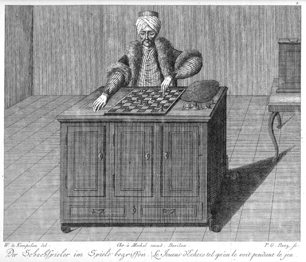

# 【AI】小白话系列——人工智能简史（五）

## AI 的起点（从上古到上个世纪）

从三千年前的中国，到两千四百年到古希腊，再到一千年前的伊斯兰世界，直到文艺复兴时期的达•芬奇，有着一个又一个的「机器人」——「人工智能」的传说和事迹。

### [公元前11世纪：偃师的传说](20250610【AI】小白话系列——人工智能简史（一）.md)

### [公元前4世纪：赫淮斯托斯的仆人](20250612【AI】小白话系列——人工智能简史（二）.md)

### [公元9世纪：伊斯兰世界的自动机械人](20250613【AI】小白话系列——人工智能简史（三）.md)

### [1495年：达·芬奇的机械骑士](20250616【AI】小白话系列——人工智能简史（四）.md)

到了两百多年前，人工智能历史上出现了一桩著名的骗局。

### 1770年：土耳其象棋傀儡（The Mechanical Turk）

[沃尔夫冈·冯·肯佩伦](https://zh.wikipedia.org/wiki/%E6%B2%83%E7%88%BE%E5%A4%AB%E5%B2%A1%C2%B7%E9%A6%AE%C2%B7%E8%82%AF%E4%BD%A9%E5%80%AB)，这位出生在斯洛伐克，长期在奥地利担任公务员的聪明人，为了取悦当时的[玛丽娅·特蕾西娅](https://zh.wikipedia.org/wiki/玛丽亚·特蕾西亚_(奥地利))女大公，制作了一个像下面这样的魔术用具。

这个穿着土耳其长袍，戴着头巾，一副东方巫师（那时候西方人所谓的东方，指的是奥斯曼•土耳其帝国）打扮的假人，和真人大小相当。他左手拿着土耳其长烟斗，右手则放在搁着棋盘的柜子上。

柜子里面有各种掩人耳目的复杂机械装置，因为这个假人的打扮，这个玩意儿被称之为[土耳其象棋傀儡 The Mechanical Turk](https://zh.wikipedia.org/wiki/%E5%9C%9F%E8%80%B3%E5%85%B6%E8%A1%8C%E6%A3%8B%E5%82%80%E5%84%A1)。

你可以想象一下，每次肯佩伦拿这个去表演的时候，就像一次大变活人的魔术。

他首先会打开机器前前后后的柜门，让大家看到里面复杂的机械装置，甚至透过机械装置能看到对面，好确定里面没有人。

但是，里面确实藏了一个象棋高手。只不过，就像大变活人魔术一样，通过特殊的展示技巧，让你「觉得」里面是空的，只有一些复杂机械。

接着，关上门。里面的象棋高手就可以用特殊的机械装置操纵那个人偶的手臂下棋了。肯佩伦还设计了各种内外通信装置，比如：

* 用磁铁显示柜子上方棋盘上棋子的运动；
* 用内外联动的号码盘传递一些密码；
* 等等……

再加上一些掩人耳目的小器件和卓越的表演技巧，土耳其象棋傀儡骗过了许多名人，包括[拿破仑·波拿巴](https://zh.wikipedia.org/wiki/拿破仑·波拿巴)和[本杰明·富兰克林](https://zh.wikipedia.org/wiki/本杰明·富兰克林)等当时的风云人物。

直到1857年，土耳其象棋傀儡的密码，才在《[国际象棋月刊](https://zh.wikipedia.org/w/index.php?title=国际象棋月刊&action=edit&redlink=1)》（《The Chess Monthly》）中被正式揭露。

这件事儿，影响深远。

一方面，它引发了发明机械化自动装置的热潮。各种个样的模仿者纷纷出现，比如如美国的 “Ajeeb（埃及人）”、“American Chess Player”（1827年Walker兄弟制作）。

而西班牙工程师托雷斯·奎韦多（Leonardo Torres y Quevedo）在1912年开发的“El Ajedrecista”，甚至能真的自动演算王车残局，并在1914年巴黎世博会上展示。

被誉为「计算机先驱」的[查尔斯·巴贝奇](https://zh.wikipedia.org/wiki/%E6%9F%A5%E5%B0%94%E6%96%AF%C2%B7%E5%B7%B4%E8%B4%9D%E5%A5%87)，正是在与象棋傀儡对弈后，萌生了“真正的计算机器”构想，随即提出了差分机与分析机设计概要 。

但另一方面，土耳其象棋傀儡也启发了那些骗子们——

> 原来还可以这样玩！

于是乎，一些「AI」公司，在后台雇佣廉价的印巴劳工，假装起「人工智能」来。

只是在产品「原型」阶段这么做，打通商业模式倒也无可厚非。但是，架不住人性之恶，就会有些「骗子」尝到甜头后，越玩越大——把消费者、投资人骗了一波又一波，最终无法收场。

比如，最近暴雷的 Builder.ai，这家英国AI独角兽公司曾获微软、软银、高盛投资，估值达15亿美元。自称其平台“像点比萨一样构建 App ”，实际却主要靠位于印度的数百名工程师手动编码来支撑 AI 运行。

2025年5月，先是《华尔街日报》揭露其“内幕”，随后曝出涉嫌通过关联公司虚增收入达 300%（Round‑tripping 销售），到了5月中旬借贷违约，Viola Credit 扣押3700万美元，随后宣布破产，裁员近千人。

**眼看他起高楼，眼看他楼塌了！**

土耳其象棋傀儡提醒我们，在这绚烂的 AI 浪潮之中，自己还得睁大眼睛仔细分辨，看着大浪之中，是不是还藏着那些别有用心，假装 AI 的骗子们。

下次，我们来详细聊聊，人工智能历史上，那些真正的先驱者。

### 1822年：巴贝奇差分机

<待续>