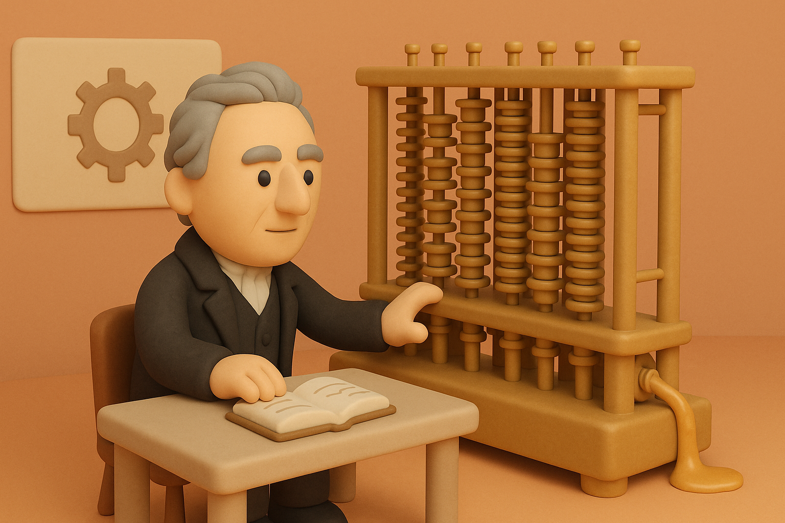
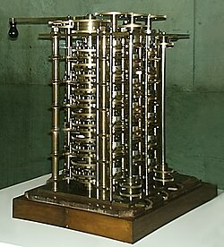
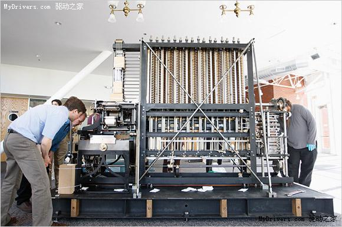
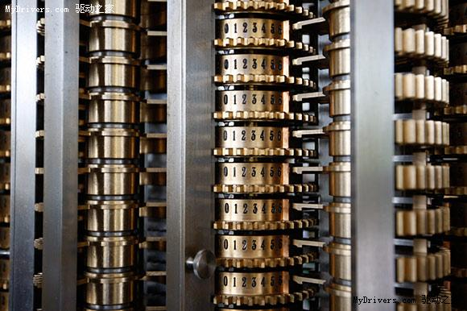

# 【AI】小白话系列——人工智能简史（六）

## AI 的起点（从上古到上个世纪）

以下是前面所有故事的索引：

### [公元前11世纪：偃师的传说](20250610【AI】小白话系列——人工智能简史（一）.md)

### [公元前4世纪：赫淮斯托斯的仆人](20250612【AI】小白话系列——人工智能简史（二）.md)

### [公元9世纪：伊斯兰世界的自动机械人](20250613【AI】小白话系列——人工智能简史（三）.md)

### [1495年：达·芬奇的机械骑士](20250616【AI】小白话系列——人工智能简史（四）.md)

### [1770年：土耳其象棋傀儡（The Mechanical Turk）](20250617【AI】小白话系列——人工智能简史（五）.md)

### 1822年：巴贝奇差分机

1819年，28岁的[查尔斯·巴贝奇](https://zh.wikipedia.org/wiki/%E6%9F%A5%E5%B0%94%E6%96%AF%C2%B7%E5%B7%B4%E8%B4%9D%E5%A5%87)在伦敦[邂逅了土耳其象棋傀儡的表演](https://www.discovermagazine.com/technology/the-mechanical-turk-how-a-chess-playing-hoax-inspired-real-computers?utm_source=chatgpt.com)。他甚至亲自上阵，和它对阵两局，不过都输掉了。

虽然怀疑其中有猫腻，但找不到证据，当时也只能不了了之。不过，聪明的查尔斯·巴贝奇开始思考：

> 如果是真的能下棋的机器，那会是什么结构呢？

这一思考，可了不得……

巴贝奇想明白了，用机器结构做计算机的原理。

在天文、航海的情况下，人类要计算复杂的对数和三角函数，是一个复杂的过程。然而，代数上证明过：任何多项式函数（比如二次、三次方程）做几阶差分后，差值就会变成常数（恒定不变）。

于是，可以用表格，一阶一阶地把差分列出来。

而这个推演、打印的过程，巴贝奇认为，可以用机械结构实现。

1822年，他在皇家天文学会提出了基于有限差分法设计的自动机械计算设备的构思，并且获得了政府拨款，从1823年开始建造。

这是一个庞大的家伙，预计完工需要25,000个零件，可以计算六阶函数，能存储16位数，也就是千兆级别的大数字。

- 利用“差商”原理和机械轮轴，自动计算多项式值。
- 每旋转一次主轴（手摇或蒸汽驱动），差分轮自动完成加法并传播进位，生成下一行表格

但是，巴贝奇干了10年，也只完成了机器的1/7，严重超时加上超支。

政府放弃了。

这是在万国博览会展示过的 1/7 成品。

失去政府资助的巴贝奇并没有闲着，在1849年，他又设计出了第二代差分机。支持31位数字、七阶差分，零件结构更紧凑，只需8,000零件。

但可惜，这个家伙在巴贝奇有生之年，也只完成了一小部分。

后来，第一台完整建成机由伦敦科学博物馆于1985–1991年制造，[2008年在硅谷计算机历史博物馆展出](https://www.wired.com/2008/05/gallery-babbage)。

下面的图片，就是后人复制成功的大家伙（图片来自[驱动之家的老文章](https://web.archive.org/web/20200613205939/http://news.mydrivers.com/1/103/103272.htm)）

巴贝奇的成功，不止这个令人惊叹的差分机。他还在第一台差分机工程歇菜后，提出了更加通用的[分析机](https://en.wikipedia.org/wiki/Analytical_engine)设计思路。这个设计，在 1837 年发表了出来。

分析机具有下面这些结构：

* **存储器（Store）**：可记录1,000个40位十进制数，是早期“内存”雏形
* **运算部（Mill）**：支持加减乘除、比较等操作，相当于现代CPU
* **控制流**：支持条件跳转、循环；程序以穿孔卡方式输入，具备图灵可计算能力
* **输入/输出机制**：读写穿孔卡，输出支持打印、打孔卡、铃声提醒等

和计算机之父**冯·诺依曼**提出现代计算机架构高度符合，可以说一模一样，可惜当年没能做出来。

阿达·洛夫莱斯（Ada Lovelace）为机器编写了计算伯努利数的程序，被誉为人类历史上第一位程序员。

至此——现代人工智能的基石——计算机理论与实体，已经接近于问世了！

### 1950年10月：图灵测试

<待续>
