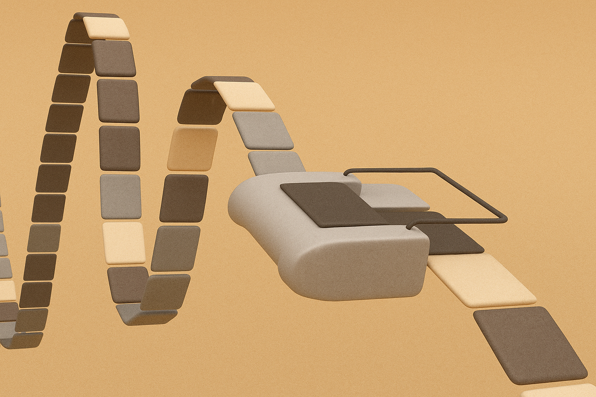
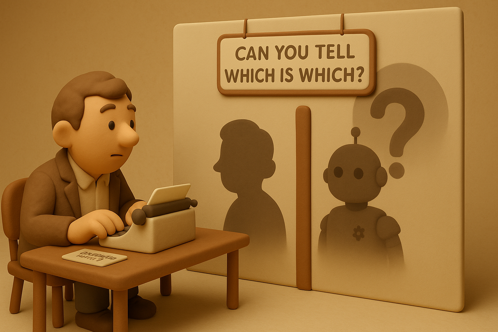
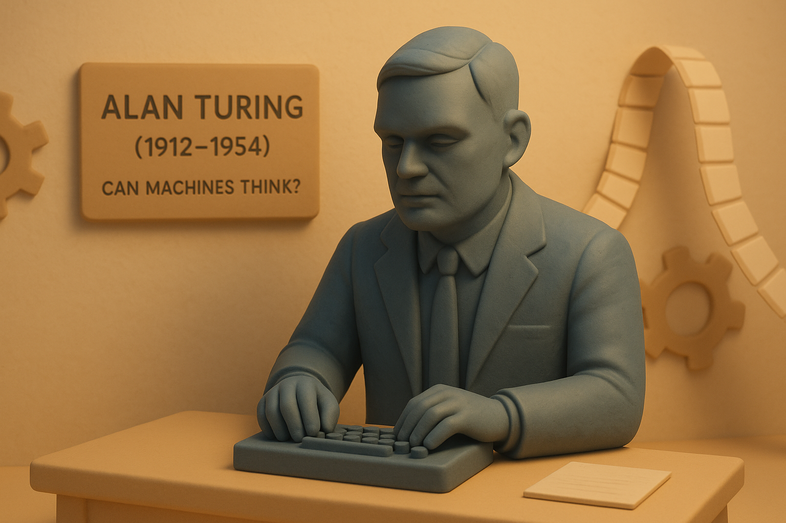

# 【AI】小白话系列——人工智能简史（七）

## AI 的起点（从上古到上个世纪）

从上古到上个世纪，这个期间的简史小故事系列，很快就讲到最后一个了。

### [公元前11世纪：偃师的传说](20250610【AI】小白话系列——人工智能简史（一）.md)

### [公元前4世纪：赫淮斯托斯的仆人](20250612【AI】小白话系列——人工智能简史（二）.md)

### [公元9世纪：伊斯兰世界的自动机械人](20250613【AI】小白话系列——人工智能简史（三）.md)

### [1495年：达·芬奇的机械骑士](20250616【AI】小白话系列——人工智能简史（四）.md)

### [1770年：土耳其象棋傀儡（The Mechanical Turk）](20250617【AI】小白话系列——人工智能简史（五）.md)

### [1822年：巴贝奇差分机]((20250618【AI】小白话系列——人工智能简史（六）.md))

### 1950年10月：图灵测试

[阿兰•图灵 Alan Mathison Turing](https://zh.wikipedia.org/wiki/艾伦·图灵)，这位人工智能，乃至计算机历史上的又一位公认的天才出生在上个世纪初——1912年6月23日，英国伦敦的帕丁顿。

小时候他就聪颖过人，显露出惊人的数学天赋。到了1935年，22岁的他就凭借证明极限中心定理的论文被选为国王学院研究员。

1936年，他在《论可计算数及其在判定问题上的应用》（[On Computable Numbers, with an Application to the Entscheidungsproblem](https://www.cs.virginia.edu/~robins/Turing_Paper_1936.pdf)）里，提出了[图灵机](https://zh.wikipedia.org/wiki/图灵机)的概念。后来在普林斯顿读博士期间，进一步完善了图林机的设想。以至于后来的现代计算机之父[冯·诺依曼](https://zh.wikipedia.org/wiki/冯·诺依曼)想要把他留下做他的博士后助理，但是图灵拒绝了，回到了伦敦。

二战期间，图灵一直是布莱切利庄园破解德国密码的主要参与者。在他的主导下，德国的密码系统[恩尼格玛密码机](https://zh.wikipedia.org/wiki/恩尼格玛密码机)被破译，以至于德国的各种秘密军事行动，在英国军情六处面前，全都变成了明牌。

1950年，图灵发表了那篇著名的《[计算机与智能](https://en.wikipedia.org/wiki/Computing_Machinery_and_Intelligence)》的论文，在这篇文章里，他提出了著名的图灵测试思想实验：

> 一个人和一台计算机被关在一个房间里，另一个人类提出问题，送进房间，由人类和计算机分别作答。然后答案被送出来，由提问的人类判断哪一个是真人，哪一个是计算机。

从此之后，图灵测试成为了人工智能领域最具影响力的哲学概念。一个人工智能程序或者系统，是否能通过图灵测试，曾经一度被公认为，是判定这个「人工智能」是否具备人类智能的黄金标准——直到最近， ChatGPT 等大语言模型纷纷通过了图灵测试，人类才开始再度寻找那些更高[「通用人工智能」标准](20250524【AI】小白话系列——什么是人工智能（AI）（五）.md)。

图灵的影响力是如此深远，以至于以他的名字命名的「图灵奖」，至今还是计算机科学领域的最高圣杯——就好像其他科学领域的「诺贝尔奖」那样。

就连苹果公司那只被咬了一口的苹果标志，也被大家怀疑，那是在向图灵致敬。乔布斯被问到此事时说道：

> *God we wish it were.*  上帝啊，我真希望这是真的！

想要深度了解图灵这位天才，可以看看2014年的那部传记性质的电影——《[模仿游戏](https://zh.wikipedia.org/wiki/模仿游戏)》。

好了，以图灵测试为分界点，这「从上古到上个世纪」的人工智能简史第一部分，就到此为止了。

其中，还有些与之相关的现代计算机理论与实践的历史，并没有展开。而巴贝奇的差分机背后的数学原理，限于我的数学功底，也没能展开讲清楚。

先有待后续吧……