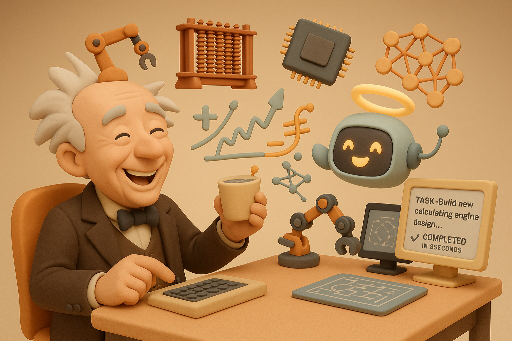

# 【随笔】如果巴贝奇生在今天

前两天，[研究巴贝奇差分机历史](20250618【AI】小白话系列——人工智能简史（六）.md)时，发现巴贝奇虽然在人工智能历史上留下浓墨重彩的一笔，但他自己却是在怨恨中去世的。

甚至，在他去世时，《[泰晤士报](https://zh.wikipedia.org/wiki/泰晤士报)》在讣告中里还嘲讽了他的「失败」。

他不仅仅设计了差分机一号和差分机二号，还设计了分析机，甚至先于提出科学管理理论的先驱[弗雷德里克·温斯洛·泰勒](https://zh.wikipedia.org/wiki/弗雷德里克·温斯洛·泰勒)，更早地在《[论机械和制造业的经济](https://zh.wikipedia.org/w/index.php?title=论机械和制造业的经济&action=edit&redlink=1)》，描述了现在被称作[巴贝奇原则](https://zh.wikipedia.org/w/index.php?title=巴贝奇原则&action=edit&redlink=1)的观点。也就是科学地将任务交给不同技能，不同薪酬的人分工合作——当然，这个遭到了同时代马克思的强烈批评。

他的失败，显然在于差分机一号、二号，还有分析机都没能在他有生之年制造完成。甚至他提出的科学管理理论，也没能在这方面帮到他。

假如，当初有一个和他配合无间，并且在执行力方面相当强的工程师和项目经理辅助他，结果会不会完全不一样呢？

我想，更大的可能是。巴贝奇本身就属于那种思考力远超过行动力的人。

甚至，他的思考了不止是超过了自己的行动力，而是超过了那个时代，当时那个世界的行动力。

而且，他对于自己和团队的行动力显然存在误判。以至于，他没能满足于留下一份无人能实现的理论与设计，而是拉到「投资」，建立了团队，真的动手去做了，只不过功未成，身已死。

假如，巴贝奇出生在现代，他的那些想法，恐怕早就能够用AI + 3D打印这一套流程，先把原型做出来了。

当然，如果他出生在现代，他一定有着更多超前，领先于世界的想法吧，不止于他在200年前那个时代，就能想明白的差分机，分析机这些概念了吧。

最近看到一个说法，说是「空想家」的春天，就要来了！

因为 AI 的能力持续增强，很多过去无法实现，或者需要很多钱，很强的团队才可能实现的想法，现在已经可以越来越容易地实现并验证了。

如果巴贝奇晚生200年，他一定正兴奋地实现着自己一个又一个的奇思妙想吧。

……

虽然我看到差分机的原理都是一头雾水，但整体而言，我也常常感受到那种脑力与行动力不匹配的痛苦。

这样看来，随着 AI 的能力越来越强，我这个「空想家」随意翱翔的日子，怕也是快来了吧……