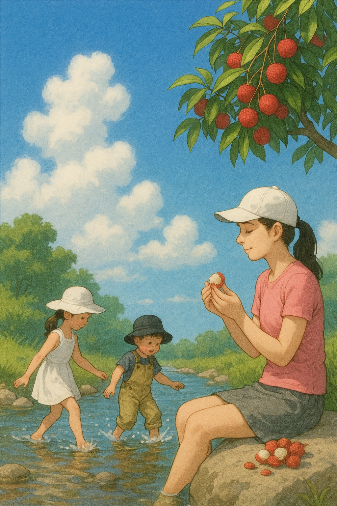

# 【随笔】荔枝

每到这个季节，就会惦记着吃荔枝。

其实，也不用惦记，到了这个季节，到处都是卖荔枝的。除了超市，百果园，街边都随时会出现卖荔枝的小摊小贩。甚至，有一天早上送大鱼去幼儿园，在幼儿园门口都遇到一个正在给荔枝装箱的老板，在他那里买了好几斤。

只不过，今年马亲王大作《长安的荔枝》正当季，这不绝于耳的各种宣传，又在那里不停地撩拨着那藏在肚子里的馋虫……

题外话，这剧我没看，书我也只是看过些简介，但相信有马亲王讲故事的能力打底，应该还是有点颇有些看头的。

今年显然又是荔枝的「大年」，大宝惦记着，今年无论如何，要去一次果园。上末周末大雨，这周想必不会，于是我们早早就做了打算。

回想上一次去果园，还是五年前的事情呢。那时阿宝还是个可爱的小小人，大鱼刚出生没多久，没到能带出门的时候。然后，这几年一晃眼就过去了，似乎浑浑噩噩，也不知在忙什么，荔枝大一年，小一年地结果，孩子们也一年又一年地长大了。

早上起床还是阳光灿烂，待到出了小区门，竟然下起雨来了。

我们犹豫了一会儿，一咬牙，还是叫了一辆车来，管它三七二十一，先去果园再说。

司机人好，听说阿宝晕车，特地稳稳地慢慢开，又拿糖果哄着大鱼，还一路安慰我们说，估计西丽那边没有下雨呢。

不过，等我们到了，雨却依然还在下。

白芒村那边的入口处，汽车已经排满了长队，每一辆汽车都需要果园老板的预约确认。保安告诉我们说，步行不用登记。于是我们欣然下车，撑开唯一的一把雨伞，开始步行。

雨已经不大了，我戴着太阳帽，背着背包，再扯开一条垃圾袋挡在肩膀和胸前，不禁有一种「竹杖芒鞋轻胜马」轻快感。

大宝很纳闷：

> 你真的不用把雨衣拿出来吗？

我摇摇头：

> 我喜欢淋雨，只是不喜欢鞋子被打湿。
>
> 而现在，淋着雨，鞋子还没来得及湿透。
>
> 正是最舒服的时候！

以前通往果园的土路，全都被修成了平坦漂亮的绿道。走起来各位舒坦。

或许，我们不依不饶的精神，也让老天爷开了眼。快走到果园时，雨竟然停了。

我们愉快地给老板付了钱，带着孩子开始上山摘荔枝。

……

路边就有红彤彤的桂味挂在枝头，我摘下两颗，叫住大宝，给我留了一张——「今年吃到的第一枚树上熟荔枝」的照片。然后，就开始放开肚子吃起来。

没多久，我就感慨起来：

> 哎！早上真不应该吃早饭啊，肚子竟然就饱了！

这时，我们刚刚走到果园尽头。

五年前，那棵特别好吃的桂味老荔枝树还在那里，满枝的红果，香甜一如往年。

果然，吃饱了，还可以吃撑，吃撑了，还可以吃得更撑……

……

摘了个心满意足，给爸爸妈妈，还有托我们寄荔枝的朋友又买了几箱，找顺丰下了单。接着又把我们自己摘的，以及老板自己刚摘来下的荔枝装了满满两大塑料袋——大约有九斤多。

然后就开始徒步西丽湖绿道了。

绕湖一圈，发现在绿道出口不远，有一处小溪，许多孩子在玩。

蓝天、白云，挂满红彤彤荔枝的绿色荔枝树，在溪边戏水的孩子们，像极了宫崎骏动画中那美丽的画面。

我坐在溪边，一边看着孩子们玩水，一边大快朵颐地一颗又一颗剥着荔枝，快乐极了！

后来，大宝在这旁边的「网红」荔枝园，又买了三斤荔枝。

……

我们还以为，这12斤荔枝要吃好久呢，没想到，只不过到了第二天上午，就全数告罄了！

后来，家里人告诉我们，荔枝收到了，特别好吃——从来没有吃过这么新鲜的荔枝。

听到电话里传出的开心的声音，自己也觉得开心极了。

我和大宝说：

> 这一天真是值！