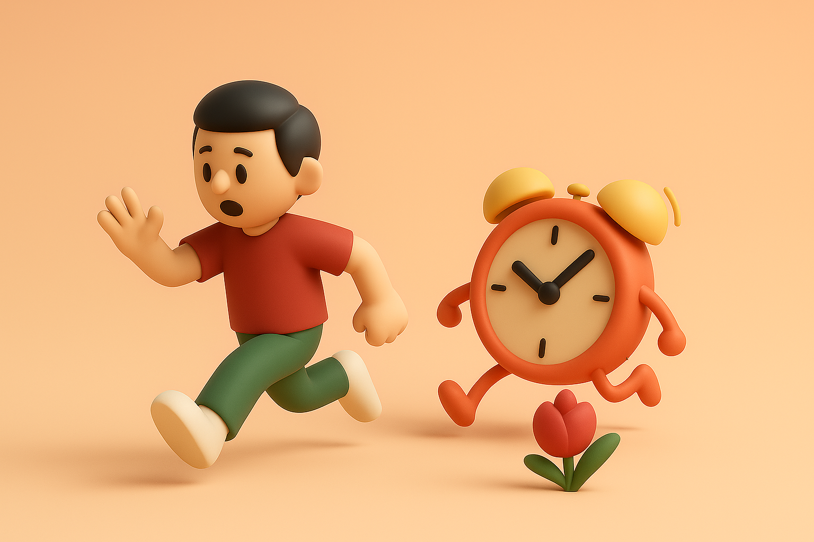

# 【随笔】新的作息平衡

不知不觉，在新公司上班三个月了，竟然也形成了一种新的作息平衡。

一开始，早上 5 点 30 起床，然后完成每天早上的写作练习。通常计划的是一个小时，但常常需要一个多小时才能搞定，最多会画上一个半小时多点。

但后来某一天开始，早上再也不能自己在闹钟响之前自己醒来了，6 点的闹钟变成最后一道阀门。但是，好歹周一到周五工作日的时间，都还能在上班前完成土法纯手工写作（有时会利用 AI 做些调研或大纲之类的准备工作）、用 AI 配图、在公众号发表这三板斧。

原来设想的是，头一天下班前或晚上睡觉前用 TimeBoxing 的方法完成第二天的计划，并辅以六时书，用三省吾身的方法，提醒自己把注意力放在最最重要的修行上。

但后来变成了早上到公司后，如果这天不忙，就把当天的TimeBoxing计划，六时书的表格准备好，然后再记录一下感恩日记，还是三板斧。如果忙起来，就直接一天忙忙碌碌到下班，压根没有时间拿起本子来，做计划、搞反省、记感恩……

中午有一个小时的午休，但「静坐冥想」一个小时，一直只停留在「念想」之中。不过，10 分钟到半小时的正坐冥想通常还是可以保证的。有时候实在感觉太困，会偷懒变成躺在午休床上躺平睡个午觉，10分钟或半小时不等，最多有次躺了 45 分钟。

曾经有一阵子，中午会热好饭后带着去往人才公园。在户外海边草坪附近吃饭，静坐。来回路程骑车虽然只不过半小时，但还是略有点紧张，并没能坚持形成习惯。

晚上坚持不再把工作带回家，事情再多也是加班干完再走。到家后就努力调整心情，全心全意地陪着家人。最近，大宝开启了一种新的模式，如果她白天不忙，会做好饭，带着孩子们一起到人才公园接我。我在那里晚餐，然后全家人一起玩一会儿再回家。

和家人们在一起，就尽量不要看手机。这一点努力做到后，确实感觉很不错。

有一阵子尝试过全家人在 7 点半 8 点之间，一起安静地读纸质书，但是因为我常常到 8 点才吃完晚饭，没能把这个好作息坚持下去。

然后，晚上很想要在 9 点半就睡觉。偶尔，有时候能在晚上 9 点半把孩子们全都赶上床。不过，大部份时候是 10 点到 10 点半之间。有一阵子，每天睡前都还能给阿宝讲讲西游记的故事。

当然，时不时也会有不留神拖到晚上接近 11 点才睡觉的时候，然后第二天会很困。

但不管怎样，晚上躺下后很长时间睡不着的现象，已经很久没出现了。

周末曾经还尝试过继续早起写作，但想到周一到周五已经完全仰仗大宝为全家人准备早餐，收拾家里。加上自己还特别想睡个懒觉补觉（通常也就是睡到 7 点钟之后），于是变成了周末放下其他一切，只接受大宝的安排，或者做家务，或者出门玩，总之一切活动，最高原则就是——要放下手机、电脑，全身心地陪伴家人。

这样感觉效果也很不错！

虽然，还有很多想要改善、提高的地方，但是目前的这三大收获：

1. 上班前就能完成一天的写作练习。
2. 上床后能在十几分钟内就睡着。
3. 周末能全身心地陪伴家人。

让我对目前这个新的作息平衡，整体上非常满意👍

