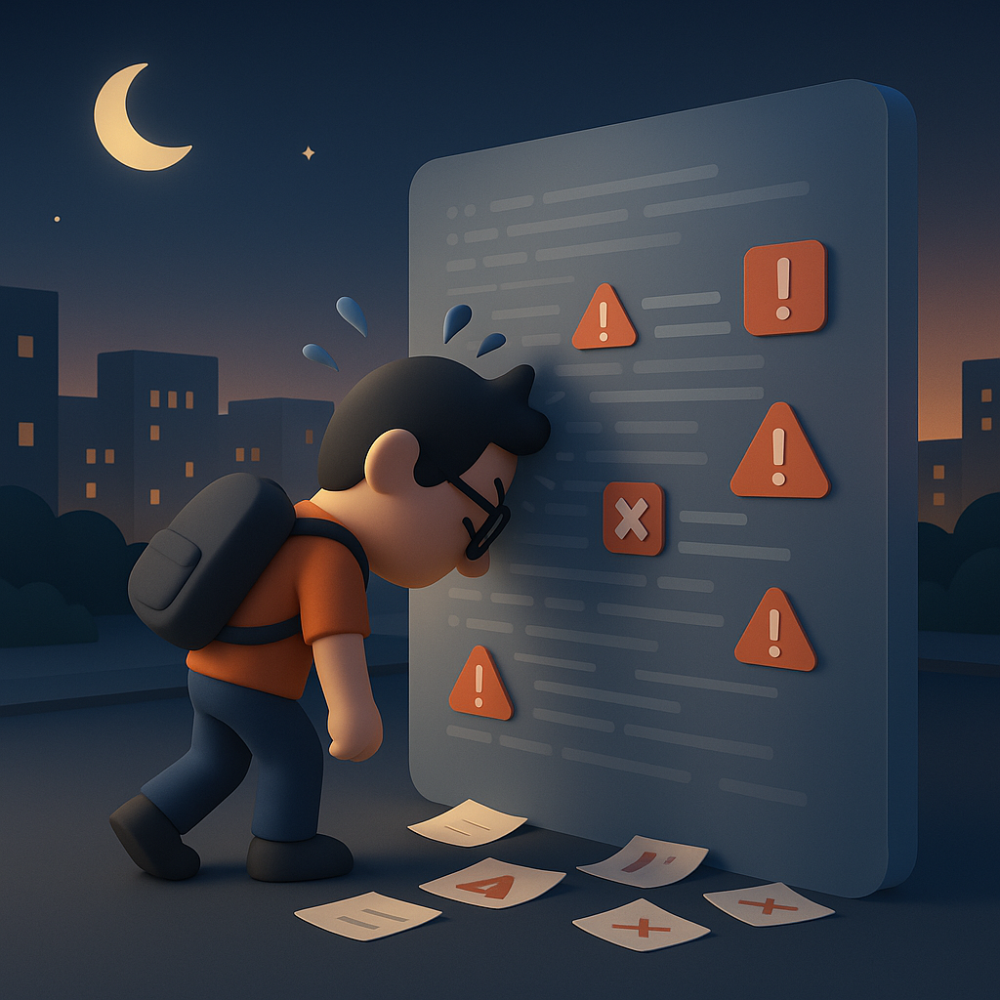

# 【生命⋅修行】AI 编程的挫折

最近发现 Gemini 创作的纯前端 InfoGraph 挺漂亮的，而且可以直接拷贝到 PPT 中使用。

于是我突发奇想：能不能让它把我之前在工作中用 Excel 绘制的图表重新制作一下呢？正好我有一些新的想法，想要在趁着数据刷新时，把图表修改修改呢。

想明白之后，我觉得，这应该总共只用两三个小时就能搞定吧？毕竟就是一个小小前端页面的事儿，需求说清楚就行了。说干就干，昨天早上，我开始指挥 Gemini 帮我设计这个纯前端数据展示页面。我的思路是这样的：

1. 让 Gemini 制作一个图表，看看能不能达到效果。
2. 如果效果满意，就让 Gemini 把这个扩充到多个数据集，完成整页 PPT 上需要的多个图表。

一开始还挺顺利的，它几分钟就迅速做出了原型。我很高兴，心想，如果是用 Excel， 我还不知道自己把自己的想法画出来呢，现在它不但迅速画出来了，而且还比 Excel 里的图漂亮！

当然，还有些小问题需要解决……

这一开始解决「小」问题，时间就慢慢到了下午。各种小问题，比如需要调整的界面，错误的显示格式，以及一些随时冒出来的新主意，一一让 Gemini 搞定之后，我终于开始让 Gemini 把这一个图表扩充成到多个不同品类的数据集。

遗憾的是，这不是一次简单的扩充。

两个品类的原始数据略有不同，我能一眼看出来，Gemini 也能一样看出来，甚至它还在文字上给出了一个「像模像样」的解决方案。

但是，它的代码再次出现了 BUG 。

而且，明显地，我感觉 AI 掉进了一种奇怪的「愚蠢死循环」。这种感觉曾经也遇到过，就是它怎么也搞不定一个看起来非常简单的问题，并且不断地在这个过程中重复犯之前已经犯过，并曾经改过的错误。

6点半的时候，我犹豫要不要下班。

但是，看了看 Gemini 生成的前端代码，连同 HTML 框架加起来也才 1000 多行。

> 这对于 AI 来说并不难才对呀？

我这么想着。

> 要不，再花个把小时，让自己享受一下搞定这件事情的快感吧？

这个欲望战胜了其他想法，我继续把自己钉在办公室的座位上，督促着 Gemini 继续干活！

时间一分钟一分钟的过去，公司的网络也「变」得极慢，每次我都怀疑浏览器死掉，迫不及待地重新刷新整个 Gemini 的网页，看看它是不是其实已经在后台干完了更新代码的工作。

晚上8点半，我想过一次放弃；9点半我又想过一次；直到 10 点 20，我终于下定决心，接受「失败」！

回家的路上，我充满挫折感地回顾着这完全没有价值的四个小时加班，忽然意识到，这在自己过去当程序员的年轻岁月里，其实是常常发生的情景。

虽然现在的 AI 相比过去的编程，看起来更加强大，同时也有着更多的不确定性。

但是回到我自己的感受上，这就是一种一而再，再而三，时常发生的事情：

> 我以为事情会如何进展，
>
> 但实际情况不是这样……
>
> 我不屈不挠，
>
> 但现实继续给你教训……

而面对这样的情景，「坚持」还是「放弃」，两种策略都说不上是正确还是错误。

因为，两种选择自己曾经都经历过，但谁也无法保证是 5 分钟后就柳暗花明，还是一通宵后依然困顿无解。

不用闭上眼睛，我都依然能够清晰回想起那些画面，那些从公司出来，四下无人的凌晨；甚至迎着上班人潮逆行的清晨；或清冷，或闷热的晚风；或安静，或忙碌的科技园街头；因为剪过草坪，在空气中弥漫的青草味道；或者是街头早餐铺热气腾腾的蒸包子的香味……

以及那个头晕眼花、头重脚轻走在路上的我，有时成就感满满，有时挫折感满满。

原来这些挫折自己早就一再经历。而所有的挫折感受，和引诱你挑战挫折的那些成功感受，其实都是差不多的啊！

我忽然释然了，这次影响了睡觉，下次多多留心，以睡觉时间为基准，给自己画个 Deadline 及时放手就好了。

一觉醒来，就是新的一天，不是吗？