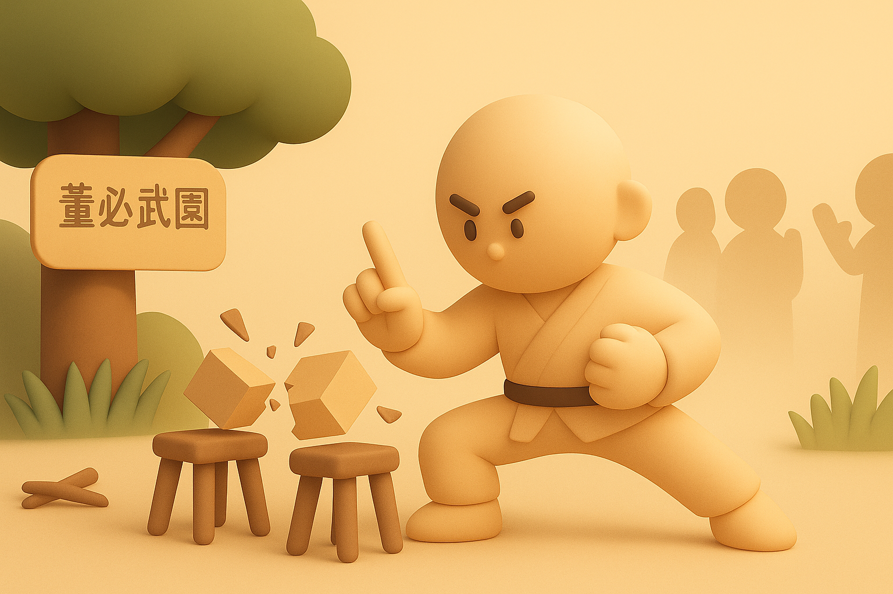

# 【生命•故事】（137）螳螂拳与硬气功

关于武术的记忆，忘不了的总有那么两段挨揍的历史。一次发生在小学刚刚参加武术学校的学习之后，另一次是临近大学毕业时。

第二次的事儿以后再记录，而第一次我似乎以前记录过一段《[【生命•故事】（051）练武术也会打输的小男孩](20220305【生命•故事】（051）练武术也会打输的小男孩.md)》。今天，我想记录的，是发生在高中时候的事情。

也许是因为有着小时候开始练武术，身体就变好的经验吧。加上少年对「武功」的热爱或许感染了妈妈。在初中后几年，或者刚上高中的时候，妈妈为我在洪山广场的「董必武公园」找了一位师傅，教我螳螂拳。现在的「洪山广场」比以前大了很多，但绿植和草坪却比以前少了，听说如今也没有人在那里练武了。

我还记得，那时候公园公园正中是董必武的站立雕像，董必武先生拿着拐杖，却是一副走路虎虎生风的样子。周围的平地和草地，就是各家老师练武、授徒的地盘。

我的师傅好像姓赵，约莫有点光头，个子不高，看着就是一个孔武有力、武师模样的老头儿。那时候我很快就学完了螳螂拳（虽然我现在只记得起势了），然后我就想学赵老头的看家本领——硬气功了。

听说练这个硬气功对眼睛有好处，妈妈答应了，给我交了学费。

每天早晚都练，如果是上学的日子，我会在上学前先去董必武公园，锻炼完了再直接去学校。晚上就在家里。

我记得有一个主要动作是这样的：

斜着身子，用头顶着大树或墙壁，一面用嘴用力吸气，吸出口哨音，一面将双手用力打开；接着用鼻子用力喷气，同时把双手收回来，猛地用力击打自己的双肋。

然后，还让妈妈给我制作个辅助工具。削一把筷子粗细，半米多长的细竹条。把其中一头紧紧扎起来，另一头自然散开。用的时候，拿着扎住的那头，扎马步，换着边击打自己的双肋，同时用力呼气。

我这么练了许久，但是自问绝对不敢进行那些街头胸口碎大石，喉咙顶长枪的硬气功表演。事实上是，即便是师傅的其它徒弟，我也没见过他们到底练到了什么水平。但是，我感觉师傅是确确实实有功夫的。

有一次，师傅和我们聊天。他说，曾经有公园里另一处练武的某师傅，练棍的。拿着棍来调侃我的一个师兄，说：

> 你跟赵老头学硬气功，练成了没有啊？你的头有这个棒子硬吗？

师兄没敢搭话，师傅上前解围。一面说：

> 他才刚学，还早呢。

一面顺手拿过对方手里的棍子，猛地往自己头上一敲。咔嚓一声，棍子应声断成两截，对方吃了个蹩，只好灰溜溜地回去了。

我望向当事人之一的师兄，他肯定地点了点头。

后来在学校，我终于有了一次「表演」硬气功的机会。

班上有几个也喜欢武术的同学，当时在教室后面玩闹着。他们在校园里找到一些长条型的小瓷砖，说是要表演以手指开砖。但是，没有人成功。有个特喜欢武术，姓谢的同学让我试试。

于是，我让他们把瓷砖在板凳间架好。心想，要想用手指斩断瓷砖，起码得在心中当瓷砖是断的。于是，我不是对准瓷砖，而是透过瓷砖，对着瓷砖下方虚空处两寸的位置，用右手食指与中指，捏了剑指，猛地挥舞下去。

咔嚓一声，瓷砖应声两半。我手指被瓷砖打得生疼，但内心里得意至极。

谢同学欢呼着，向其它没来得及看清的同学讲我有多么厉害：

> 他真的就用手指把瓷砖打成两半了。
>
> 他真的会硬气功！

不过，他也不甘示弱，一次又一次地练习着。

到了另一次下课的时候，他把我拉过去，表演给我看。

没想到，他竟然也可以用手指斩断瓷砖了！

