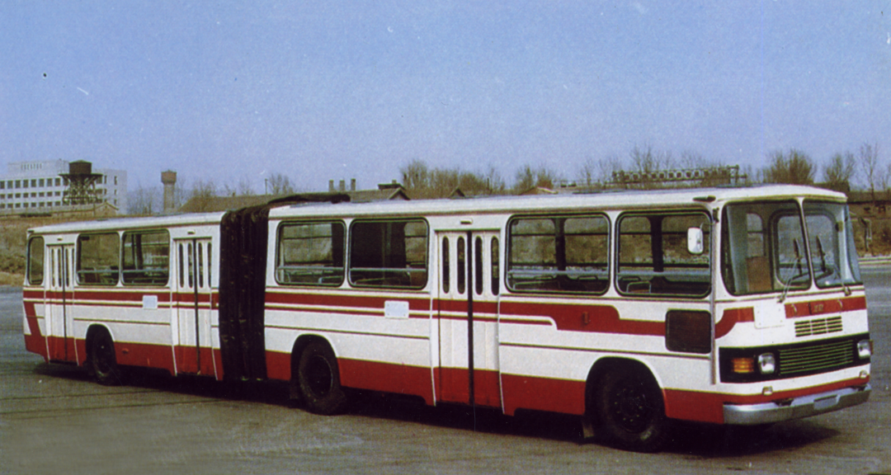
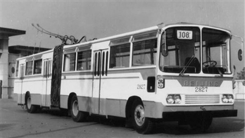

# 【生命•故事】（138）公共汽车

小时候常坐的公共汽车有两路，一个是烧汽油的，19路公共汽车，从我们家门口一直开到江边中华路码头；另一个是拖着两根大辫子的8路电车，从武昌南站，经过我们家门口，一直开到东湖梨园门口。

它们都是两截的铰接式车厢，有三个门，可以装很多人。

大致就是下面这种模样。

两截车厢中间，用一个大转盘铰接起来。那种车子的底盘有许多空隙，能直接看到路面，东西也可能会掉进去。转盘附近尤其如此。

记得有一次，我们去亲戚家玩，回来时他们送了很多西瓜给我们。一大麻袋西瓜，一直拿在手里太沉，坐车时我们就把这一大包西瓜放在了脚下。

当时，就站在两截车厢中间的转盘处，我喜欢站在那个地方，一则通常人少，二则转来转去很好玩。

但是，那天等到下车时我们低头拿麻袋，才发现麻袋已经被转到转盘的缝隙处，袋子里只剩下了两三个西瓜，其它的都不知什么时候从被磨破的麻袋里掉出来，又从公共汽车的缝隙里掉落下去了。

为此，妈妈和我遗憾了好久。

……

记得第一次独自和同学们坐公共汽车是过最后一个六•一儿童节，那天放半天假，而且按国家规定，我们可以免费乘车。于是，我们几个同学一起，坐上 19 路公共汽车，到司门口新华书店去看书买书，玩了一下午。

关于公共汽车，有些小时候的模糊记忆，妈妈抱着我坐在窗边。耐心地指着窗外告诉我这是什么，那是什么……

后来，依然喜欢窗边的座位。对了，那时候大部分座位都是在窗边，除了最后一排，还有少数几个双排座位有靠走道的位置。

我最喜欢的座位，是汽车轮胎后方窗边的座位。因为车轮的缘故，车厢里会有一个巨大的鼓包，个子小小的我，坐在它后面，正好可以把脚踩在上面，对我来说算是最舒服的座位了。

等到读高中，19 路公共汽车变成每天必须乘坐的交通工具。学生有优惠，可以买学生月票。但是为了省钱，有时我们会用各种方法逃票。最常用，简单实用的方法，是练就理直气壮的纯粹汉腔。当售票员过来找你买票时，「月票」两个字一出口，她就转向下一个人去了。毕竟，早上上班的高峰期，一车人太多了！

另一个办法更小众，就是「画」月票。这属于那些心灵手巧的同学的专利，我反正是没搞定过。

售票员更是练就一双火眼金睛，她总是能从各种蛛丝马迹中，发现「月票」两个字背后的颤抖和犹豫，喝令你拿出月票来，拿不出来就一顿羞辱，再让你老老实实补票。

而那些画月票的同学，也有落网的时候。时不时会有某某画月票被抓住，报送到学校去的传闻。

上学放学高峰期的时候，坐公共汽车的人真的太多了。大家也绝不会排队。由于我来回都是起点站上车，是有机会抢到座位的，但是想要真的抢到一个座位，那可是要使出浑身功夫。

每次公共汽车进站，人群就像潮水一样冲过去，然后跟着汽车涌动，这其实是相当危险的。而司机也要和人群斗智斗勇，要么提前停，要么绕开人群过站一点再停，总之不会让你那么准确地判断汽车最终停稳开门的地点。

而我们，则发明了最危险的玩法。

胆大的男孩子，会远远地迎接在汽车进站前的马路上，公共汽车经过时，就一跃而上，扒在公共汽车门边站住。一只手抓住车门缝隙，一只手抓住车门旁边的车窗边缘，脚则踩在车门边上不过3、5厘米宽的空隙处。

这样，等到车停下来一开门，你就可以确保第一个上车了。这基本上可以保证，你一定能抢到座位。通常，等车停稳到时候，车门上已经扒了三四个男孩子。

有时候，会有人失手，于是在大家的惊呼声中，司机停下来车。大家一起去检查这莽撞的孩子有没有受伤，严重不严重。我记得，曾经有发生过掉下去，然后不幸被车轮辗过的惨痛事件。

但是，为了在拥挤的上学、放学路上拥有一个座位，男孩子们还是英勇地继续扒车门，抢座位。甚至，发展到有些人，背两三个书包扒门，上车后用书包帮同学一口气多抢两三个座位的情况。我自己，最多只背过两个书包，成功地抢过三个座位。

现在回想起来，还真危险呢！

<待续>