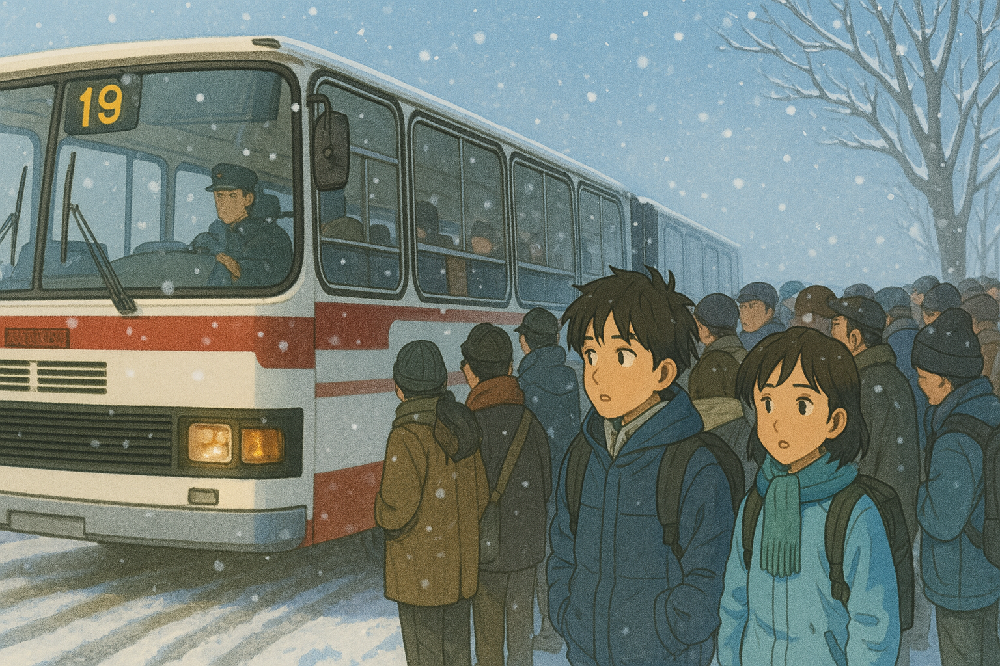

# 【生命•故事】（139）公共汽车（续）

到了冬天，出门上学去等公交车时，天通常都还是黑黢黢的，等到了学校附近那一站路，天就亮了。

那一年冬天，遇上一个大雪天。到车站时，雪还在下着，等啊等啊，车一直没来。车站等车的人越来越多，渐渐变成了黑压压一大群。

天亮了，第一辆公共汽车终于从积满大雪的公路尽头缓缓开了过来，出现在大家的视野里。由于车晚点了太久，车上早已坐满了乘客，并且到了我们这这个终点站，也几乎有一多半人都没有下车——大家都知道，这是早上的第一辆车，于是后面车站的乘客们纷纷都选择坐回头车，以确保能够坐上车。

反正，我应该是挤上车了，不然会迟到。

但是，我还是迟到了，和所有人都一样。

因为，雪天路滑，这辆车开得比平日里慢了不止一倍。而司机知道大家都担心坐不上车，每一站路都尽可能地把人多装一些。

我也惊奇地发现了这辆公共汽车「巨能装」的能力。每到一个车站时，车厢早已经装满了人，但车站黑压压的一群人居然还能再塞进去一半左右。

司机每次都会下车来，努力地帮着把乘客推上车，再使劲儿推门，确保门关好了，再回到驾驶室。很多时候，他甚至还得发动一下汽车，再猛地踩一脚刹车，利用这惯性把大家晃动一下，装得更瓷实一点。最后，车站还是会剩下许多乘客，只好在那里继续翘首期盼着下一辆公共汽车到来的时间。

我站在车厢里，根本不用担心会摔倒。因为就好像沙丁鱼罐头里的小鱼干一样，被挤得紧紧的，和众人贴在一起。然后，晃啊，晃啊，晃啊。

大冬天的，甚至都出了一身汗。

那天到学校，几乎迟到了一、两个小时。

但学校并没有苛责大家，因为除了住校的学生，几乎所有人都一样。

……

不过，即便不是这样的下雪天，早上在上学、上班的高峰期也同样是挤得够呛。

虽然在起点站上车的我，大部分时候都能坐上座位，但一旦到了人多的那几站，我即便是坐在那里，也得一样被挤得歪着脑袋贴在玻璃窗上。这时，正值青春期的我，不免就会充满幻想地期待，紧紧地把自己按在玻璃窗上的身边乘客，不是那满脸胡茬子的大叔；或者凶巴巴胖乎乎的大婶儿；也不是和自己一样的男生；而是一位年轻漂亮的女孩子。

虽然绝大部分时候，幻想只是幻想而已。但偶尔，身边站个女孩子，会让自己这一路拥挤的上学路程，都变成一种微妙的、不可言说的开心之旅。

