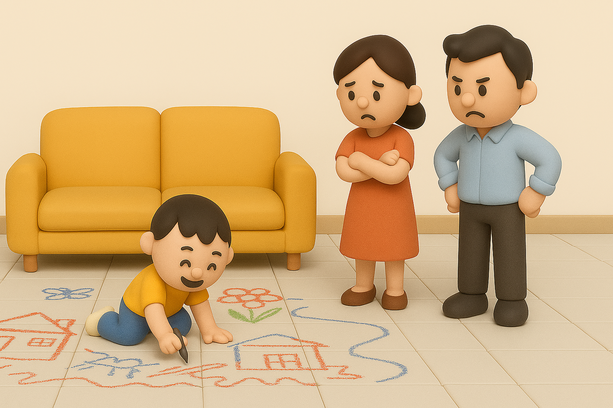

# 【随笔】画画

有个问题憋了很久，最后还是忍不住咨询了一个做设计师的朋友。

我在微信上问她说：

> 有个事儿想咨询咨询你，喜欢画画的女儿二年级快结束了，她现在常常表示不愿意去上学，很大原因是因为不爱做作业，作业做不完。

> 曾经有一阵我们为了让她早睡，会帮她做点作业，现在越来越不愿意催她，不想把她的事扛在我们身上开始有点放任了[捂脸]

> 有一天我和一个老同事聊天，他提到小孩子都是争强好胜的，这方面父母可以帮到他们。

> 于是，那天我问了一下她，有没有哪门功课想要父母帮助的，我想象中是她正面临困扰的语文，数学，为了表示自己公平考虑，我问她说所有的课目中，最想要提高的是哪个…

> 没想到的是，她说是画画，她说班上还是有人画得比她好，而且，上次选画参展，她没有被选上，她觉得自己画得很好（我们也觉得很好），但老师选了别人的画而不是她的，她颇有些失落…

> 所以，我想请教你的是，在画画这件事情上，我们要怎样帮她最好呢？ 是不是到了给她找老师，上培训班的时候呢？ 还担心不好的老师打压了她对于画画的热情（可能瞎操心了）

> 另外，还有其他课业的教育和课业压力该怎么面对，我们倾向于多让她自己练习安排时间自己应对这体制内的教学环境，尽量让我们夫妻俩学着自己接受她的一切现状。说实话，时常还是会困惑(◍•﹏•)，摇摆，也想听听你的看法

早上，收到了她的回复。她说：

> 我觉得我的经验和教训不知道适不适合国内的大环境，首先作业这一点，恩恩他们的很少，而且老师会要求很多作业都在学校完成，所以恩恩已经基本养成先把作业做完的习惯，她有一些课外班的作业，和一些必须做的家务，比如收拾自己的房间，周末负责洗碗，这些就是周日她自己安排时间做，如果做得慢了就完全没有游戏时间了，那她也只能接受这个后果

> 至于画画，我不太赞成去和别人比，恩恩到现在为止也没参加过画画比赛，她的画也不总是会被他们学校的艺术老师选中，因为她不太爱画单幅的画，她喜欢画故事，但她画的什么拿给我看我都由衷赞美而且真的很喜欢，我猜这种真心的来自父母的肯定对她还是有帮助的。

> 以前她上过一个美术课，老师tease她不画鼻子，她回来后很沮丧，说觉得自己不会画画。我就给她看hello Kitty，跟她说这个猫没有嘴但不妨碍这是世界上最有名的猫之一。历史上有多少大师成名前都不被人认可，如果相信别人对自己的判断，就没有大师了。

> 我一直对恩恩说的是这些，我感觉她有被洗脑，知道一些说法只代表别人自己的意见，不代表她的水准和从画画中得到的快乐。后者真的更重要。

> 如果你的孩子真心愿意学习技术，得多试一些老师，以她的感受为准，如果在那个老师那里反而对画画变得畏手畏脚或不开心，就赶紧换。

> 恩恩现在面临申请初中，确实好的私立学校会看的是体育和艺术，作为一个从不参加画画比赛的孩子怎么能在艺术上获得录取的可能，我的做法是按照她的爱好和兴趣，给她量身打造一个能展示她所有能力和兴趣和其他品质的项目，辅助她完成，目前跟升学顾问聊的状况来看，这是一个很独特的方向，她很看好，等我们明年如果成功了我再来跟你分享

……

看了朋友的分享，我不禁感叹，教育孩子真是一件特别难的事情。她说的道理，我特别能认可。可是自问却不太能做到，比如鼓励她在画画上不被别人的评判所影响，即便是去上培训班也有信心能及时从「差」老师的影响下撤退。

……

正在琢磨早上写点什么的时候，早起的大鱼拿着一支记号笔，趴在客厅的地板上，开始在地砖上涂抹起来！

我愤怒地叫他：

> 不许在地上画，拿纸画！

大鱼不理我，继续画下去。

几分钟后，大宝看到了，同样愤怒地吼了他一次。这次，大鱼乖乖地把笔交还给了妈妈。

没想到，这还有一个「小画家」……

这，这，这，该怎么办呢？

