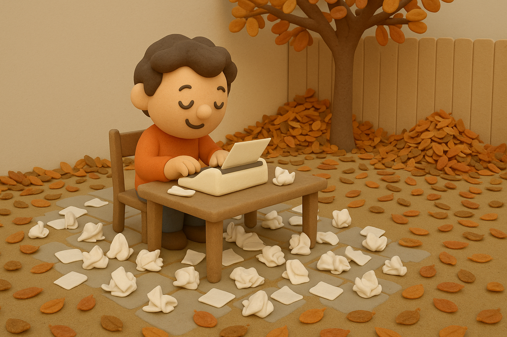

# 【生命⋅修行】似乎缺少真正的刻意练习

那天看到[池卉](https://baike.baidu.com/item/%E8%BF%9F%E5%8D%89/6355263)写到一篇写作教学文章——《[写作练习：气味、触觉和情绪](https://mp.weixin.qq.com/s/SEHV983M2IUcx5Vv4zjabw)》，然后再回头想想、看看自己最近每天早上写下的那些东西，不免有些感慨：

不要说气味、触觉甚至情绪这些「高级」的东西，就是所谓「空洞」的视觉描写，也少得可怜。

而这些基本功，似乎早早就学过。

比如，在《[写出我心](https://book.douban.com/subject/26822680/)》里，作者就建议，在不知道写什么时，就从面墙墙壁的一块儿砖写起。

但真正花功夫练的时间，却似乎每天连一个小时也做不到呢？

虽然，最近每个工作日的清晨，我都会打开电脑，对着屏幕和键盘，努力地输出一些文字。但在这个过程中，几乎都想不起来，要刻意地练习那些最最「基本」的「基本功」。

这就好像，每天早上勉强都到了拳场练拳，却只是随便比划一下，并没有认真地，刻意地，一下又一下地练习划圈。更别说留心自己与师傅动作的差异之处，努力纠正、做到那些之前做不到、做不规范的细节。

然而，我这样对于「练习」，所谓「真正的刻意练习」的期待，是不是也有些太过头了呢？

这一丝疑虑从心底里升起时，也是因为想起来娜塔莉•戈德堡（Natalie Goldberg）在《写出我心》里也一直在强调的一件最基本的事情

> 开始写，立刻开始写。
>
> 就算在纸上写下全世界最烂的垃圾文字也没关系。

然而，再深思一层，就发现这两者并没有什么矛盾。

不停地写、全身心地写；

此时此刻，意识到自己缺少一些基本功的刻意练习，那么就适时地刻意练习。

一个是最底层的信念与坚持；另一个偏上层的招数，虽然是基本的招数，也属于招数。

「眼」、「耳」、「鼻」、「舌」、「身」、「意」——因为语言文字，本身就是「意识」的抽象，思考的工具。

不由自主地飘浮在「意识」层，或许正是偷懒人类的本能。但正如 AI 如果只停留在文字符号上，无法建立真正的智能一样。

人类的思考如果一直远离「六感」，也会变得越来越飘忽不接地气。

所以，还是要多多刻意练习。

虽然，今天还是止步于纯粹的思考。

但只是这么想想，大鱼的嚷嚷、抽油烟机的嗡嗡声，猫尿的气味，笔记本键盘的塑料感、塑料桌布混着汗液的黏稠，棉质 T 恤带着点粗砺的柔软质感，就这么汹涌地涌入了脑海。

此外，定期回头这么反思一下，也是重要的事情。就像曾国藩说的：

> 每月作诗文数首，以验积理之多寡，养气之盛否。

这些练习的文字，正是一面呈现自己日常「积理」、「养气」功夫程度的镜子。