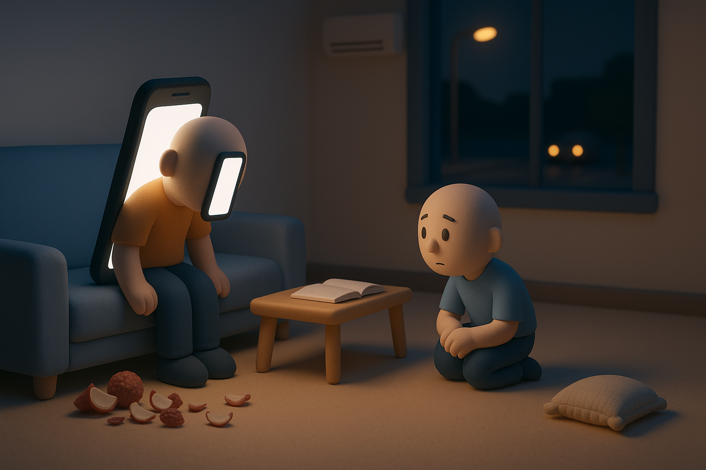
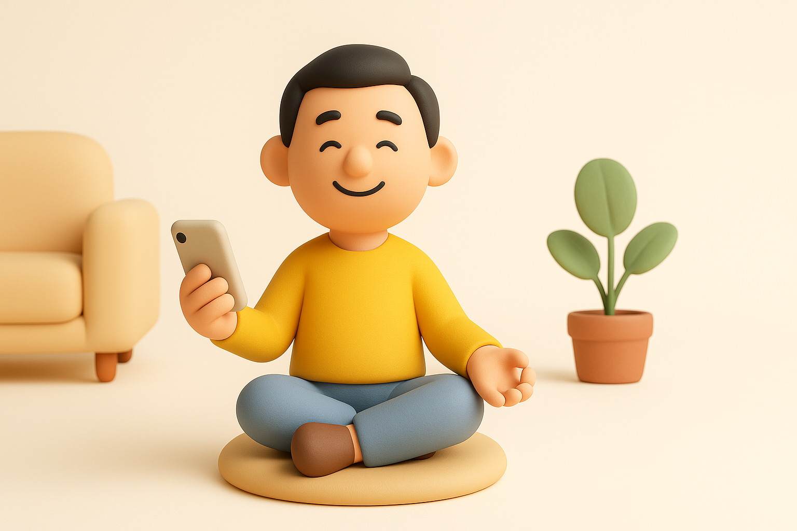

# 【生命⋅修行】从控制手机想开去

大宝带着孩子们回了老家，深圳剩下我一个人。

下班后，我有种什么都不想干的感觉，除了走走路。

一路走回，到家才 8 点钟。一看桌边，居然还有昨天大宝买的荔枝剩下，索性就拿荔枝当晚饭了。

本来想着，就这么早早的洗个澡，再读读书，甚至书也不读，就是打打坐，静下来好好想想，怎么渡过我的这个「假期」。然后早早睡觉……

但因为不知什么原因，拿起了手机，刷啊刷啊，就到了 10 点。可能隔 10 分钟、半小时，就会想着：「不能刷手机了」，但是显然，这些个微弱的「念头」除了积累了些「焦虑」与「自责」之外，没有产生任何实质的效果。

大约去年此时，我独自在万里之外的中东，也是觉得自己被手机所困，还写过一篇《[请AI出招帮我管控佞臣](20240727【随笔】请AI出招帮我管控佞臣.md)》。这快一年下来，最能贯彻到底的，是不把手机拿进卧室，但每天减少使用手机的时间至今还是难以突破 3 小时大关。

我知道，这方面大宝总是能很神奇地做得比较好。上次阿宝说，让她在陪她的时候专心陪她。她就说到做到，几乎再也没有在孩子们在家时刷过视频，看过小说。

于是，晚上和她通话时，我告诉她自己这两个小时的困扰。

她却说，你想刷手机就刷嘛。你忍不住，肯定是内心有这个想法。你想要放松。刷手机让你觉得放松，让你觉得舒服。

只不过，你过去的教育，包括自我教育，告诉你：

* 刷手机很 Low
* 应该做一些更高级的事情，比如打坐、读书

我忍不住想要争辩——刷手机确实让我不舒服，那只是被短期的快感劫持了。

但是，我忍住了。

也许，她说得对啊。我对「手机」那既厌恶又离不开的纠葛中，有多少是来自内心真实的声音，有多少是来自外界灌输的概念呢？

关了灯，独自躺在床上。窗外马路上汽车依旧轰鸣着，室内的空气中弥漫着一丝闷热焦灼。我想了想，还是决定不开空调，转身趴在了大鱼的荞麦壳枕头上。荞麦壳发出沙沙的声音，自动变成了贴合我脑袋的形状。数着呼吸，我想起来[林世儒老师](www.samasati.org)讲过他当年时时刻刻「记得自己」的一段修行经历。

是啊，看不看手机，看多长时间手机只是一个表象。

我有没有觉知自己当下正在做什么，有没有听从自己内心的声音去「做」或者「停」。

这才是「功夫」。

就像打坐时数息一样，心跑开了，就再回来，如此绵绵不绝，可以一直练下去。

有事做，就带着觉知做事。当做则做，当停则停。就好像林世儒老师在教我们「[养生主灵性按摩](https://www.samasati.org/category/%e5%bd%b1%e7%89%87/%e6%8c%89%e6%91%a9%e5%bd%b1%e7%89%87/%e6%8c%89%e6%91%a9%e7%a4%ba%e7%af%84/)」时一再强调的心法——按几次，按多重多轻，你自己觉得到了就到了。

无事做，就内观。观呼吸，观身体感受，怎么样都行。

这些，[阳明先生不是早就教过我嘛](https://chuanxilu.5000yan.com/cjcl/20699.html)：

> 尔那一点良知，是尔自家底准则。尔意念着处，他是便知是，非便知非，更瞒他一些不得。尔只不要欺他，实实落落依着他做去，**善便存，恶便去**，他这里何等稳当快乐！此便是「格物」的真诀、「致知」的实功。若不靠着这些真机，如何去「格物」？我亦近年体贴出来如此分明，初犹疑只依他恐有不足，精细看，无些小欠缺。

对啊，我为什么不趁着这个月独自在家的机会，好好练练这功夫呢？

嗯，就从睡觉开始，带着觉知先好好睡一觉！

