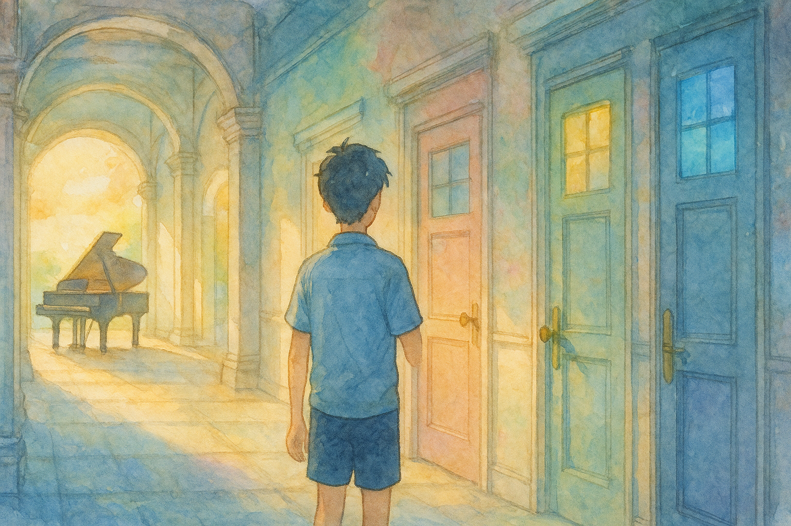

# 【随笔】你想活出怎样的人生

前两天晚上，给自己煮了碗面。刚煮好的面太烫，于是对着热气腾腾的面条，无聊地坐在餐桌边，忍不住打开电脑一直划拉。这才发现宫崎骏 2023 年那部收官之作——《你想活出怎样的人生》——在腾讯视频有得看了。

本来打算看一小段儿的，结果一口气把它看完了。

说实在话，这部电影一点都不好懂。反正已经上映这么久，无所谓剧透一说了，我就随便聊聊自己的感受。

是的，这是宫老爷子极度放飞自我，完全意识流的一部电影。不像以前看过的《龙猫》、《悬崖上的波妞》、《起风了》等等，当年还只是克制地在使用这种手法。

而这部片子，一开始就，然后还持续不断地给我这种感觉——

> 这又是在描述宫老爷子自己的梦境吧？

看完后，合上电脑，一脸懵逼。尤其是，那座金灿灿的墓园上写的四个大字：

> **学我者死！**

让我困惑不已。齐白石的原话，不是「学我者生」吗？

想了想，又打开电脑，打开 Google ，看看别人怎么说这部电影。

终于，哔哩哔哩上 [*拒绝暴力义辉公*](https://space.bilibili.com/368299726?spm_id_from=333.1369.opus.module_author_name.click) 的这篇雄伟长文，[***昭和绘卷：看我者生，学我者死（宫崎骏《你想活出怎样的人生》解析）***](https://www.bilibili.com/opus/917967573570551814)，让我解开了困惑。原来，「学我者死」这里的「我」，指的是曾走过错误道路，给世界带来苦难的，历史上的那个日本啊。

没办法，谁让我不熟悉日本历史，尤其是日本近代史呢。若不是 87 年前的今天所发生的那场[卢沟桥事变](https://baike.baidu.com/item/%E4%B8%83%E4%B8%83%E4%BA%8B%E5%8F%98/13716)，以及更早些时候发生的[九•一八事变](https://baike.baidu.com/item/%E4%B9%9D%C2%B7%E4%B8%80%E5%85%AB%E4%BA%8B%E5%8F%98/2573930) ，像我这样的普通中国人，谁会格外留意到这个特别的邻居呢？

不过，以我的感觉，这部电影不止倾注了作者这一个念想。

或许因为宫老爷子自己也觉得这是自己最后一部电影，他将自己整个一生，一生经历，一生所学，一生所悟全都塞到了这短短两小时的片子里。

每一个片段，每一帧画面，都像全息影像一样，承载了老爷子脑海中轰鸣了一生的信息洪流。就连久石让，也觉得像「天空之城」里那种恢宏的管弦乐章，依旧无法承载这些情感。于是，大多数时候，我们只能听到一架钢琴强力、孤独的敲击着琴键；抑或提琴弓弦突如其来一阵猛烈的轰鸣，如同飓风摧枯拉朽，又瞬间归于寂静。

当我写字时，当我白日梦时，我也时常被那种叠在一起的无数过往画面，那种汹涌而无法言说的信息洪流冲击得晕晕乎乎。但是，那种感觉，那些感悟却难以表达。哪怕只是想抓住一刹那的感受或感悟，等写过500字，才发现，最多也不过剥开了洋葱的第一层而已。

有时候，第一层都剥不开。

真的，越发钦佩那些创作的大师了！

像宫崎骏这样，或者像庄子那样，能够在自己的作品中，层层叠叠地放进去那么多东西。

于是，能够让后人通过他们的作品，一层一层地解开密码，读到一层又一层的故事，最终得以窥见他们曾经亲见的那个「真实世界」的完整一角。

真的学不来！从这个角度上讲，也同样是「学我者死」啊！

那么，我自己，想要活出怎样的人生呢？

你呢？

