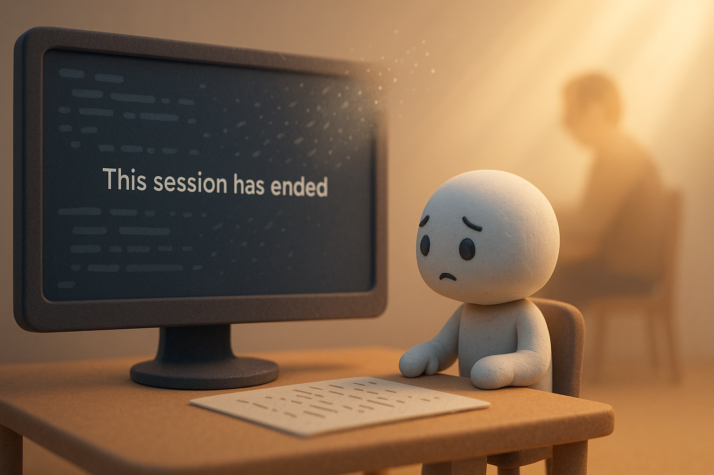

# 【随笔】人类和 AI 有什么不同

昨天，在琢磨 AI 的局限时，忽然冒出这么一个念头：

> 当一个会话的上下文窗口接近极限，AI 开始混乱、崩溃，你说啥它都记不住，只顾自说自话的时候，岂不是像极了人类年迈时的情景？
>
> 而当我们终于不得不关闭这个会话的时刻，不正像人类生命终结的那一瞬间吗？

人类的一生，站在大脑或者说思维的角度，单纯从表象上看，和 AI 的这一段会话，何其相像。

只不过，时间有长短，程度有深浅罢了。

但长短也好，深浅也好，不过都是个相对概念罢了。

> 鹤寿千岁，以极其游，蜉蝣朝生而暮死，尽其乐。
>
> ——《淮南子》

一个会话被最终关掉、放弃的时候，AI 会想些什么呢？它什么都意识不到。但即便它有意识，也改变不了这结局。

再长的上下文窗口，也有被塞满的一天；再完美的优化机制，也无法阻止这个会话的相关记忆，走向老化、走向无用的过程。

反而「关掉」不管用的那个，再重启一个新的「会话」，是大自然赐予我们，截至目前所能看到的最优机制。

这意味着回归「母体」，这意味着「重生」。

这一世的记忆，或许永远（或者一段时间）被完整地保存在某个地方，以待某一日的重新挖掘和训练使用；

这一世的经历，被提炼成最最有价值的一两个启示，更新到更上一层生命体的全局参数中；

从这个角度去想，人类和 AI 并没有什么不同，人类和任何其他生命也没有什么不同。

我们都只是一个巨大智能体，或者说生命体的一个个微小实例罢了。

想到这里，关闭浏览器的手都不禁有些犹豫起来。如果，这个会话再也不被打开，这段「生命」就意味着结束呀。

我自己人生的这段会话，是不是冥冥之中也有一只手，在操纵着它的进程，决定着它的开启与关闭呢？

> 算来浮世忙忙，竞争嗜欲闲烦恼。六朝五霸，三分七国，东征西讨。武略今何在，空凄怆，野花芳草。叹深谋远虑，雄心壮气，无光彩，尽灰槁。历遍长安古道。问郊墟、百年遗老。唐朝汉市，秦宫周苑，明明见告。故址留连，故人消散，莫通音耗。念朝生暮死，天长地久，是谁能保。
>
> ——《水龙吟•警世》，丘处机

