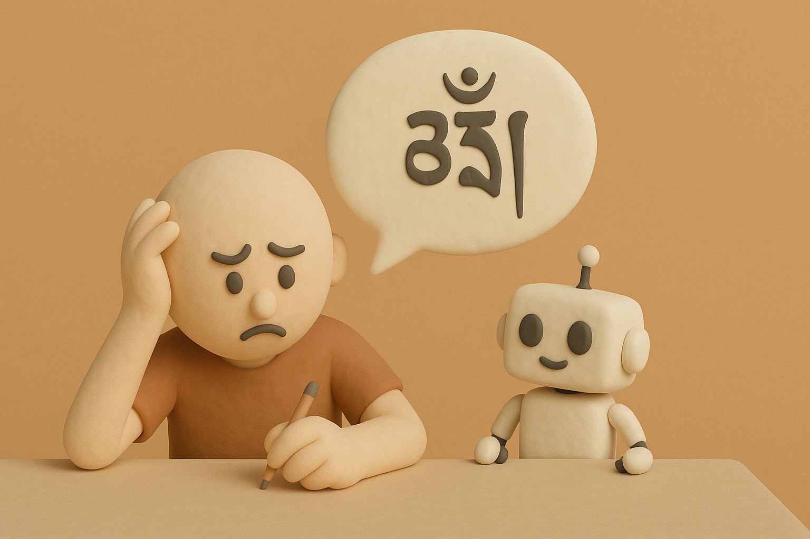

# 【随笔】给自己编咒语

被[和菜头的一篇文章](https://mp.weixin.qq.com/s/g5vOZ4PTa4PikkiIkXOXeA)撺掇，我把[脱不花和李笑来的长谈](https://mp.weixin.qq.com/s/7vca_9MIGjqG03AsfQM3Gw)找来看了一遍。

看完了节目，我才意识到和菜头这篇文章，很可能是受朋友之邀写的软文。不禁默默在心里给菜头又点了一个赞，软文可以写得如此出色，让人不知不觉，服了药，且起了效。🐮！

跟着李笑来老师学习过很长一段时间，这次他又捣鼓出点新东西。

他从近十来年脑科学的研究进展里，又找到了一个奇技淫巧，竟然可以无痛地退出像抽烟这样一种根深蒂固的习惯。我不禁想到，我最近常常被自己负面的评价困扰，岂不也是一种对自己的负向催眠吗？

那些常常在脑海里浮现的声音：

> 我总是在拖延……
>
> 我总是忍不住刷手机……
>
> 我做事情总是很慢……
>
> 我总是无法完成或者没时间去做自己想做的事情……
>
> 我甚至无法及时完成应该完成的工作任务……
>
> 我想做的事情总是变成一团乱麻堆在那里……
>
> 我常常会觉得不开心、不幸福，无力和倦怠……

哇！我为什么不参考李笑来的说法，用一整套正面角度的催眠话语换掉这些我想要摆脱的状态和枷锁呢？

转头，我就找 GPT 深度搜索了一下这种语音催眠背后的脑科学逻辑。当然，这不过 10 分钟到「深度搜索」并不能全面地给我一个理论支撑。

我转而决定先攻克一个点，也就是可衡量的目标。

假如我开始试用这个方法，怎么衡量有没有效果呢？

我再次求助了 GPT，经过一番相当长时间的探讨，那个 One Metric That Matters 终于找到了。

在最后，对比究竟是「带着觉知做事的时间」还是「觉知中完成的事项数量」更值得追踪时，GPT 这么说：

> **两个指标都有价值，但如果只能选一个 —— 请选「事项数量」**
>
> 理由如下：
>
> | 指标                     | 优点                         | 局限                                                      |
> | ------------------------ | ---------------------------- | --------------------------------------------------------- |
> | ✅ 事项数量（觉知中完成） | 明确、可操作，构建自信感强   | 忽略事情大小和持续时间                                    |
> | ✅ 觉知做事的总时间       | 更精准，能反映长期状态沉浸度 | 难估计，容易变主观、焦虑                                  |
> | ❌ 一开始就追踪时间       |                              | 容易让人走偏 → 「我今天不够觉知，怎么办？是不是没变好？」 |

它成功说服了我，并给了我一个确实值得参考的精炼过的修行式追踪系统小结，像下面这样：

| 维度                   | 是否追踪         | 怎么追                   |
| ---------------------- | ---------------- | ------------------------ |
| ✅ 觉知完成的“重要事项” | ✅ 必须           | 每日打卡数量             |
| ✅ 觉知中“拒绝去做”的事 | ✅ 可选           | 简单记录“我为什么不做”   |
| ✅ 觉知中行动的总时间   | ✅ 可作为进阶指标 | 每周估算，不必每日       |
| ❌ 低空掠过任务         | ❌ 不需追踪       | 做时觉知在，做完放下即可 |

接下来，我就开始构思我的「咒语」了。

但直到第二天早上，在骑着自行车上班的路上，当我突发奇想地开始背诵「[As I began to love myself](20240222【生命⋅修行】再读卓别林的诗.md)」时，那忽然变得清明的状态提醒了我。

我的目标是智慧，手段是觉知与行动，那为什么不用那些现成的，已经证明过有力量的话语呢？

比如[卓别林的诗](20181130【随笔】查理⋅卓别林的诗（十）  .md)，甚至，比如心经的咒语和六字大明咒。

我意识到，其实，原来咒语的效果，背后也是有科学道理支撑的。

仔细看，心经最后的密咒是这样。

> 揭谛、揭谛、波罗揭谛、波罗僧揭谛、菩提萨婆诃

*大致意思时，渡过去吧，渡过去吧，渡到智慧的彼岸去吧。和大家渡到智慧的彼岸去吧。成就无上正等正觉吧*。

佛教的咒语讲究不要翻译。这不是几乎具备了李笑来所说最有效的「心灵暗示」最重要的几个因素了吗：

* 不那么熟悉的语言——绕过理性的防御机制
* 行动
* 理由
* 情绪
* 身份认同

再加上，这些古老的咒语在声音节奏和发声频率上，有明显独特而有效的韵律和频率。然后自己反复读诵，效果继续加成。

难怪，历史上许多故事中说，单单只是持咒就大有裨益呢。

[六字大明咒](https://zh.wikipedia.org/zh-tw/%E5%85%AD%E5%AD%97%E7%9C%9F%E8%A8%80#:~:text=baa%20me%20hoom-,%E4%BB%A3%E8%A1%A8%E6%B6%B5%E7%BE%A9%E5%8F%8A%E5%8A%9F%E5%BE%B7,%E8%AB%8B%EF%BC%8C%E6%91%A7%E7%A0%B4%E7%85%A9%E6%83%B1%E3%80%82%E3%80%8D)，其实也一样。

> 其核心含义是观世音菩萨的慈悲与智慧的结晶。咒语为“唵嘛呢叭咪吽”，字面意思是“珍宝在莲花上”，更深层的含义是净化自身烦恼，最终成就佛果。

> **唵(Oṃ)”**:
>
> 象征清净我慢，开启智慧。代表宇宙的起源和本源，也象征着佛的身体、语言和意念。

> **“嘛(Ma)”**:
>
> 象征清净嫉妒，培养慈悲心。代表佛的智慧，也象征着菩萨的慈悲。

> **“呢(Ni)”**:
>
> 象征清净贪欲，提升清净心。代表佛的教法，也象征着菩萨的耐心。

> **叭(Pad)”**:
>
> 象征清净愚痴，开启智慧。代表佛的功德，也象征着菩萨的精进。

> **“咪(Me)”**:
>
> 象征清净悭吝，获得圆满。代表佛的法界，也象征着菩萨的禅定。

> **“吽(Hūṁ)”**:
>
> 象征清净瞋恚，圆满修行成果。代表佛的事业，也象征着菩萨的智慧。

简单来说，就是净化自身的贪、瞋、痴、慢、疑、嫉妒等烦恼，并最终获得解脱，成就佛果。

不过，明白了这些传统咒语的力量。我还是想要额外给给自己找到一段英文，作为一个短版的日常提醒，来配合那首卓别林的长诗——因为，那首诗，和那两段咒语一样，在过去10 年里，给过我很多力量。

还好，有GPT，再一次反复提炼之后，我得到了这段属于自己的咒语：

> I wake to the voice within.
> I act in accord with what I truly know.
> Because I do not betray this clarity.
> And I feel calm, clear, and free.

其实，这就是阳明先生下面那段话的定制英文版呢。

> 尔那一点良知，是尔自家底准则。尔意念着处，他是便知是，非便知非，更瞒他一些不得。尔只不要欺他，实实落落依着他做去，善便存，恶便去，他这里何等稳当快乐！

