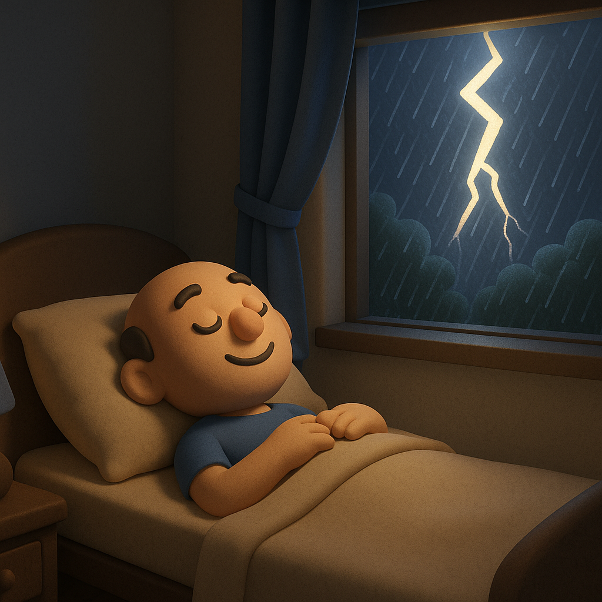

# 【随笔】雨终于下来了

闷了许多天，每天的天气预报都说要有暴雨。

但迎来的，大多只是阴天或者多云，然后随便一动就是一身暴汗。

正当我觉得，天气预报应该把「暴雨警告」改成「暴汗警告」时，雨来了。

还好，此时我已经回到了家里。忽然风从窗户里猛地吹了进来，是那种带着雨水味道的凉风。我赶忙走去窗边，把窗户关小一点，远处已经传来「哗」的雨声。

眨眼之间，声音由远而近，由小变大，窗外就笼罩在一片白茫茫的雨雾中了。

我抢在大雨打湿阳台的衣服之前，把它们全都收了进来。然后关上灯，留着半扇门，躺在床上。

风略大的时候，总有那么一些湿润的水雾，奋力地穿过纱门，扑到身上、脸上，凉丝丝的。我心想：

> 这个晚上，终于不需要空调了。
>
> 这几天热得，连一向讨厌空调的我，都得开着空调才好睡觉。

闪电！

居然开始闪电！

不仅仅是倾盆大雨，刹那间竟然电闪雷鸣起来。

我想起那个在[户外躲避雷击](https://zhuanlan.zhihu.com/p/617846170)的30-30法则，忍不住在下一个闪电之后开始数了起来。

1、2、3、4、5、6、7、8、9、10、11、12……

还没数到13，咔嚓一声，雷就炸开了。这么算起来，雷击的位置距离我不过3、4公里而已。「轰隆隆」的雷声还没隐去，又是一阵闪电。我继续数着，基本上都是10秒左右，最快的时候，雷声距离闪电只不过6、7秒。

就这样，数啊，数啊，我渐渐困了。

不知不觉，竟然进入了梦乡。

或许，这样一个凉爽的夏日雨夜，本就是睡觉的好时光吧……

