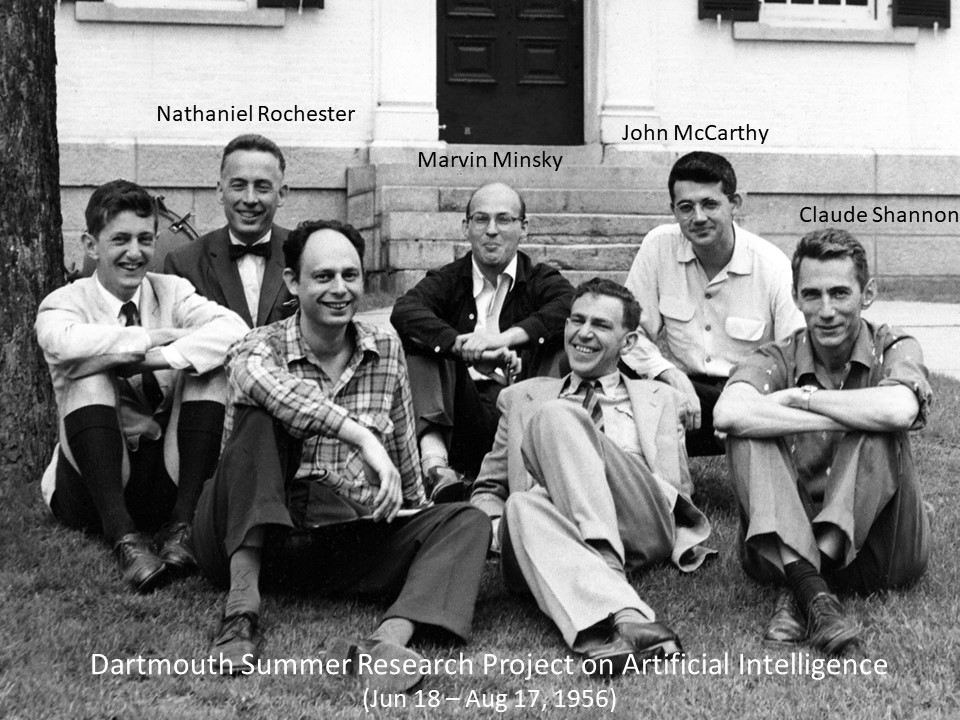
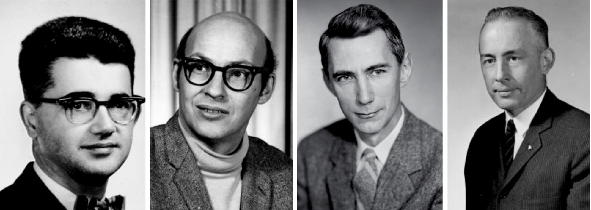
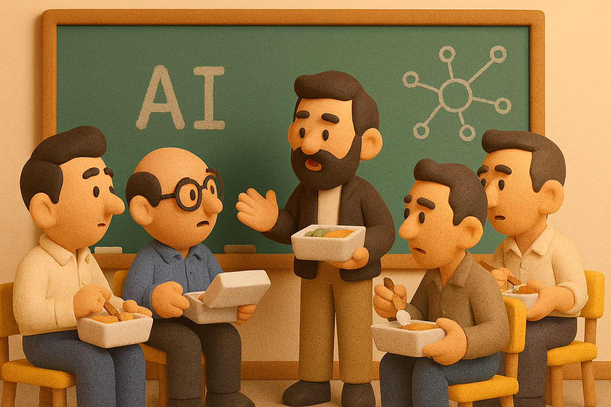
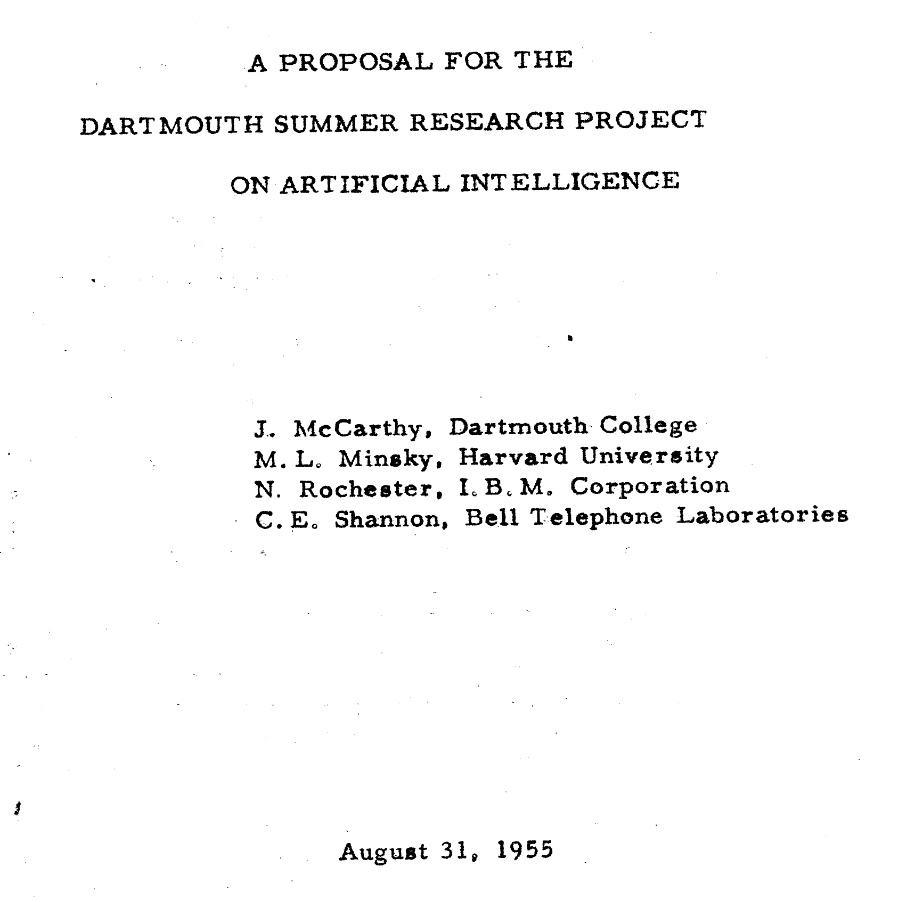

# 【AI】小白话系列——人工智能简史（八）

## 现代人工智能的筑基期

### 现代「AI」 的诞生——达特茅斯研讨会

1955年，也就70年前。在天才的图灵提出了[著名的图灵测试思想实验](20250619【AI】小白话系列——人工智能简史（七）.md)之后 5 年。

那时，我们的国家还在内忧外患之中艰难地、努力地想要在那乱世的终局站稳脚跟——启动代号「02」的核武器研究计划；第一次海陆空协同苦战收回江山岛与大陈岛；从苏联手里收回旅顺；建设黄河大桥，新疆的第一座水电站；并在大自然的雪灾与水灾面前奋力自救……

而同一时间在大洋彼岸的美国，时任达特茅斯学院教授的[John McCarthy](https://en.wikipedia.org/wiki/John_McCarthy_(computer_scientist))，已经开始申请资金，构思组织那个人工智能史上著名的夏季研讨会了。

上面这张照片里（照片来自[科学棋坛一篇关于 AI 序幕的文章](https://sci-story.com/3563/)），除了 John McCarthy，还有[Marvin Minsky](https://en.wikipedia.org/wiki/Marvin_Minsky)，[Nathaniel Rochester](https://en.wikipedia.org/wiki/Nathaniel_Rochester_(computer_scientist))，[Claude Shannon](https://en.wikipedia.org/wiki/Claude_Shannon)都是这场会议的组织者。就是下面这四个人：

他们在组织会议的倡议书里，附上的简历是这样的：

> 贝尔电话实验室数学家 **Claude E. Shannon**（就是我聊[史上最著名的财富公式](20240319【教程】再详细聊聊史上最重要的财富公式（一）.md)里说的那个传奇男神——香农）。香农开发了信息统计理论，将命题演算应用于交换电路，并取得了交换电路的有效综合、学习机的设计、密码学和图灵机理论的成果。他和J.麦卡锡（**J. McCarthy**）合著了一部关于“自动机理论”的数学研究年鉴。

> 哈佛大学数学与神经病学资深研究员 **Marvin L. Minsky**。明斯基建立了一个模拟神经网络学习的机器，并撰写了一篇名为“神经网络和脑模型问题”的普林斯顿大学硕士学位论文，其中包括学习理论和随机神经网络理论的成果。

> 纽约波基普西市IBM公司信息研究经理 **Nathaniel Rochester**。罗切斯特（**Rochester**）关心雷达的开发已有7年时间，而计算机设备的开发已有7年历史。他和另一位工程师共同负责IBM Type 701的设计，IBM Type 701是当今广泛使用的大型自动计算机。他研究出了当今广泛使用的一些自动编程技术，并一直关注如何使机器完成以前可能由人来完成的任务的问题。他还致力于神经网络的仿真，尤其着重于使用计算机测试神经生理学理论。

> 达特茅斯学院数学与物理教授 **约翰·麦卡锡（John McCarthy）**。麦卡锡研究了许多与思维过程的数学性质有关的问题，包括图灵机的理论、计算机的速度、大脑模型与其环境的关系以及机器语言的使用。这项工作的延生出包含在Shannon和McCarthy编辑的即将出版的“年度研究”中。麦卡锡的其他工作一直在微分方程领域。

不知是不是扯虎皮拉大旗，有了香农背书的原因。[原计划10人左右](https://raysolomonoff.com/dartmouth/boxa/dart564props.pdf)，只在暑期周末举行的讨论会。前前后后一共有47人参加。

会议就在**达特茅斯学院**的数学系楼上。

想象一下，一群年轻、意气风发的科学家，在 69 年前那个炎热的暑假里，聚在美国新罕布什尔州**达特茅斯学院**空旷的数学系教学楼里。

日常就是端着午餐饭盒，爬上最顶楼层。然后拿着图表，算法，聚在一起聊天。有时，可能只有三个人到场；有时可能有 7、8 个人。这场讨论，就这样延续了一整个暑假。

在倡议书里，McCarthy 第一次提出人工智能这个词。

一开始，这个词还不太被所有人接受。但渐渐地，人们都接受了这个概念。在会上，甚至许多人激进的相信：

> 只需要两三年，就能造出像人一样智能的机器。

在会上，Allen Newell & Herbert Simon 带来了他们刚刚完成的**Logic Theorist**，它能自动证明数学定理，是世界第一个有目的的“推理型 AI 程序”。他们展示了程序是如何在《Principia Mathematica》中重新证明38条定理，甚至得到一些比原作者更短的证明。

Minsky 回忆说，在那个夏天，当他在会议上阅读《欧几里得》时，突然发现可以教机器证明几何定理。他瞬间激动得好几个小时不自知，感觉思路完全被「AI」点燃。

后来，这场会议成为了人们公认的现代人工智能成立的「宪法大会」：**它铸就了AI的姓名、价值、研究流派与方法论**。

Marvin Minsky 和 John McCarthy 后来成为了 MIT AI 实验室的奠基人。而参会的其他人，也大多成为了后来几十年 AI 研究各个领域的领军人物。

现代人工智能的历史，就此拉开序幕。

<待续>

----

以上参考 GPT 帮我整理的历史故事，以及以下文章内容和照片，尤其是博客园的那篇长文，有更多详细的历史，值得一读。

https://zh.wikipedia.org/wiki/%E4%BA%BA%E5%B7%A5%E6%99%BA%E8%83%BD%E5%8F%B2

https://en.wikipedia.org/wiki/Dartmouth_workshop

https://www.cnblogs.com/tsingke/p/14265052.html

https://min.news/en/tech/c4f93f274f1cee02c23f04958d1d96e7.html

https://sci-story.com/3563/