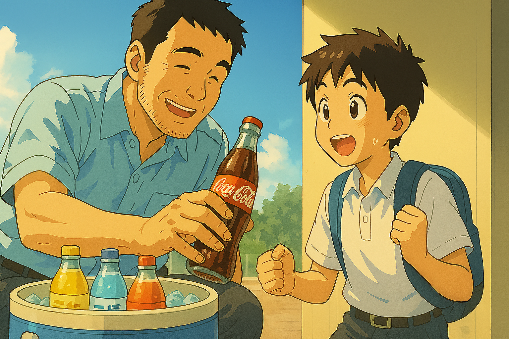

# 【生命•故事】（140）汽水与可口可乐

我发现，时至今日，有两样东西，依然时不时地让我嘴馋。

一个是冰淇淋，另一个则是可口可乐。

今天想说的是可口可乐。

之前独自一人在中东的时候，每隔一段时间就会忍不住跑去超市，花上 8.9 迪纳姆，给自己买一大瓶可口可乐。

前两个星期的周末，在有一天疯狂运动一阵子之后，我就忍不住嘴馋，央求大宝给我买了一大瓶，结果 2 升装的可乐，不到 36 小时就被我喝完了。

没曾想今晚，这奇怪的馋虫又被勾上来了。

为什么会这样呢？其实如果盲品的话，我大概率分不出百事可乐和可口可乐的区别。当然，无糖和原味的区别，我还是能分辨的。

但是，如果这两个牌子明摆在我面前让我做选择，我大概率会选择的，还是可口可乐。

也许，是因为小时候？

记得，最开始，我们喝的汽水，是装在和白酒瓶差不多大小的玻璃瓶中，似乎没有牌子，就是本地汽水厂生产的。我记得，大家认可的，最正宗的汽水是二厂生产的。

最初是两种口味，柠檬味是白色透明的，香蕉味是绿色的。其实还有一种是父母在工厂会发的盐汽水，并不好喝。所以，我们这些小孩子能买到，常喝的还是那两种。

回想那汽水的味道，应该就是糖精加香精兑成的。但依然是我们夏天消暑的必备，在武汉那样的火炉城市，感觉一切都在冒着火的三伏天。一瓶冰镇汽水咕嘟咕嘟灌进肚子，再打两个嗝，暑气立马就消减了三分。

一瓶汽水一毛五分钱，后来涨价到了两毛。然后还出了一种橘子汽水，可能是真的加了橘子汁，味道明显要好很多，这个要三毛钱，贵了不少。

后来，家里开了一个小商铺。到了最热的夏天，妈妈会从工厂的冰库里取回巨大的一块冰块，放在一个大保温桶里，运会爸爸的商店。然后把各种汽水，还有啤酒一起放在桶里，摆在商店门口，再挂上一块硬纸板写的牌子——「冰镇汽水、冰镇啤酒」。

然后最热的时候，我会时不时地跑到商店里去，找爸爸讨汽水喝。大部份时候，他会给我拿最便宜的那种。有时候，也会应我要求，给我橘子汽水。

后来，在爸爸的商店里，出现了一种更稀奇的饮料——可乐。

这是一种奇怪的，带着曲线的小小玻璃瓶。感觉我们平常喝的汽水，份量上一瓶能顶这两瓶。可这这小瓶子，却得卖五毛钱一瓶，一瓶的价钱就可以买两瓶汽水。

有一天，我跑去爸爸的商店，找他要汽水喝。他却忽然从冰桶里，摸出一瓶可乐来。

> 要不你尝尝这个？

我开心坏了，我可从来没喝这么贵的汽水啊。

刚从冰桶里拿出的可乐，还在湿漉漉地滴答着冰水。爸爸另一只手拿过开瓶器，熟练地帮我打开瓶盖，还破天荒地放进去一根吸管，递给我。

我接过可乐瓶，瓶身也是冰凉凉的，但似乎没有其他汽水瓶手感那么冰。或许是因为瓶子小？不过，对于我而言，这小小的瓶子比那大汽水瓶更好拿。我低下头，小心地用吸管喝了一口，这褐色的奇怪液体，冰凉凉的，和汽水一样凉爽，但是有着完全不一样的奇怪香甜味。

爸爸好奇地看着我，似乎咽了一下口水，问：

> 这个好喝吗？

我想了想，点点头，说：

> 好喝。你尝尝？

我把可乐瓶递给爸爸。

爸爸啜了一小口，像品酒一样，眯缝着眼睛，似乎仔细品味了好一会儿。然后把可乐递回给我，说：

> 嗯，好喝！
>
> 五毛钱一瓶呢！

那么一个小小瓶，真不经喝。没两口，就喝完了。但汽儿真是足，还没全喝完，就打出嗝来，舒服极了！

……

再后来，喝可乐的次数慢慢多了起来。

再后来，听说武汉饮料二厂被可口可乐收购了。

再后来，随着新世纪到来，二厂也不再生产我们原来喝过的那些汽水了。

但在回忆里，那大玻璃瓶装的橘子、香蕉、柠檬味的二厂汽水，一直是童年夏日解暑的美味主力。

而那小小玻璃瓶里的可口可乐，则始终带着点外来的神秘奢侈品光环。

……

为了等我嘴馋时叫的可口可乐外卖送到，我打开电脑敲这篇文章。

本以为随手写点回忆中的故事，然后关上电脑，喝上一杯可口就可以去睡觉，结果没曾想，时钟嗖地就转过了午夜12点……

唉，有些闸门一旦打开，根本就关不住！