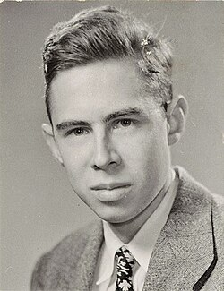
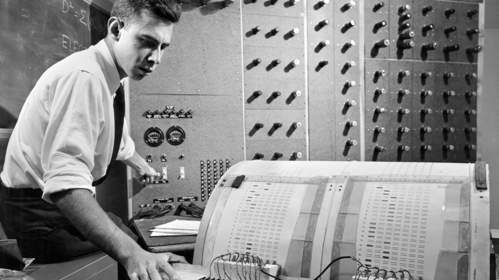
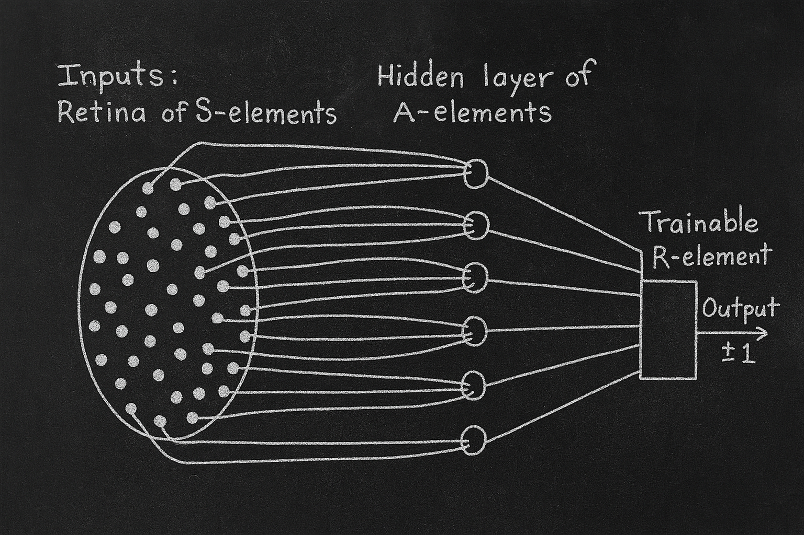
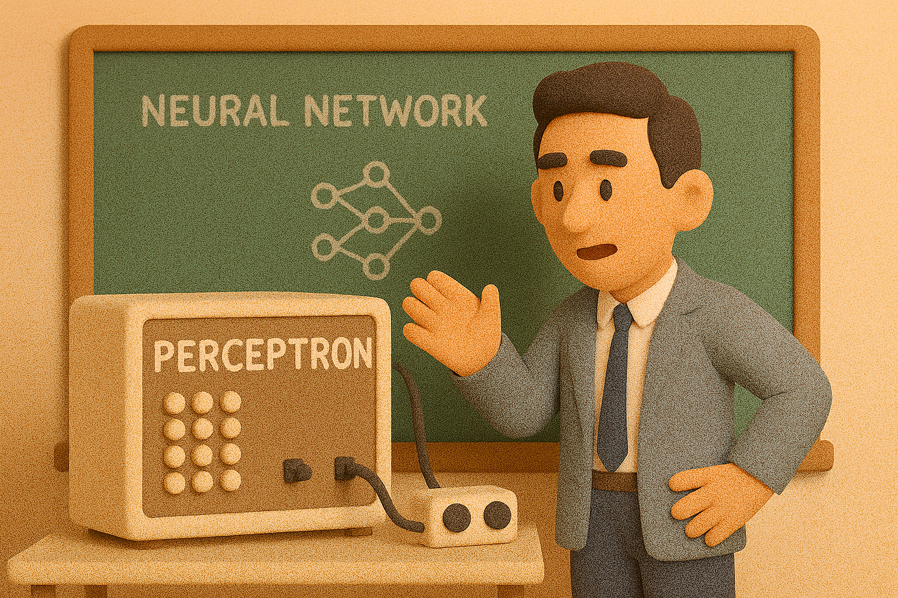

# 【AI】小白话系列——人工智能简史（九）

## 现代人工智能的筑基期

### [1956年：现代「AI」 的诞生——达特茅斯研讨会](20250712【AI】小白话系列——人工智能简史（八）.md)

聊过了大家公认的 AI 立宪会议，接下来我们聊聊下一个里程碑事件——

### 1958年：跑在机器上的神经网络——Frank Rosenblatt 与感知机（Perceptron）

说这事儿之前，补一段我从[《人工智能历史回眸：达特茅斯会议》](https://www.cnblogs.com/tsingke/p/14265052.html)这篇文章看到的重要小插曲。

> 1955年，美国西部计算机联合大会(Western Joint Computer Conference)在洛杉矶召开，会中还套了个小会：“学习机讨论会”(Session on Learning Machine)。

> 讨论会的参加者中有两个人参加了第二年的达特茅斯会议，他们是塞弗里奇(Oliver Selfridge)和纽厄尔 (Allen Newell)，塞弗里奇发表了一篇模式识别的文章，而纽厄尔则探讨了计算机下棋，他们分别代表两派观点。

> 讨论会的主持人是神经网络的鼻祖之一皮茨(Pitts)（热爱数学，很聪明的年轻人），他最后总结时说：“**(一派人)企图模拟神经系统，而纽厄尔则企图模拟心智(mind)……但殊途同归。**”

这句总结，预言般地揭示了之后贯穿了人工智能 AI 领域几十年间两个主要派别的竞争。

GPT 帮我制作了下面这张对比表格，大家可以一目了然地弄明白这两派的主要区别。

| 视角     | Selfridge（神经模仿派）           | Newell（符号模仿派）                                         |
| -------- | --------------------------------- | ------------------------------------------------------------ |
| 哲学基础 | 模仿人脑的神经结构（感觉与识别）  | 模仿人类思维结构（逻辑、规划）                               |
| 技术方法 | 早期神经网络、Pandemonium体系架构 | 早期符号AI程序、之后的 Logic Theorist                        |
| 代表作品 | 1955 早期模式识别演示             | “Chess Machine: dealing with complex task by adaptation”方案([Wikipedia](https://en.wikipedia.org/wiki/Logic_Theorist), [SciSpace](https://scispace.com/pdf/in-pursuit-of-mind-the-research-of-allen-newell-3qzw4jridj.pdf)) |
| 实质区别 | 功能从底层信号层面起步            | 从高层抽象与推理层设计                                       |

之前提到过，在达特茅斯会议上给大家展示的Logic Theorist 就属于符号模仿派。

接下来我们要说的事情，属于另一派。

#### 谁是 Frank Rosenblatt

[Frank Rosenblatt](https://en.wikipedia.org/wiki/Frank_Rosenblatt)，1928年出生，美国心理学家，1946年就读布朗士克（Bronx High School），1950年获康奈尔大学学士，1956年获博士学位。

1957年，他加入了康奈尔航空实验室（Cornell Aeronautical Laboratory），担任研究心理学家。随后主持“认知系统研究计划”（Cognitive Systems Research Program），探索机器如何通过自我学习“看”和“认知”外界。

#### 感知机（Perceptron）的面世

受 McCulloch & Pitts 的人工神经元、赫布学习理论启发，Rosenblatt 构思出“感知机”模型。

1958年7月，他使用 IBM 704 大型机运行感知机算法：通过输入打孔卡（带左标志 / 右标志），训练 50 次后，机器能自动区分图案。

你可以想象一下，它就像一个有眼睛，有脑子，有嘴巴的小机器人，把它的原理图简单画出来就像下面这样：

最左边的这部分是输入层，叫做 “Retina of S-elements”，就像眼睛里的视网膜一样：

* 它有很多小圆点（S-elements），每个点负责看一个像素（比如黑白图案的一部分）。
* 比如：给它一张黑白卡片，每个点就能感知这个点是黑是白。

中间这部分，叫 A-elements，是感知机的“中间神经元”。

* 它们不直接看图，而是从输入层接收信息。

* 比如第一个神经元可能只接收图上“左上角”的一堆像素，第二个神经元接收“右下角”的一些像素……

* 每个神经元都会尝试从这些像素中找出“有没有某种模式”。

最右边这部分，叫做 R-element，它会根据中间神经元给的信息，输出一个最终结果。比如：

* +1 表示 「Yes」（这个图案是 A）
* -1 表示「No」（这个图案不是 A）

那么，它怎么学习的呢？就像小孩子学习认字一样，它也同样需要训练。训练的过程是这样的：

1. **看一个图**（比如一张黑白图，代表“A”）
2. **它尝试猜一下** 是不是“A”
3. 如果猜对了 → 很棒！继续下一张
4. 如果猜错了 → 调整“每根线的粗细”（也就是“权重”）。

这个过程会一遍又一遍地重复。

就好像小孩子学习认字时，刚开始根本不知道「A」是个什么东西。但是，在老师、父母一遍又一遍地教，一遍又一遍地纠正的过程中，小孩子大脑中关于这个字符模式识别的神经元链接，被一遍又一遍地强化。最后就学会了认这个字。

经过了50次训练，它就学会了认卡片上的某个字母。

随后，Rosenblatt 在美海军研究办公室主办的新闻发布会上进行了展示，媒体一时喧哗，大肆报道：

* 《纽约时报》写了头条文章[“Psychologist Shows Embryo of Computer Designed to Read and Grow Wiser”](https://www.cs.cornell.edu/courses/cs4780/2023fa/slides/Perceptron_no_animation.pdf)；
* [《New Yorker》则称这是“电子大脑的最严肃对手”](https://visionarymarketing.com/en/2024/04/22/perceptron-a-history-of-neural-networks/)。

于是，Rosenblatt 团队得到海军研究资助，开发了名为“Mark I Perceptron”的硬件机型：配有20×20光电感应阵列（S单元）、512个关联单元、多个输出单元，并用马达和电位器调整权重；1960年6月正式公开展示。

1962年，他出版专著《[Principles of Neurodynamics](https://en.wikipedia.org/wiki/Perceptrons_(book))》，对感知机理论、三层结构与收敛性定理作详细阐述。

可以说，这是神经网络学派非常重要的一个早期里程碑：

* 它在计算机上实现了一个最简单的神经网络模型。
* 它第一次通过「调整权重」，实现了有「错误反馈」的训练和学习。
* 后来的 Mark I 则更进一步地在工程上，实现了神经网络学习算法的软硬件结合。

**Rosenblatt**是首位将“神经网络”和实际机器结合，并用硬件演示“机器可以学习”的科学家。

**Mark I 感知机**是第一台可以通过训练改变行为的机器，是神经网络走向现实的重要历史节点。并且，它开启了对人工神经网络的硬件探索。

当然，由于当时理论与硬件能力的局限，神经网络这一派，到了60年代后期，就慢慢陷入了低潮。这其中的故事，我们以后再讲。

后来，60年后，[Cornell Chronicle 在2019年写了篇文章纪念这件重要的事情](https://news.cornell.edu/stories/2019/09/professors-perceptron-paved-way-ai-60-years-too-soon)。

<待续>
