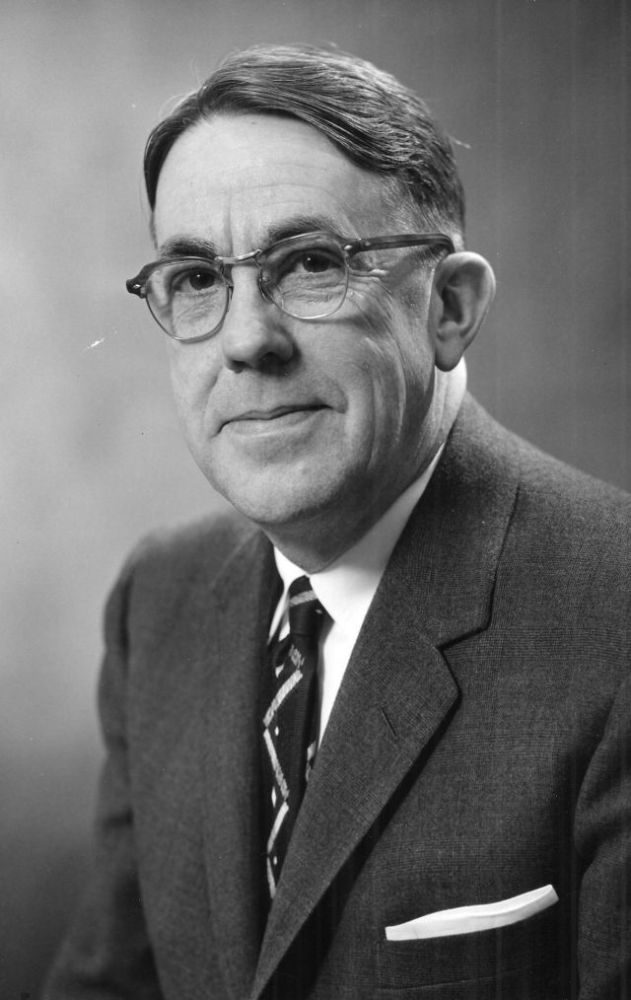
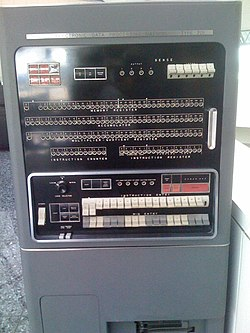
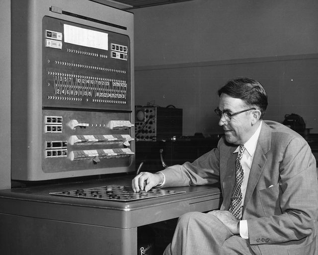
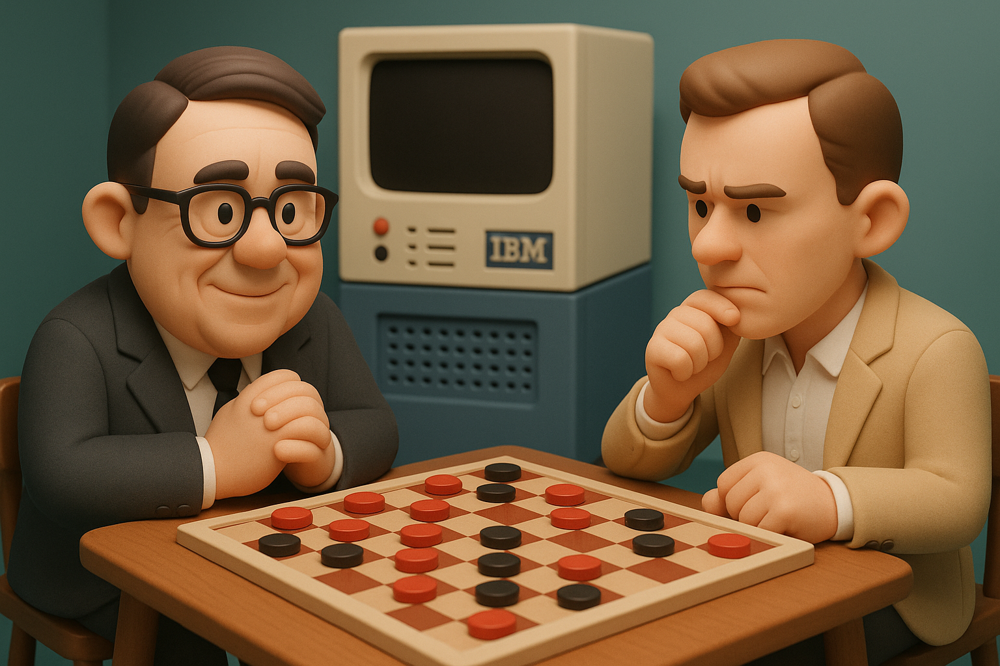

# 【AI】小白话系列——人工智能简史（十）

## 现代人工智能的筑基期

* [1956年：现代「AI」 的诞生——达特茅斯研讨会](20250712【AI】小白话系列——人工智能简史（八）.md)

* [1958年：跑在机器上的神经网络——Frank Rosenblatt 与感知机（Perceptron）](20250714【AI】小白话系列——人工智能简史（九）.md)

### 1962年：机器学习的开端——Arthur Samuel和战胜人类冠军的跳棋程序

#### [Arthur Lee Samuel](https://en.wikipedia.org/wiki/Arthur_Samuel_%28computer_scientist%29) （[亚瑟·李·塞谬尔](https://zh.wikipedia.org/wiki/%E4%BA%9E%E7%91%9F%C2%B7%E6%9D%8E%C2%B7%E5%A1%9E%E8%AC%AC%E7%88%BE)）

Samuel 出生于 1901 年。是美国计算机科学的先驱。他从 MIT 毕业，然后贝尔实验室工作过，后来到了蓝色巨人—— IBM 旗下 Poughkeepsie 实验室。

在 IBM ，他最早实现了著名的 Hash 表及其算法，还有我们接下来要详细聊的跳棋程序。

他也是一个著名地能够深入浅出写作的作者。退休后他到了斯坦福，和现代计算机科学界的传奇人物[高德纳](https://zh.wikipedia.org/wiki/%E9%AB%98%E5%BE%B7%E7%B4%8D)一起，发展[Tex](https://zh.wikipedia.org/wiki/TeX) 计划。一直到 88 岁，老人家还在自己写程序。

#### 战胜人类冠军的跳棋程序

早在1952年，Samuel 在英国的曼彻斯特看到[Christopher Strachey](https://en.wikipedia.org/wiki/Christopher_Strachey)在[Ferranti Mark 1 计算机](https://en.wikipedia.org/wiki/Ferranti_Mark_1)上演示[跳棋程序](https://en.wikipedia.org/wiki/Checkers_%281952_video_game%29)，就想着自己可以在 [IBM 701](https://en.wikipedia.org/wiki/IBM_701) 上也搞一个类似的玩意儿。

于是乎，说干就干。到了 1956 年，他的程序就写出来了，并且在电视上直播演示，带动 IBM 的股票当时就大涨15%

在这个小小的跳棋程序里，Samuel 使用了许多引领时代的技术与概念，是现代机器学习、强化学习技术的开端。即便是在如今的人工智能程序与算法中，我们依然能看到它们的影子：

* **Alpha-beta剪枝算法**：由于当时的计算机内存和能力限制，这样程序可以不用遍历所有可能性，只对重要路径深入搜索，省时高效。显然，因为计算机面临的问题越来越难，相对于可能性来说，计算机的资源永远是不够的。因此，时至今日，这个办法依然重要而有效。
* **评估函数（Scoring Function）**：为棋盘状态打分（如棋子数量、后备程度等）；程序每次按“极小极大策略”选择走法。这意味着，可以用逻辑表达棋盘的状态，实现了从感知到认知到映射。
* **自我学习机制**
  * **Rote Learning**：记录遇到的棋局及最终胜败结果，下次再遇相同局面时直接回调记忆；
  * **自我对弈 + 专家对弈优化机制**：程序不仅仅通过和人类的对弈学习，复盘著名的高水平棋谱，他还可以通过和自己下棋来持续学习、优化算法。
* **「[机器学习](https://en.wikipedia.org/wiki/Machine_learning)」概念**：后来（1959年），他首创了机器学习这个词，算法自学从此有了官方术语，奠定了现代机器学习领域的基础。

简单说来，就是这么几步：

1. 教会程序跳棋的规则：吃掉或堵住对方所有棋子就算赢。
2. 开始自己乱下，输了就记住这种下法不好。
3. 还可以拿出人类著名棋谱进行复盘。
4. 持续重复2～3步。

就这样持续训练着，到了 1962 年，Samuel 开发的这个跳棋程序，终于战胜了当时的美国冠军 Robert Nealey。

这是人工智能历史上，第一次在某个细分领域，战胜人类冠军！

#### 跨越两种流派的桥梁

我们前面提到过，当时的人工智能已经慢慢形成了两个流派——神经模仿和符号模仿。

符号模仿派，本质上就是教机器做「逻辑推理」，用明确的规则来思考。

而 Samuel 的跳棋程序，一方面使用了逻辑评估，但本质上更贴近「自学习」。它使用启发式搜索与记忆机制，体现的是「经验驱动的进步」。

这更接近**神经网络派精神**的一角，但又并非严格的神经模型，而是更贴近现代的「强化学习」这个领域。

严格来说，Samuel 是一个务实主义者，他既要逻辑结构清晰的规则与推理，又强调经验学习，是跨越两派思想的桥梁。

然而，人类并不是那么好超越的。AI 下一次战胜人类冠军，是很多年以后的事情了。

那么在这期间，到底发生了什么呢？

<待续>

本章参考了 GPT 帮我汇总的内容，及以下文章。

----

https://history.computer.org/pioneers/samuel.html

https://webdocs.cs.ualberta.ca/~chinook/project/legacy.html

https://www.chessprogramming.org/Arthur_Samuel

https://www.ibm.com/history/early-games