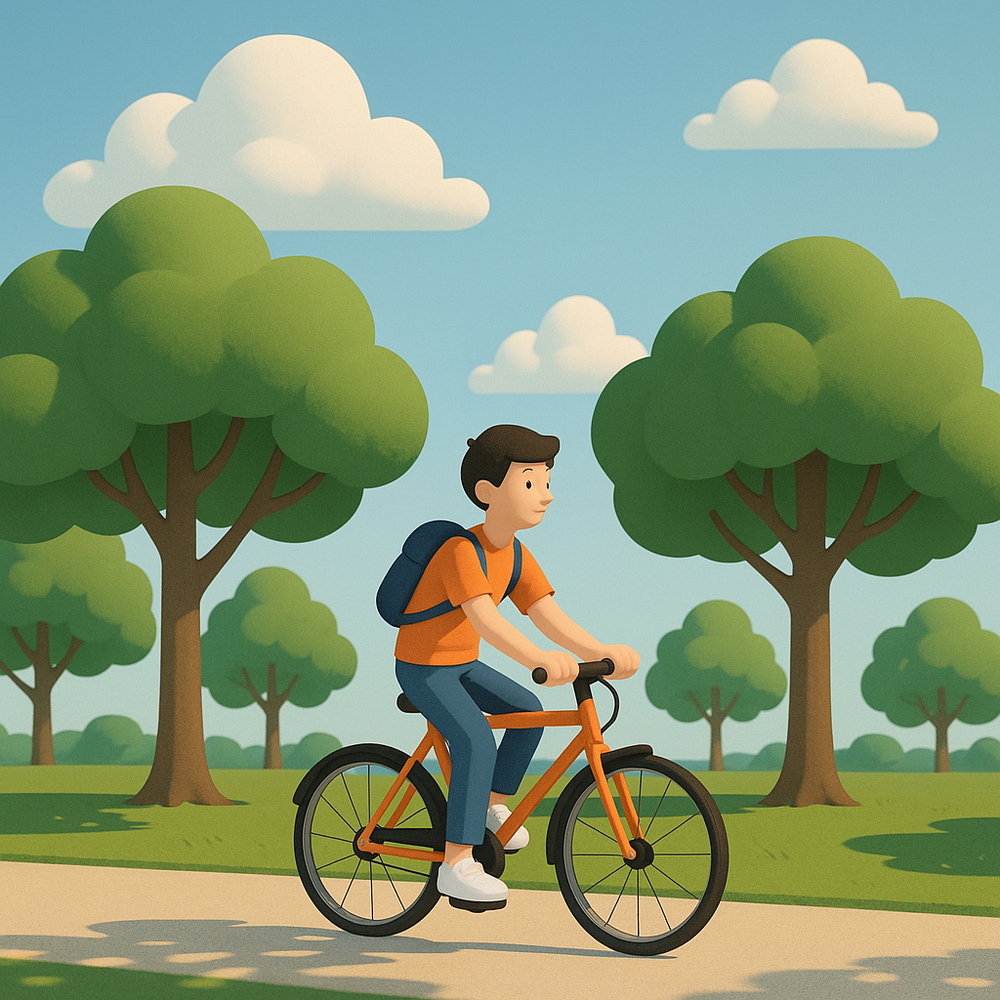

# 【随笔】骑车

周末约了和朋友见面聊天，我打开地图看了看路线，不到二十公里，坐地铁是一个小时的路程。

不如骑自行车？

这么想着，就这么干了。

前一天还是暴雨天气，到了出门的时候已经是艳阳高照。不过，偶尔会有些南方特有的巨大的云朵，从海面升起来，遮住太阳，带来一阵子的阴凉。

不知从什么时候起，深圳变得越来越适合骑自行车了。

我选了一条从中心河边绕道深圳湾运动公园，再顺着滨海绿道一路骑行到大沙河，再从大沙河边一路骑到西丽的路线。

夏天，道旁的大树枝叶繁茂，骑在这样的林荫大道是我最喜欢的感觉。我出生长大的江城、尤其是武昌，来深圳前十多年一直居住的华侨城，都有这样的林荫大道。

让斑驳的树影撒在身上，自己则撒了欢地猛踩着自行车从光影中一路飞驰，风迎面而来，吹得衣服呼啦啦作响；树顶高处的蝉则起劲儿地「知～知～～知～～～」着，声音延绵不绝；一阵青草的气味，一阵清爽的栀子花香，各种树木各种不同的味道迅速地钻入鼻孔，一种又一种，让你来不及分辨……

这让你有一种恍惚的，穿行在时光隧道的感觉。那被你迅速超过，使劲踩着三轮童车的小男孩是你；那背着书包，叮铃铃风驰电掣从你身边呼啸而过的少年是你；那小跑着跟在刚刚学骑车的女孩自行车后，扶着她，帮她保持平衡的中年人还是你；那一头白发，却稳稳、悠悠地沿着路边缓慢骑行的也是你；甚至那个坐在路边浓荫处的木凳上，擦着汗，摇着扇子，看着来来往往路人的老人家，依旧是你……

到了海边，风景却大不相同。你似乎一下子就回到了现在，回到了这个日新月异的都市。

这里，是最近常常来的地方。但每个季节，每一天，甚至云朵飘去飘来的每一个时刻，都有着不同颜色的天空，不同颜色的海水，空气中弥漫着不同的气味，抬眼望去，都是不一样的风景。

不过，虽然桥上车来车往，跨海大桥却一直稳稳的立在那里，任由不同时刻的光影，把自己染成不同的颜色。

……

骑车出行的感觉真好，看来以后二十公里以内的地方，都可以考虑自行车出行了。