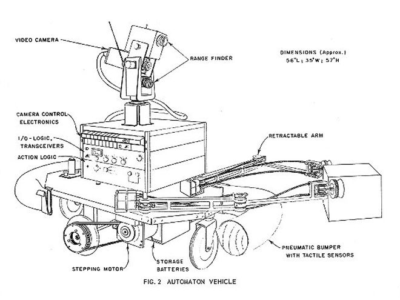
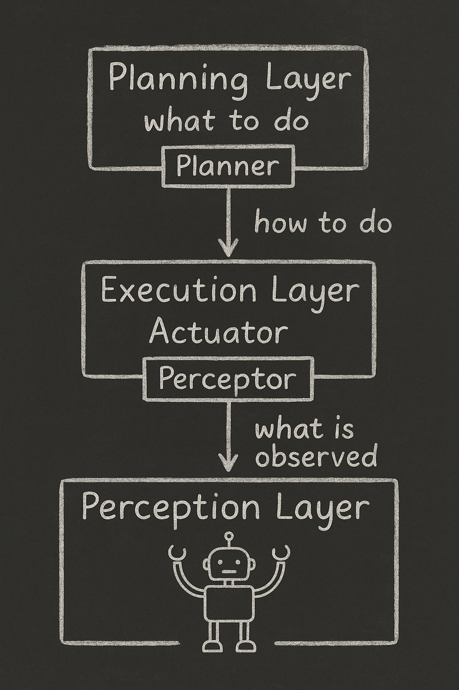
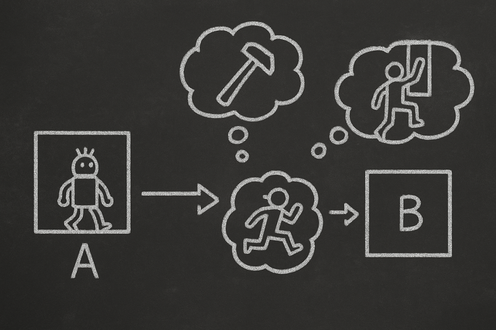
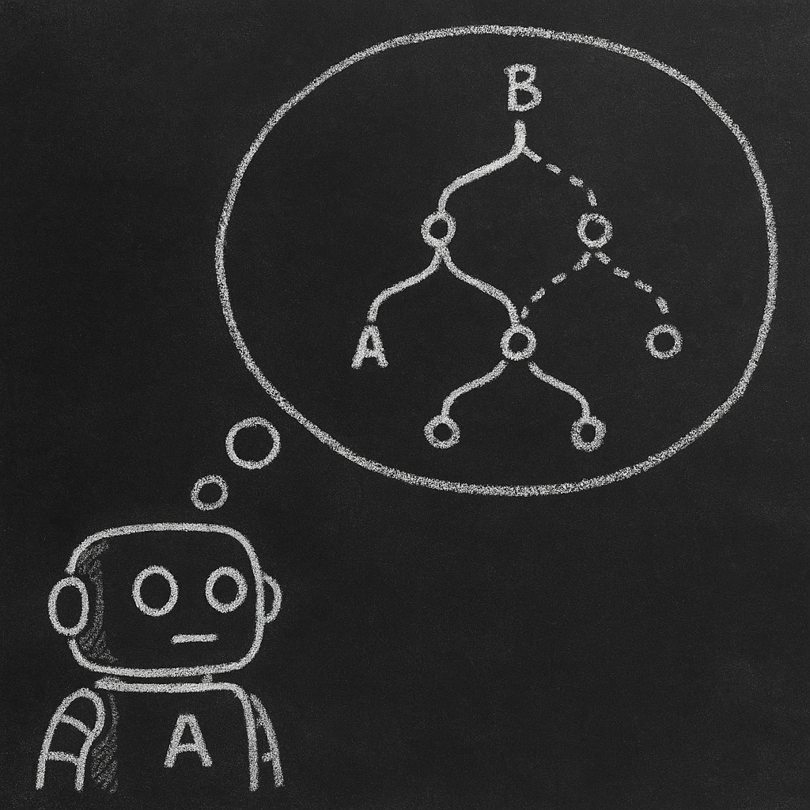

# 【AI】小白话系列——人工智能简史（十一）

## 现代人工智能的筑基期

* [1956年：现代「AI」 的诞生——达特茅斯研讨会](20250712【AI】小白话系列——人工智能简史（八）.md)

* [1958年：跑在机器上的神经网络——Frank Rosenblatt 与感知机（Perceptron）](20250714【AI】小白话系列——人工智能简史（九）.md)

* [1962年：机器学习的开端——Arthur Samuel和战胜人类冠军的跳棋程序](20250715 【AI】小白话系列——人工智能简史（十）.md)

### 1966年：机器人元年——Shakey，首台通用移动智能机器人

1963年，[Charles Rosen](https://en.wikipedia.org/wiki/Charles_Rosen) 向国防高级研究计划署（DARPA）提出自己的梦想：「[制造能像人一样行动思考的机器人」。

1966年，随着拿到 DARPA 批复的 75 万美金赞助，Charels Rosen带着 [Nils Nilsson](https://en.wikipedia.org/wiki/Nils_Nilsson_(researcher))、[Peter Hart](https://en.wikipedia.org/wiki/Peter_E._Hart) 等在美国斯坦福研究院（SRI International）人工智能中心开始 [Shakey](https://en.wikipedia.org/wiki/Shakey_the_robot) 的研发。

这是 Shakey 的早期设计图纸，我们可以看到，它包括了推车底盘 + 摄像头 + 「猫须」碰撞传感器 + 雷达/声纳 + 无线与主机通信这些模块。

硬件上并不复杂，但是，作为第一台能够**能“思考”自身行为**的通用移动机器人，不同于只能执行具体动作的传统机器。

想象一下，当你命令这小车说：

> 给我把方块从这个平台上推下去。

它必须要经过下面这些步骤：

> 1. 接受英语命令，比如「push the block off the platform」。
> 2. 通过内部规划（STRIPS）分解任务。
> 3. **视觉识别周边环境**（摄像头 + Hough 变换）。
> 4. 规划路径并行动。
> 5. 感知错误并重新规划。

为了达成这个目标，Shakey 完成了一系列的创新：

#### 1.  从低级反应到高级思考的三层架构

##### **感知层（Perception Layer）** — 「看见什么」

- **作用**：处理来自摄像头、测距仪等传感器的数据；
- **任务**：识别房间结构、障碍物、物体轮廓等；
- **输出**：生成一个对周围环境的表示（地图或模型）。

🧠 *这层相当于Shakey的眼睛和耳朵，让它知道「我在哪里、周围有什么」。*

##### **中间执行层（Execution Layer / Action Layer）** — 「怎么做」

- **作用**：将高级计划拆解成一连串具体动作；
- **任务**：将「去厨房」分解为「往前走、左转、再走两步……」；
- **模块**：包括运动控制、路径规划等。

🧠 *这层就像「手脚协调的运动指令中枢」。*

##### **计划层（Planning Layer）** — 「想做什么」

- **作用**：负责高层逻辑思维和推理；
- **核心算法**：STRIPS（Stanford Research Institute Problem Solver）；
- **任务**：决定「我要干什么」、「我能做什么」。

🧠 *这层就像Shakey的大脑，负责思考策略和计划。*

然后，为了更好实现「规划」这一层的功能，团队还设计了完整的 STRIPS（Stanford Research Institute Problem Solver）规划系统。

#### 2.STRIPS 规划算法

**STRIPS** 是一套让机器人「动脑子想清楚要怎么做事」的程序，前面说过了，它的全名叫 Stanford Research Institute Problem Solver —— 斯坦福研究院解题者。

首先，STRIPS 把「做一件事」拆解成三部分：

1. **当前状态**（我现在在哪、什么情况）
2. **可做的动作**（我有哪些「技能」可以使用）
3. **目标状态**（我想达到什么结果）

比如，小机器人现在房间 A，它的目标是到房间 B 。它有三种技能可用：走路，穿过走廊，走到房间 B ；翻窗户爬到房间 B ；砸破墙壁，钻到房间 B。

其次，关于「动作」，STRIPS 有严格的定义。包括以下两个部分：

1. 前提条件（就是一堆的状态清单）
2. 结果状态：
   1. 增加那些状态
   2. 减少那些状态

我们还是继续用刚才那个例子吧。比如砸墙钻过去这个动作的前提条件就是：

* 小机器人在房间 A
* 房间 A 和房间 B 之间隔着一堵墙

结果状态：

* 减少：房间 A 和房间 B 之间的墙没了
* 增加：小机器人在房间 B

实际上，「砸墙钻过去」这个动作还可以再分成「砸墙」和「钻过去」这两个动作；「从走廊走过去」也同样可以分解成「走出房间 A 到走廊」再「从走廊走到房间 B 」这两个动作；从「窗户爬过去」也一样可以分解成「爬出房间 A 到窗户」和「爬进房间 B 的窗户」……

那么，STRIPS 怎么用这些「动作」来思考的呢？

它就像是在脑子里画一棵行动树： 现在的状态是起点； 每一个合法的动作，是一个「往前走的路径」； 最终找到一条可以从现在走到目标的路径。 这就是 STRIPS 的自动计划能力。 它还会用启发式搜索算法（比如 A*）来快速找到最有效率的路径，这我们后面再讲。

为什么说 STRIPS 厉害呢？因为它能够：

1. 把行动形式化：它让机器人能够像解数学题一样的思考如何行动。
2. 状态变更最小化：只改变需要改变的状态，保持世界稳定。
3. 计划可重用：学会的步骤可以在其他任务中重新用，具备「抽象学习」的雏形。

STRIPS 是第一个真正把「规划问题」变成「程序可解问题」的工具。它让 Shakey 具备了真正的「思考—行动」能力，也为之后几十年的 AI 规划技术打下了基础。

<待续>