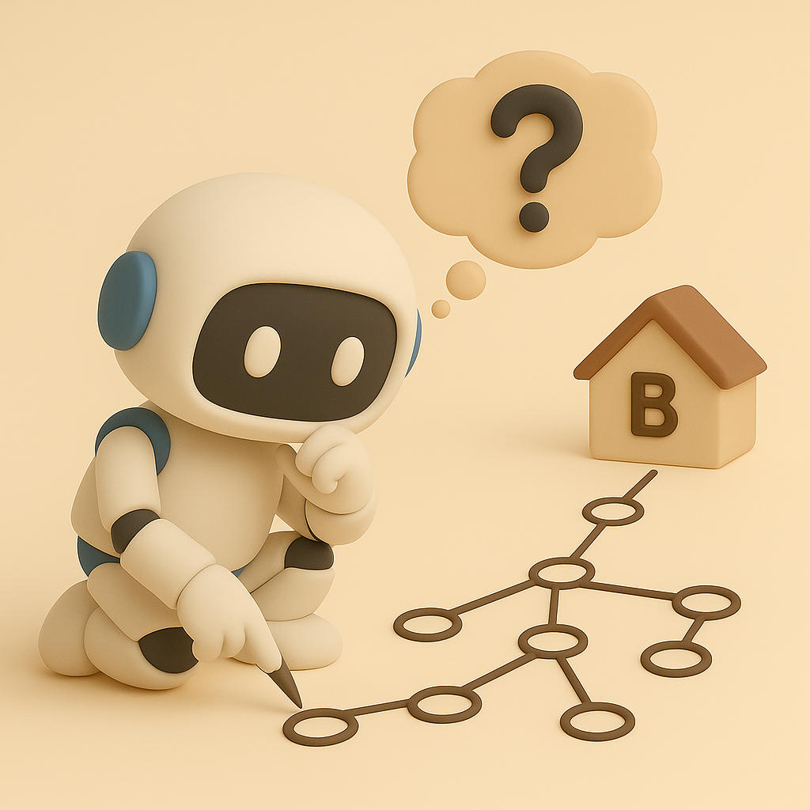
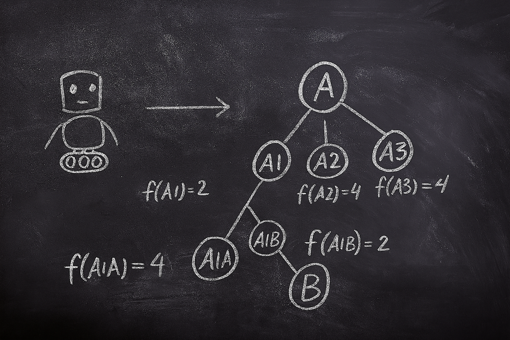

# 【AI】小白话系列——人工智能简史（十二）

## 现代人工智能的筑基期

* [1956年：现代「AI」 的诞生——达特茅斯研讨会](20250712【AI】小白话系列——人工智能简史（八）.md)

* [1958年：跑在机器上的神经网络——Frank Rosenblatt 与感知机（Perceptron）](20250714【AI】小白话系列——人工智能简史（九）.md)

* [1962年：机器学习的开端——Arthur Samuel和战胜人类冠军的跳棋程序](20250715【AI】小白话系列——人工智能简史（十）.md)

### 1966年：机器人元年——Shakey，首台通用移动智能机器人

#### 1.从低级反应到高级思考的三层架构

#### 2.STRIPS 规划算法

昨天晚上写到半夜，居然[还没把这史上第一台通用移动机器人的厉害之处写完](20250717【AI】小白话系列——人工智能简史（十一）.md)。只好早上起来继续。

#### 3.A\* 路径搜索算法

A\*，也就是A-Star / A星星路径搜索算法，是一种聪明的路径搜索算法。通俗地说，就是一种从地图上寻找从起点 A 到终点 B 的最快路径的方法。

注意，光是路线最短没用，还得走得最快或者最省力气（代价最小）才行。因此 A\* 会根据两个两个维度来评估每一步应该怎么走：

* g（n）：从起点 A 到现在这个位置点 n 到实际成本（走了多少步或者说耗了多少力气）
* h（n）：从现在这个位置点 n 到终点 B 到预估成本（猜猜看需要多少步或者说需要消耗多少力气）

然后，把每一步的总代价算出来：

> f（n） = g（n） + h（n）

最重要的是，A\* 每次都优先探索总代价最小的点。走最省力气的路，聪明吧？

这个h（n）的猜测是怎么来的呢？这就是 **启发式（heuristic）**，A* 的精髓就在这里！它会先根据常识或经验，来估计某一个动作最可能优先到达终点。比如，继续用我们之前举过的例子，给小机器人进行规划时：接下来可能要移动几步就是就是一种猜测原则。

简化的 A\* 算法流程像下面这样：

1. 把起点 A 加入「待探索清单」
2. 从「待探索清单」里找出 f（n）最小的点
3. 看看这个点是不是目标，是就结束
4. 否则，扩展这个点，看看从它出发能走到哪些位置点
5. 计算这些新位置点的g（n）、h（n）、f（n）
6. 把这些统统加入「待探索清单」
7. 回到第二步，开始循环

继续用小机器人举例：

* 刚开始，小机器人在房间 A
* 待探索清单里只有 A，而且也不是终点
* 所以开始探索可能的下一步状态，比如是：
  * A1：去走廊 
  * A2：翻窗户
  * A3：砸墙
* 接着，再计算一下这三个新状态的总代价，假设走路花的力气是 1，翻窗户花的力气是 2，砸墙花的力气是 3。当然，关键是靠谱地再猜测一下，从走廊到房间 B 可能走过去就可以了，再花力气 1；从窗户外再翻到房间 B ，可能更费力，还得花力气 2；墙已经砸烂后，穿过去走到房间 B 花到力气是 1。于是：
  * f（A1）= g（A1）+ h (A1) = 1 + 1 = 2
  * f（A2）= g（A2）+ h (A2) = 2 + 2 = 4
  * f（A3）= g（A3）+ h (A3) = 3 + 1 = 4

* 把这三条加入「待探索清单」
* 那么，因为去走廊这条路线，总力气最小。那么把这条路线 A1 拿出来继续探索。
* 可是，走廊不是终点，所以接下来又有两种可能，比如：
  * A1A：走回 房间 A
  * A1B：走到 房间 B

* 再次计算这两个后续点所花费的总力气：
  * f（A1A）= g（A1A）+ h (A1A) = 2 + 2 = 4
  * f（A1B）= g（A1B）+ h (A1B) = 2 + 0 = 2

* 把这些加入待探索清单，现在清单里还剩 A2、A3、A1A、A1B这四条路线待探索。显然，A1B是 f（n）最小的。
* 嗯，A1B 这个状态，已经到达房间 B 了，目标完成，探索结束。

画成树状图，就像这样：

A\* 算法总算讲完了，想让 GPT 把它画明白，费了老大劲，正好赶上它发布什么 Agent 新功能，唉……

<待续>

#### 4.Hough 转换

#### 5.错误处理能力

#### 6.总结：为什么说 Shakey 厉害

#### 7. Shakey 的团队后来都干嘛了
