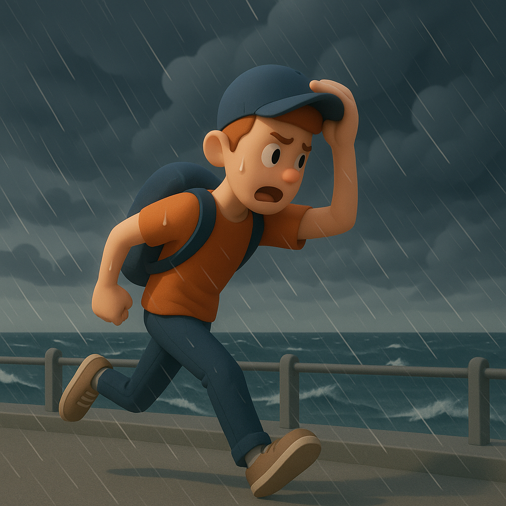

# 【生命⋅修行】想象中的周末

上一周不知咋了，经常熬夜。到周五晚上，临睡因为想起一个关于「知行合一」还有葛印卡说过的「受想行识」这个循环的关系和区别，一困惑就去各种查资料，「不留神」又熬夜到 12 点才睡。

躺床上时，我想不管怎么说，还是可以趁着周末这样一个大好机会，把作息调过来，然后好好地、真正地、放松地休息一下：

* 周六先睡一个懒觉
* 然后抄抄经
* 再写一下文章
* 除了写文章以及和大宝聊天，坚决不碰电脑和手机
* 出门暴走一圈
* 给自己买个近视的游泳眼镜
* 然后早早睡觉
* 周日早起
* 去游个泳
* 好好把家里打扫打扫
* 然后随便干点啥，再早早睡觉

……

然后，如愿以偿地睡到了早上 9 点半才起床。去拿抄经纸时发现，Karmapa 的隶书版抄经纸，只剩下了最后一张。想到前几次，都是在「快快地」抄写——虽然目标是「又快又好」，但毕竟是以「快」为先。

这最后一张我喜欢的「隶书抄经纸」，不如慢慢来吧？

当然，一如以往，过程中还是有着一次又一次地走神，各种思绪万千，但这次写完，已经到了 11 点 20。算算时间，已经过去了一个半小时。

我很满意早上渡过的这第一个给自己的一个半小时，于是开心地想要和大宝视频。

视频接通已经是又过了一个多、两个小时之后的事情。我已经吃了一碗面，向大宝抱怨着：原计划不碰手机，却又刷了许久手机的懊丧。

大宝提醒我说：

> 你不是还有一个下午吗？

我恍然大悟，放弃了睡午觉的念头。换上衣服就出门了，从家里走到沙河迪卡侬，看起来是 7、8 公里。正好走个来回当作锻炼。

不过，我还是想稍微绕一下，从深圳湾公园的滨海绿道过去，一路风景会更好。

在公园里，一对小夫妻从我身边经过，正好听见了他们的对话：

> 天气预报说，晚上 6 点有暴雨。
>
> 啊？那怎么办？

暴雨？我想起上周没能淋上雨的那一点点遗憾，心中不禁有些向往：

> 或许，晚上 6 我正在外面呢？

走到迪卡侬，已经接近了下午 5 点，花了三个多近四个小时。确实走累了，我看了看手机记录的步数，居然是 1 万 7 千步。奇怪，不是 7、8 公里吗？

回程时，我决定打开高德导航，让它给我记录一下，这一路究竟有多远。

快落山的太阳，从沙河公园密密匝匝的树林间，把阳光撒在公园山顶小道的长椅上。我坐了下来，想起以前在这里玩时，总是很烦恼公园管理处的大喇叭，在哪里没完没了地播放「提醒」，但此时此刻，居然没有喇叭。

远处的车流声隆隆地像瀑布一般当着背景，小鸟们还没到黄昏唱歌的时刻，只是偶尔飞过，喳喳叫上两声。我拿出尺八，闭上眼睛，悠哉地吹了一会儿。能感觉到，不时有一两个游人从我面前走过时，脚步略略到停留。

休息了一会儿，我站起身，继续沿着原路返回。

到海边的时候，天已经变得阴沉沉的。

大宝打来电话，我给他们看了看阴云密布的海边。大宝也忍不住担心地问：

> 那怎么办？你要不要打车回去？

我摇了摇头，说：

> 不，我正想淋一场暴雨呢！

公园里的喇叭开始循环播放警告：

> 19 日 18 点，深圳已发布台风黄色警报，请游客们安排好时间，有序离园……

而现在的时间，已经是 7 点半快 8 点了。

原来是台风，不是普通的暴雨。下午时，公园里那络绎不绝的游客早已不见，只是偶尔有一两辆自行车，从身边高速掠过。

风越来越大，我有点犹豫。但最终，想要搞清楚这一段路究竟有多少公里，以及那一丝丝想要淋雨的念想，战胜了对台风的恐惧。

我侥幸地想，应该没太大问题吧？

大宝还在电话那头继续和我聊天，雨已经下来起来。风变得更大了，帽子差点被吹飞，我赶紧扣上帽子的防风巾，把手机等小电器装进一个塑料袋里，再把他们塞到包里。然后把毛巾拿了出来。

眨眼之间，零零星星的雨点变成了倾盆大雨，我不由得奔跑了起来。但是，前面的大风呼啸着卷着雨水疯狂地砸在我脸上，我眯缝着眼睛，只见从天到地全都是水，根本分不清那是雨水还是海水。

一种恐惧油然而生，前面正好有一段岔路，我掉头向着陆地的方向跑去。

但是，没跑几步，我就发现，自己根本分不清方向。

四面八方全都是水，全都是风，根本分不清哪边是大海，哪边是陆地。

我害怕地又跑了几步，分辨出一边是以前周末带着阿宝和大鱼运动锻炼的平地。便转了过去，发现这里有两个骑自行车的人在避雨。

见到人类，而且也分辨出了方向，心终于安定了下来。我就继续沿着路小跑着，过了一会儿又重新改成快走。

这下，自己如愿以偿地淋了个浑身透湿。

最大的那一阵雨，渐渐过去了。路变得清晰了些，风也小了些。公园里的喇叭，还在大声疾呼着宣布着闭园的消息，催促着像我这样的游人离开。我一面赶路，一面好整以暇地开始想：

> 那些巨大的生物让人心生恐惧和压迫感，而这狂风中的大自然，更让人恐惧和压迫。
>
> 只因为那在这绝对的大自然力量面前，人类太过渺小了吧！

……

在靠近小区的路口等红绿灯时，旁边一位父亲载着两个孩子停在我身旁。他们没有打伞，两个小家伙用手遮着头，催促着自己的父亲，似乎被雨浇得很狼狈。

一看没车，不等人行道的红灯变绿，他们就着急地冲了出去。我正好听见，那个大些的男孩在看了我一眼之后好奇地问：

> 为什么别人不怕呢？

我心想：

> 小家伙，你可知道，我刚刚也在害怕么？

到家了，看了看高德地图：11.1 公里，3 小时零 1 分 45 秒，平均速度 3公里每小时。而最高时速居然是 20 公里每小时 —— 想必那就是我在恐惧中狂奔的时候吧？

正准备睡觉，收到体育馆公众号发布的消息，说因台风闭馆，看样子周日时游不成泳了。

然后，自己依旧没有早睡。虽然10点过就躺在了床上，但是翻看着梁启超那篇讲读王阳明心学的讲稿，不知不觉又到了12点过……

<待续>