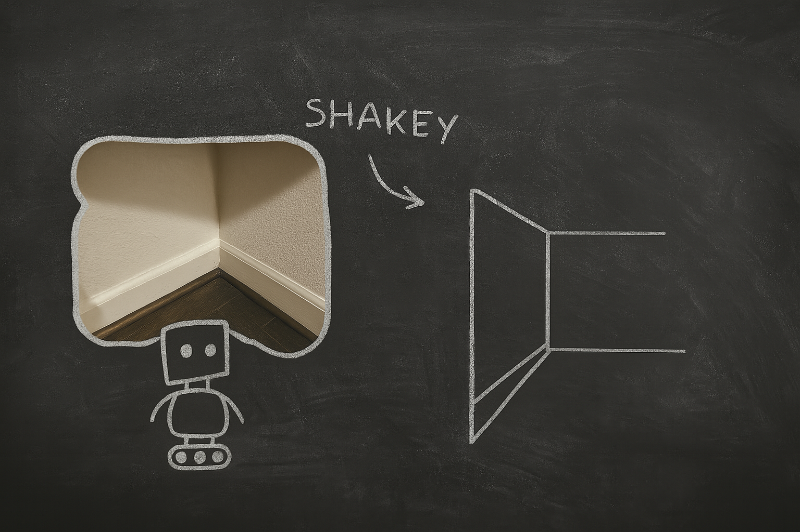
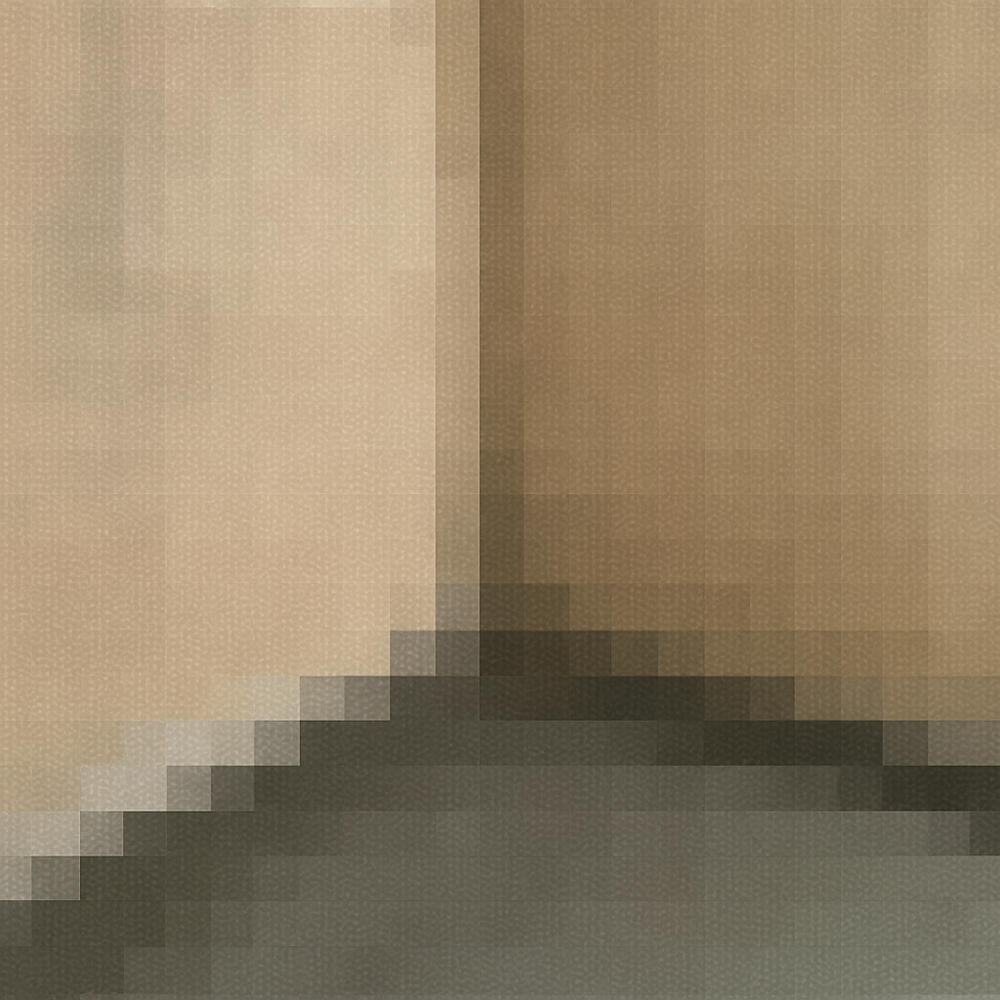
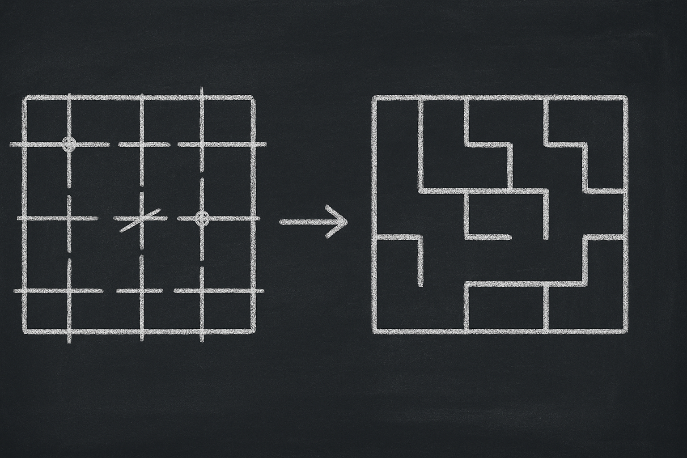

# 【AI】小白话系列——人工智能简史（十三）

## 现代人工智能的筑基期

* [1956年：现代「AI」 的诞生——达特茅斯研讨会](20250712【AI】小白话系列——人工智能简史（八）.md)

* [1958年：跑在机器上的神经网络——Frank Rosenblatt 与感知机（Perceptron）](20250714【AI】小白话系列——人工智能简史（九）.md)

* [1962年：机器学习的开端——Arthur Samuel和战胜人类冠军的跳棋程序](20250715【AI】小白话系列——人工智能简史（十）.md)

### 1966年：机器人元年——Shakey，首台通用移动智能机器人

#### 1.从低级反应到高级思考的三层架构

#### 2.STRIPS 规划算法

#### 3.A\* 路径搜索算法

#### 4.Hough 转换

前面讲了[ Shakey 的经典三层架构和STRIPS规划算法](20250717【AI】小白话系列——人工智能简史（十一）.md)、[A\* 路径搜索算法](20250718【AI】小白话系列——人工智能简史（十二）.md)，接下来我们再了解一下 Shakey 里应用的另一个重要算法——[Hough 转换（Hough Transform）](https://en.wikipedia.org/wiki/Hough_transform)吧。

我们知道，1966 年的 Shakey 配备了当年最先进的摄像头，猫须传感器，还有雷达 / 声纳设备。

但是，从它的眼睛看到外面的世界，到它理解这是个什么「世界」，然后用 STRIPS 做规划，中间还缺点什么。

我们看到上面这张照片，能够「立刻」明白这是墙角，这个方向没路了。而 Shakey 通过摄像头看到的这张照片，首先只是各种颜色的点——所谓像素。大概，就像下面这样：

而且，实际情况，可能比这还要糟糕，比如断断续续的边缘，模糊不清的颜色。Shakey 需要把这样的图片，处理成能够 STRIPS 能够理解的元素——墙壁、走廊等等——也可以说，这就是最近[李飞飞](https://zh.wikipedia.org/wiki/%E6%9D%8E%E9%A3%9B%E9%A3%9B)常常在提及的，所谓[世界模型](https://zhuanlan.zhihu.com/p/661768957)的超轻量简化版。

那么首先要做到是，把上面这些各种颜色的点，变成数学上能够表达的几何形状——直线、圆形等等。

比如，至少是最简单的直线吧，然后，它才能在自己的「大脑」中画一幅迷宫图。

Hough 转换就是这样一种巧妙的算法，它不是去寻找那些代表来几何形状的数学公式参数，它直接让每个像素点自己「投票」。举个最简单的例子：

上面这张图是一个有3 x 3 一共 9 个像素点的局部，假设最简单的情况——每个点可能是一条横线经过，也可能是一条竖线经过——一共有 2 x 2 x 2 x 2 x 2 x  2 x 2 x 2 x 2 = 512 种可能性。

我们让每个点给这 512 种可能性都投个票。

但对于每个点来说，它更可能只需要在下面这 6 种可能性中优选：

* 穿过自己的横线（一格、两格、三格）
* 穿过自己的竖线（一格、两格、三格）

等每个点都投票完成后，统计票数最多的那些线段，保留它们，迷宫就画出来了。

简单来说，Hough 用下面这几步搞定如何把摄像机输入的图片变成能够用数学表达的几何图形：

0. 先提取边缘轮廓线（这算是预处理）
1. 每个点都猜一下自己可能在什么线上（直线、斜线、圆圈圈），数学上就是一堆带参数的公式
2. 大家全体投票：我最可能在哪条线上
3. 高票者当选

就这样，Hough 转换用民主的机制，扫清了 Shakey 认路的基本障碍。而且，这项祖师爷级别的图像识别技术，后来远不止在机器人领域发挥作用，而是变成了计算机视觉界的常青树技术。

| 优点       | 说明                                       |
| ---------- | ------------------------------------------ |
| ✅ 抗噪强   | 图像中有很多干扰也能准确检测线             |
| ✅ 易解释   | 投票机制简单，结果容易理解                 |
| ✅ 可扩展   | 能适配很多不同形状（直线、圆、椭圆、模板） |
| ✅ 确定性好 | 不依赖训练数据，逻辑清晰                   |

因为上面这几条硬核优点，直到今天，在某些需要精度与稳定性的领域，70 多岁的它依然不可替代。

<待续>

#### 5.错误处理能力

#### 6.总结：为什么说 Shakey 厉害

#### 7. Shakey 的团队后来都干嘛了