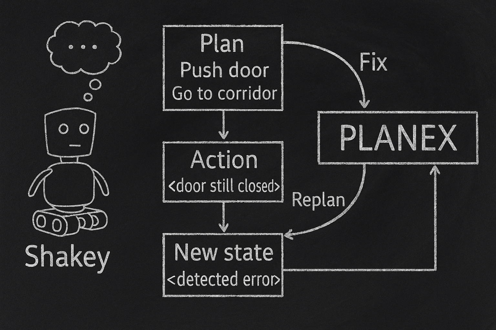
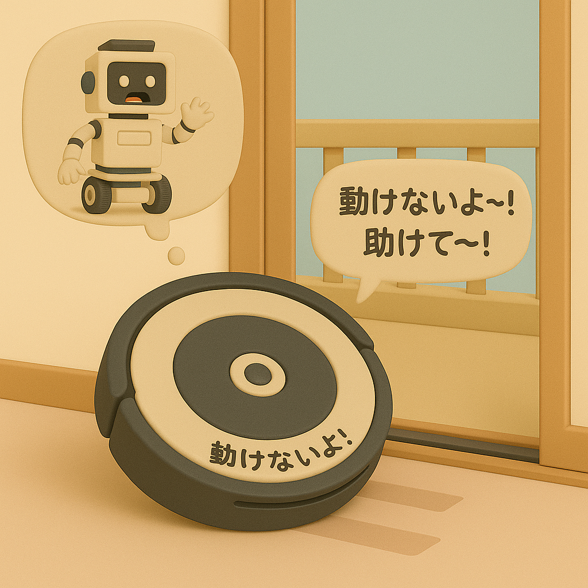
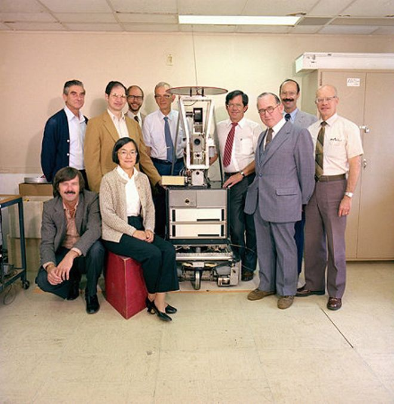

# 【AI】小白话系列——人工智能简史（十四）

## 现代人工智能的筑基期

* [1956年：现代「AI」 的诞生——达特茅斯研讨会](20250712【AI】小白话系列——人工智能简史（八）.md)

* [1958年：跑在机器上的神经网络——Frank Rosenblatt 与感知机（Perceptron）](20250714【AI】小白话系列——人工智能简史（九）.md)

* [1962年：机器学习的开端——Arthur Samuel和战胜人类冠军的跳棋程序](20250715【AI】小白话系列——人工智能简史（十）.md)

### 1966年：机器人元年——Shakey，首台通用移动智能机器人

#### 1.从低级反应到高级思考的三层架构

#### 2.STRIPS 规划算法

#### 3.A\* 路径搜索算法

#### 4.Hough 转换

#### 5.错误处理能力

前面讲了[ Shakey 的经典三层架构和STRIPS规划算法](20250717【AI】小白话系列——人工智能简史（十一）.md)、[A\* 路径搜索算法](20250718【AI】小白话系列——人工智能简史（十二）.md)、[Hough 转换（Hough Transform）](20250723【AI】小白话系列——人工智能简史（十三）.md)。接下来，简单说说这个听起来平平无奇，但是对小机器人 Shakey 来说却很关键的一个能力——错误处理。

「知错就改」—— 这是我们人类教育小孩时常常强调的一个基本要求。然而，对于这第一台能够自己规划、执行任务的小机器人 Shakey 来说，这也是它的必备技能。

原因很简单，因为我们需要它在现实世界，而不是理想世界里执行任务。就拿我们之前那个最简单的例子来说吧。仅仅是想要从房间 A 走到房间 B，在现实世界里，就会遇到这些情况：

* 地面不平，走着走着，歪了。
* 到了门口，门却关了，打不开，走不过去。
* 砸墙砸了很多下，墙太结实，根本砸不烂。
* 翻窗户的时候，没爬上去，摔倒了。
* 撞到了一个之前没看到的障碍物……

这些层出不穷的意外，和执行中遇到的各种问题。用传统的「编程控制」办法根本无法应对。Shakey 的团队意识到，要让小机器人能够既灵活、又鲁棒（robustness），必须让它能够——「觉察错误并纠正偏差」。

Shakey 用PLANEX + 执行监控来解决这个问题。PLANEX （Plan Exective）计划执行模块用来一步一步执行 STRIPS 输出的计划。它包括下面这些功能：

* 检测执行前提是否存在：每执行一个动作前，检查一下，看看执行这个动作的前提条件是否依然满足。
* 检测异常：执行动作后，观察新状态是否符合预期。
* 回退 / 或重新规划：如果出错，尝试再来一次，或者干脆从当前状态重新规划

比如前面那个例子：小机器人计划从房间 A 走到房间 B，第一步是从房间 A 门口出去，走到走廊。它按计划走到门口，结果门是关的，它被挡在门口，没能走到走廊。

Shakey 的执行模块检测了这个结果，发现新状态和预期结果不一样，它会尝试：

* 再走一次，撞开门。
* 换第二被选方案 —— 砸墙过去。
* 通知 STRIPS，重新规划一下，到底从门口这个地方，怎么去到房间 B。

这套办法，相当经典。即便在今天，机器人依然在用这种架构：

感知 -> 规划 -> 执行 -> 监控 -> 修正

Shakey 是最早实现这种「智能闭环」的机器人，它不只能简单的听话，还是个会反思的「聪明小子」。

#### 6.总结：为什么说 Shakey 厉害

 🌍 这里总结了下面几点：

- **融合多个AI领域**：包括视觉、规划、语言、运动——[世界上首个全能型 AI 机器人](https://www.wired.com/2013/09/tech-time-warp-shakey-robot)
- **软件架构开先河**：分层控制体系成后世机器人和自动驾驶的重要架构
- **核心算法流传深远**：STRIPS 与 A* 成为机器人、路径规划、游戏AI等领域的基石
- **后代遍布今日**：从机器人吸尘器Roomba，到Mars火星车，再到自动驾驶——无不受Shakey启发

说到它的后代 Roomba，我不禁想起来当年一个记忆深刻的有趣场景。那时从日本出差，运回来一台当时号称最先进的，来自iRobot 的 Roomba 7。

然后它开始每天在家里转着圈认真扫地，但是去往阳台的推拉门槽是它常常难以逾越，却又屡屡错判的天堑。它经常会把自己卡住，然后又努力地从困境中挣脱出来。有一天，它卡在那里，努力了许久也动惮不得时，我破天荒地听见她用软萌、卡哇伊的腔调说了一句日语：

> うごけないよ〜！たすけて〜！！

这是它第一次开口说话，逗得我哈哈大笑！

#### 7. Shakey 的团队后来都干嘛了

团队的领导 [Nilsson](https://ai.stanford.edu/~nilsson/)，他教出了 Stuart Russell、Andrew Moore 等等，都成为了后世 AI 界的领军人物。

[Peter Hart](https://en.wikipedia.org/wiki/Peter_E._Hart)，他后来从学校转去了工业界。他主导发明的A\* 成为游戏 AI、自动驾驶、路径规划等广泛应用的基石；

[Richard Fikes](https://web.stanford.edu/~fikes/)，他与Nilsson 合作推出了STRIPS 技术的核心算法。之后，他又参与了KNOWLEDGE Systems Lab 的专家系统研究，对知识表示做出了深入贡献。

[Richard Duda](https://en.wikipedia.org/wiki/Richard_O._Duda)，他与Peter Hart的图像处理研究，持续地影响着计算机视觉领域。后来，他还写出了那本经典教程《[Pattern Recognition and Scene Analysis](https://www.amazon.com/Pattern-Classification-Scene-Analysis-Richard/dp/0471223611)》。

总而言之，Shakey 是上个世纪 AI 黄金十年里最闪耀，也是最后也一颗明星。至今仍然意义非凡！

……

### AI寒冬（1967–1996）：技术理想与现实落差的漫长拉锯

<待续>