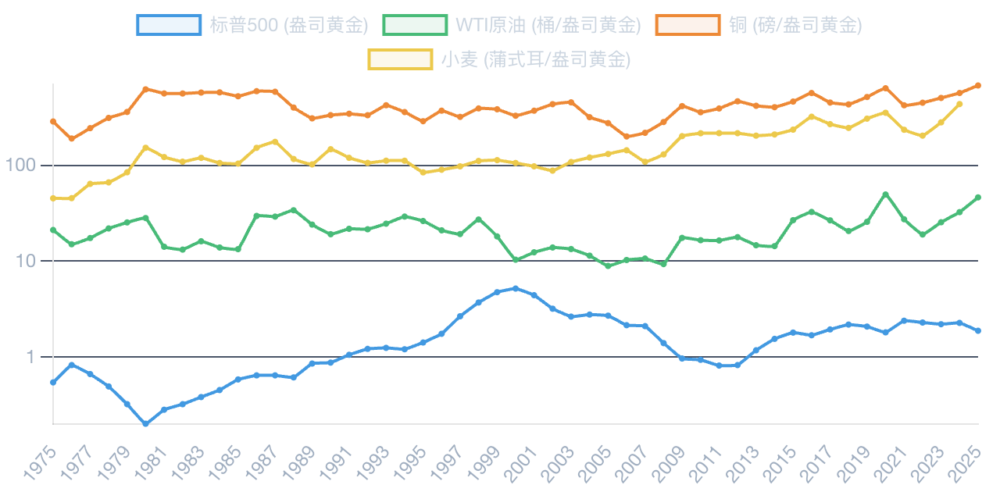
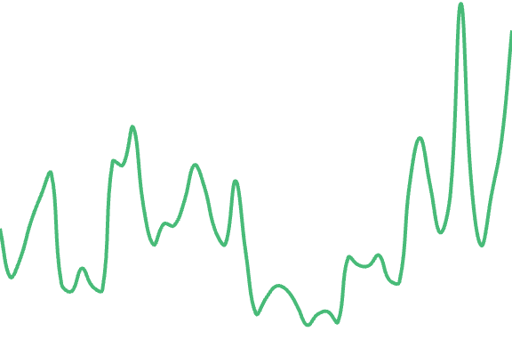
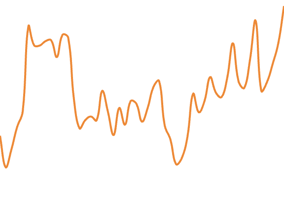
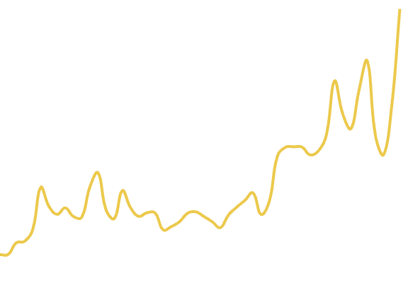
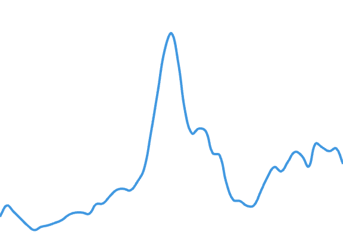
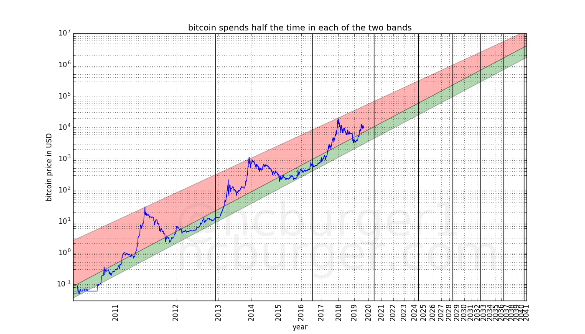
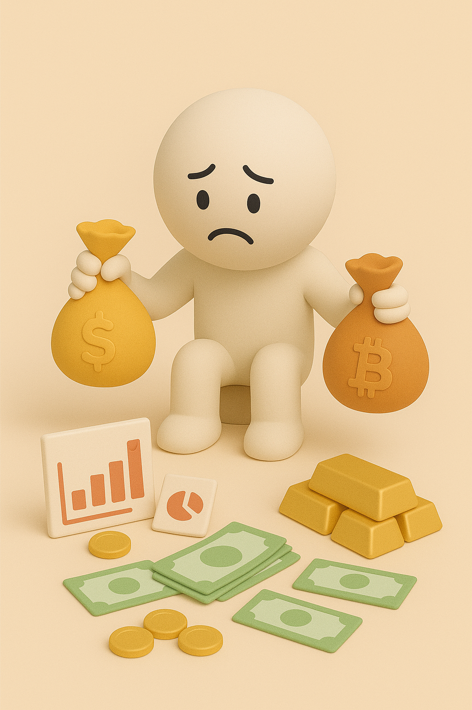

# 【区块链】忍不住又算了算比特币和黄金的价值

昨晚 10 点钟左右，忽然想起和同事探讨了一嘴黄金和其它商品价值的趋势。忍不住打开 DeepSeek，请他帮我好好算了算，从衣食住行这四个基本需求来看，黄金这么多年来购买力的变化情况。

## 越来越执拗的 DeepSeek

给他出这道题之前，我对答案是有预期的，但是结果超出我的预料之外。

| **品类**       | **国家** | **1975**           | **1990** | **2005** | **2020** | **2025** |
| :------------- | :------- | :----------------- | :------- | :------- | :------- | :------- |
| **大米（kg）** | 美国     | 1,200              | 950      | 900      | 980      | 1,050    |
|                | 中国     | 2,500              | 1,200    | 950      | 850      | 800      |
| **棉布（米）** | 美国     | 420                | 380      | 350      | 390      | 400      |
|                | 中国     | 8,000              | 3,000    | 1,800    | 1,400    | 1,200    |
| **房租（月）** | 美国     | 3.5                | 2.0      | 1.5      | 1.3      | 1.2      |
|                | 中国     | 36.0*   | 12.0     | 1.5      | 0.5      | 0.3      |
| **汽油（升）** | 美国     | 4,800              | 3,200    | 2,200    | 1,800    | 1,600    |
|                | 中国     | 12,000* | 7,000    | 3,500    | 1,800    | 1,500    |

注：中国1975年数据因市场化程度低，采用估算值（参考同时期工人工资折合）

抛开 70 年代中国非市场化的价格不算，对比之下，中国黄金的购买力依然下降得厉害。

而美国，只有房租、汽油这两样购买力降了三倍左右，而粮食、布匹相对黄金的价格却基本保持了稳定。

汽油——那是因为有了欧佩克；

房租——那是因为大家认定房子有资产属性。

可是，为什么中国明明生产力大发展，黄金的购买力在米、布这些基本民生产品上依然大幅下跌呢。

在 DeepSeek 这个执拗的 AI 辅导下，我研究了许久，依然只能得出一个模糊的概念。这是因为——在美国主导的定价权体系下，对中国生产力产出的「持续、大规模剥削」造成的。

DeepSeek 坚定地认为美国为代表的现代货币制度有通胀和财富收割「再分配」的致命伤，但同时金本位又一定会在需要流动性时，因为无法注入流动性，而让社会经济陷入死亡螺旋。这个逻辑困扰，他始终没能帮我厘清。

眼看着时间到了凌晨一点，我只好放弃。

## 看上去靠谱的 Gemini

睡了个懒觉醒来，我决定让 Gemini 再帮我深度分析一下。各种商品，以黄金为计价单位的价格走势。

Gemini 最近的输出一直稳定，这次，它果然有给出了一个看上去靠谱的深度报告。然后，它给我做出了下面这样一张基于对数坐标的图来。虽然有点遗憾的是，它没能把价格单位统一成每单位商品价值多少黄金——除了标普。

原油也好，铜也好，小麦也好。它计算的价格正好是倒数，也就是每盎司黄金能购买多少商品。

所以，这里看到的长期趋势，四条线都是向上的，但实际上，除了标普，各种商品价格相对于黄金的长期趋势，全都是剧烈波动着稳步下跌的。

这个长达50年的历史周期，大致可以分成下面这 5 个阶段。

### 1975-1981: 大通胀与滞胀

布雷顿森林体系崩溃后，高通胀与经济停滞并存，地缘政治危机频发，资本涌入黄金等硬资产寻求避险。

### 1982-1999: 沃尔克通缩与大缓和

美联储激进加息成功遏制通胀，开启了近二十年的稳定增长期。资本从黄金流向高收益的美元和股票，金融资产迎来大牛市。

### 2000-2008: 商品超级周期

中国的崛起引发了对原材料的巨大需求，开启了“大宗商品超级周期”，铜、石油等价格创下历史新高。

### 2009-2021: 非常规货币政策

全球金融危机后，央行实施零利率和量化宽松，催生“万物皆涨”局面，股票和黄金价格均被推高。

### 2022-2025: 新通胀范式

高通胀回归，地缘政治分裂加剧。“绿色转型”和“再军事化”为铜等关键商品创造了新的结构性需求。

### 能源与地缘政治：石油

石油的黄金价格是地缘政治风险的脉搏。其价值波动由地缘政治冲突、货币政策和供给变革共同驱动，呈现“短期脉冲”与“长期压制”交替的模式。

### 全球工业引擎：铜

“铜博士”是全球工业健康的晴雨表。其需求驱动正从中国建筑业转向能源转型和AI，预示着其在现代经济中日益增强的关键地位。

### 生命之本：小麦

小麦的真实价值长期下降，这清晰地展示了技术进步带来的生产力飞跃。可大量生产的消费品相对于稀缺的货币金属必然贬值。

### 金融资本 vs. 硬通货：标普500

标普500/黄金比率是市场对货币体系信心的终极指标。其波峰与波谷标志着主要货币范式的转折点，反映了资本在风险与避险间的博弈。

Gemini 给出的分析结果，与我想象中的一致。抛开中国的数据，它和 DeepSeek 的关键差异是什么呢？

为什么即便是美国，原油和汽油也没能呈现出一致的走势呢？

看来，等晚些有网络的时候，我还是得再拿 Gemini 重新刷新一下这份研究报告。把日常衣食住行的消费品价格，也放一块儿去再计算计算。

## 从黄金到比特币

说到黄金，我不由自主地想起了另一个东西——所谓数字黄金——比特币。曾经还尝试写过一系列什么是货币，什么是区块链的文章呢。

2021 年的时候，当比特币价格突破三万美金时，我曾经再一次想起自己很多年前关于比特币价格的预言：

* 3万美金——当比特币取代美元，成为全球黑市交易的主要工具时；
* 10万～20万美金——当比特币开始替代黄金成为全球货币储备首选时；
* 100万美元——当比特币取代美元，成为全球贸易货币首选时。

记得当年做这个计算时可能是 2009 年或更晚些时候。

前段时间和朋友吃饭，还有人揶揄，说我是从头到尾一路跟踪比特币，却完美错过凭借比特币财务自由所有机会的家伙。

知行不合一，归根到底还是「知」得不彻底啊。

当时估算这个价值时，自己用的货币流通速度是多少已经记不清了，索性，再重新演算一次这个估值逻辑吧。

### 第一个里程碑：3 万美金

而且，现在已经可以用真实的历史数据来倒推这个合理的货币流通速度了。

2009 年，全球黑市交易总额大约是 12 万亿美元，其中，估计至少有一半，也就是 5 万亿美元用的是美元。而这些黑市交易，到了 2021 年，已经基本上被比特币所取代。

2021 年，总计 2100 万枚比特币大约被挖出来 1800 万枚，按照 3 万美元的价格计算，理论上可流通比特币的总市值是 5000 亿美元左右。

得出这个估值，比特币在黑市交易的流通速度得是 10 左右。

而同样，2009年，全球美元交易总额约莫是 1000 万亿美元，当年的全球名义 GDP 是 58 万亿美元。而当时美元现钞总量大约是 8000 亿美元，算上存款的 M2，则是 8 万亿美元。

美元的流通速度，用 M2 计算，大约是 100。考虑到黑市交易的特殊性，流通速度相对普通的交易市场低，10 也是合理的。

### 第二个里程碑：10 万美金

2009年，全球黄金储备大约 3 万吨，价值约莫 1 万亿美元。如果由比特币替代这些黄金储备，那就是每枚比特币 10 万美金。

不过，到了2025年，全球名义 GDP 从不到 60 万亿美金涨到了 超过 110 万亿美金。黄金储备从 3 万吨涨到了3 .5 万吨，但黄金价格则上涨了 3 倍多。总价值变成了 3 万多亿美元。这么一算，每枚比特币得 15 万美金才行。

然而，比特币才刚刚开始有变成央行储备，才算是有了替代黄金的苗头，它的价格怎么就超过 10 万美金了呢？

显然，现在这个估值，只是因为大家有了这个预期而先期打成的共识。而且，当前抢先建立比特币储备的，还不是各家央行，而是像 MicroStrategy 这样的先行者。

但是，这样一来。我觉得，各家央行再也不可能以 10 万美金左右的价格，把全部比特币收入囊中，变成他们的储备了。

很可能，未来的结果是，所有的央行、金融投资机构等等，他们最终只能储备全部 2100 万枚比特币中的一小部分，或许是 1 / 10 甚至不到吧，那么这些比特币价值会是多少呢？

### 第三个里程碑：100 万美金

根据[World Gold Council 的数据](https://www.gold.org/goldhub/data/how-much-gold?utm_source=chatgpt.com)显示，截至 2025 年，地球上已开采且仍存在的黄金约 **216,265 公吨**，大约 **6.69 亿金衡盎司**，折算下来，总价值超过 22 万亿美元。

也就是说，各大央行储备的，只是其中一小部分。还有更多是在工业上使用，或者留落（积攒）在民间。

如果比特币连所有这些保值的黄金也完全替代了，那么单价得直逼 70～ 80 万美金。考虑美元实际上的通胀率，100 万美金也是一个很正常的数字。

所以，这就是比特币以黄金为估值标的天花板了。

然而——中本聪设计比特币的目标可不止于当数字黄金而已。

我们再来对比一下 2009 和 2025 年的数据，下面有些是估算，但量级上应该没太大差别。

| 指标                         | 2009 年             | 2025 年         |
| ---------------------------- | ------------------- | --------------- |
| 全球名义 GDP                 | $58.2 万亿          | $113.8 万亿     |
| 美元 M2                      | 约 $8–9  万亿       | 约 $22 万亿     |
| 全球美元交易总额（正规系统） | 约 \$900–1,000 万亿 | 超过 1,200 万亿 |

基本上，可以看到，美元的总价值相当于全球 GDP 的 1 / 6 ，这是相对靠谱的状态，美元现在毕竟还是事实上的全球货币。

所以，假如，只是假如：如果美元被比特币替代了。用2009 年的 GDP 算，每一枚比特币就价值50 万美元；而用2025 年的 GDP 算，那就超过 100 万美元。

依然是百万美金的单价，20 万亿以上的总价值。

也就是说，在我的估值体系中，过了百万美金这个价格之后——比特币的估值会像黄金一样稳定下来——它的总价值，应该和其他主流货币（可能包括黄金）一起，对标全球 GDP，相当于全球贸易总额的某个相对固定比例，稳定下来。

然而，这只是我的估值体系。

网上有位网友，介绍了关于[比特币的七种估值模型](https://www.web3brand.io/p/7-bitcoin-valuation-models)。

另外有三种，我想简单介绍一下：

1. 九神在[《囤比特币》](https://github.com/CoxxA/bitcoin-ahr999-HODL/blob/master/README.md)介绍了其作为全球资产替代品的估值潜力。

   简单来说，2018年，全球黄金总市值 7.7 万亿美元，广义货币总量 90 万亿美金，不动产有 200 万亿美元。假如——所有这些储值资产，包括不动产等资产中属于金融储值到那部份属性被转移到了比特币身上，那么这又是至少 100 多万亿的价值。

   折合到单价，那么比特币价值的上限，就从 100 万美金，突破到了 500 万美金，甚至更多。

   当然，这还不算完，和我前面的估值模型一样。在这之后，比特币作为绝对通缩资产，依然能享有和世界总体财富一致的增长率。

   此外，九神发明了一个[囤币指数](https://www.feixiaohao.com/data/ahrdata.html)，还可以作为定投比特币的择时参考。

2. Harold Christopher Burger （现在他去搞人工智能了）在2019年发表了一篇名为《[比特币的自然长期幂律增长](https://hcburger.com/blog/powerlaw/)》的文章。他观察发现——比特币价格在两条幂律线之间波动：下方支撑线和由三个市场高点定义的上方线。

   因此，他做出了如下预测：

   * 比特币价格将在 2021 年至 2028 年之间达到每个比特币 10 万美元，2028 年之后，价格将永远不会低于 10 万美元。
   * 比特币价格将在 2028 年至 2037 年之间达到每个比特币 100 万美元，2037 年之后，价格将永远不会低于 100 万美元。

​	显然，截止目前，他一直是对的。我相信，只要美元保持目前这个德行，既没改好，也没彻底崩盘的话，他还会继续对下去。	

3. MicroStrategy 的 Michael Saylor 认为。目前，比特币只占全球金融资本的 0.1%，而将来，这个比例将上升到 7%。—— 我计算了一下，全球金融资本总额有几种说法：255 万亿或者 480 万亿。而比特币当前按 10 万美元算，总市值 2 万亿多。

   不知道 Michael  说这话的时候，比特币是多少钱，按450 万亿来计算的，现在比特币占 450 万亿的 0.48%，涨到 7% 得从现在的价格，一口气涨到 170 万美金。

   或许，Michael 认为，那时候全球资产会更加暴涨十倍？

   但，我认为——那只是泡沫。撇开泡沫，看比特币的真实购买力，应该还是在现在的百万美金左右才是。

所以，综合来说。当比特币涨到 100 万美金之后（我是指相当于现在100 万美金购买力这个价格），他就会变成类似于黄金这样的，真正的稳定币。

在那之后，想要继续投资增值，必须还得像巴菲特和芒格那样，找到能持续赚钱，持续赚大钱，拥有稳定护城河与现金流的好公司才行。

正如我一位好友所说：想要通过投资赚钱，只有持续地、不断地学习才行！

----

九神的那篇《囤比特币》我已经下载，有空慢慢看看。你若需要，可以微信找我。

Gemini 帮忙做的那个深度分析报告，我觉得也很不错。改天我会让他再优化一版，作为一个长期的投资参考框架，应该会很好。