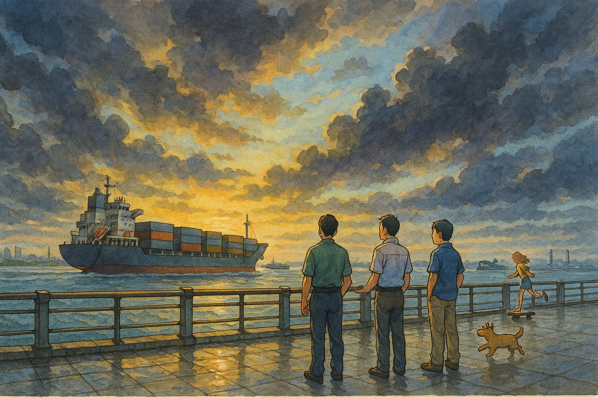

# 【随笔】三十年河东

抽时间见了一下两个高中时极好的同学、朋友。

原以为虽然距离上次见面虽然很久了，但也不至于太久。结果仔细一回忆，那已经是近十年前的事情了。

每当想起他们时，脑海里浮现出的，总是那 16 岁少年的模样。每当见到他们时，也会觉得他们没什么变化。但仔细看去，白发、皱纹、赘肉一样不少。

晚上在餐厅点菜时，H 仔细嘱咐服务员，要瘦肉不要肥肉。只因为我们刚刚重温了 S 小时候的故事，那个导致他后来再也不能吃肥肉的故事。可是，年轻的小姑娘贴心地对我们说：

> 吃点肥肉，对老年人身体好！

我哈哈大笑，拍了拍 S 的肩膀，重复着这句话：

> 对老年人身体好！

我这才意识到，虽然说，我们自己看自己——至死是少年。但在别人眼里，却不是这么回事。

认也好，服也好，不认也好，不服也好。

这就是事实。

我们并没有使劲儿回忆自己的少年时光，只是在交流着这么些年的经历、经验，以及对未来的焦虑、憧憬时，不时地会感叹一下，时间怎么会过得那么快。

怎么忽然，就开始以十年为单位了呢？

下午那一阵暴雨过后没多久，黄浦江边的游人又多了起来。H 指着来来往往，一艘艘或满载、或空仓的巨轮，说：

> 我最喜欢在这里，看这些船来来往往。
>
> 你还记得零几年的时候，我们在对面陆家嘴坐着聊天的时候吗？
>
> 那时黄浦江臭气熏天。你打趣说，这里是上海的黄金马桶盖。
>
> 现在水多清啊，已经完全治理好了！

S 说，他开始了解八字算命，我表示我也对玄学感兴趣，但H 却揶揄我俩实在是太闲了，竟然有空琢磨这些东西。

我却忽然意识到，因为大家都心有不安，却选择不同的「心安」之道。

H 一年又一年、十年又十年地仔细筹划、艰难应对现实的挑战。越来越相信，只要持续努力，认真做好准备，机会终将来临，而人也终将能在诸多不可控的人生中，握住一些可控的抓手。

S 和我却有更多的随性与固执，在与现实的碰撞中，不免更多感概命运的无常与神奇。

算一算，我们相识早已过了三十年。

不知在这刚刚开启不久的第二个三十年里，我们又会在各自的人生中，书写怎样的篇章呢？

