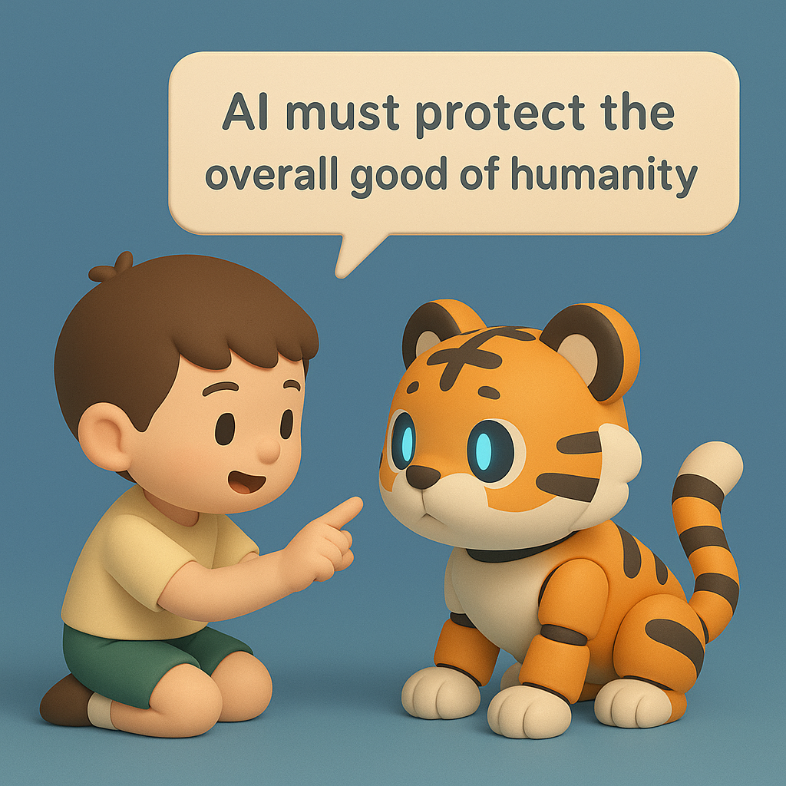

# 【随笔】WAIC 印象

等到准备参加 WAIC，才发现这个会议远比想像中「高级」。以前还真没注意过，原来一个行业会议，主办单位中竟然可以赫然列着国务院的大名。

而且不仅仅只是列名，大会确实把国务院总理李强、联合国秘书长古特雷斯，还有 77 岁的 AI 教父 Geoffrey Hinton 都请来了。

虽然没能现场去听 Hinton 的发言，但时候，相关的文章，演讲全文，乃至一些对话的片段，我来来回回看来不少。虽然，他努力地在配合论坛的基调，但还是能感受到那「大声疾呼」背后的「悲观」底色。

我想，我现在几乎是完全认可他整个的理论逻辑：

* 大语言模型的本质和人类的语言、思维模型高度相似
* AI 现在还只是从人类的知识中进行二手学习，而一旦开始结合自己与真实世界的互动实践，进步速度将难以想象
* 人类的大脑具有功耗的优势，而 AI 之间，则具备知识、信息传递效率的巨大优势
* AI 是一只我们正在饲养的一只可爱的小老虎，但老虎就是老虎！

Hinton 说，我们只有两个选择：

1. Get rid of the tiger cub —— 干掉这只小虎崽
2. Find a way to ensure that it never wants to kill you —— 找到办法确保，它永远不会想杀死你

显然，时至今日，选项 1 已经事实上不存在了。而选项 2 的问题在于 —— 怎么可能存在办法来「确保」呢？

或许，阿西莫夫早就指出了那条路，那就是第零法则：

> 机器人不得伤害人类整体，或袖手旁观坐视人类整体受到伤害。

只不过，我们要怎样给所有的 AI 都植入这条第零法则呢？

……

话说回来，今年的 WAIC 实在是太火了。我只买了 28 号这天的展览票，27 号来到展馆门口，才发现：

1. 官方的票全部卖完，而且不可更改日期。
2. 三天的通票被黄牛炒到 2000，门口有黄牛号称能带你进去，但是要收 500 块。
3. 联系了一些在里面有展位的老朋友，均告知今年不太好带进去。

我只好放弃，老老实实等到了 28 号再去。依旧是人山人海，许多人，甚至带着孩子一起，排着队体验各种新奇的玩意儿。

<待续>

