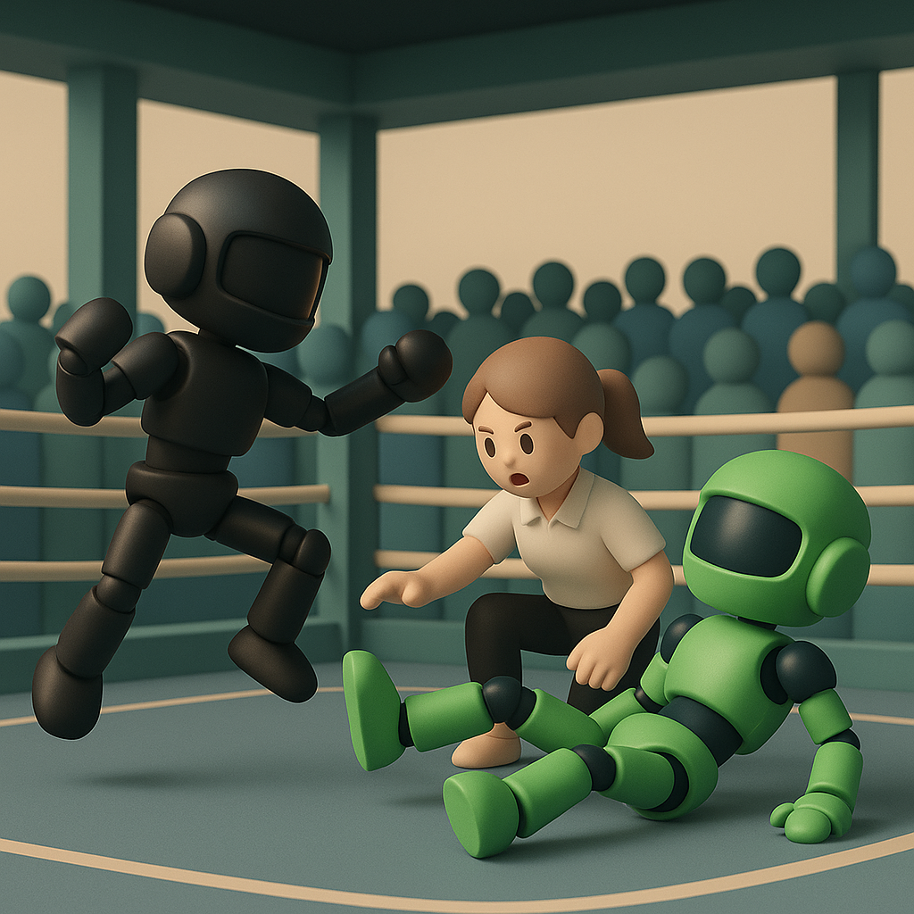

# 【随笔】WAIC 印象（续）

进入大厅，环顾四周，发现除了后退，有 5 个方向可去。左右是 H1 、H2 展馆，上下是 H3、H4。正前方还有一个看上去结合了传统和文艺的 WAIC 里弄街区……

我原地打转了一会儿，就向右转了，打算按照走迷宫算法，来个遍历搜索。

在 H1、H2 的一些展位上，遇到了几个原先老东家的同事，和他们聊了聊。得到了一些来自中老年科技人士的看法与观点：

> 热闹归热闹，但离真正全面落地还有 10 年、20 年时间。
>
> 教育可能是最快的领域吧……

确实，H1 展馆里，大多是制作大模型、基础设施尤其是国产基础设施的大厂们，都是全力以赴卖铲子的人。

不过，有意思的是，哪怕明知道中国不得不全面选择「国产化替代」这条路，Google 和 AWS 还是来了。还有互联网时代的英伟达——Cisco 也在。

老东家，菊场搬出了 384 节点的昇腾真机展示，方法虽然简单粗暴，也确实凭实力碾压了其他一众做底层硬件基础设施的参展商。以至于我记得还看到了好几家展示多节点的厂商，但看完昇腾那一堵墙的机柜后，把其他名字都忘记了。

即便是在 H2 行业应用馆，还是有很多展示算力运营，以及GPU 服务器，一体机的展商。至于真正的行业应用，深入细分领域的见得不多，办公、教育等偏通用场景的则更多一些。

但是，那些新晋 AI 厂商的名字，和他们产品的名字，让我感受到越来越强烈而熟悉的科幻文艺味儿——什么月之暗面、无问芯穹、无限光年、阶跃星辰，还有面壁……

等逛到 H3，发现走廊两边挂满了各色正在休息的机器人，不禁有了一种探访「西部世界」后台工厂的感觉。

说是智能终端馆，但这终端，除了少部分的眼镜，全都是机器人。而且大部分是人型机器人相关。

最火的，显然是宇树的机器人擂台赛。我也挤在里三层、外三层的人群中，垫着脚，伸长着脖子看了一场。

一边看着小绿一次次被小黑摔倒、又爬起来、在解说员的打趣声中拳打脚踢还捎带卖萌；一边还忍不住听身边一位妈妈大声地和工作人员吵架，说挡住了她的孩子，而她的孩子则弱弱地在一边不知所措。

我忍不住想，这些在这里看着小机器人格斗表演的孩子们长大后，或者他们的孩子们长大后，能避免身处《终结者》中那种被机器人全世界追杀的惨烈环境吗？

这些人类和早期机器人欢聚一堂的场景，是先到的未来，还是一场噩梦的开端呢？

除了宇树、智元，其他家机器人、机器狗的运动协调能力，显然都还落后一大截。但是不妨碍人型机器人的厂商密密麻麻地出现在这里，甚至你能嗅到背后那已经开始完善的产业链条——大量做关节、模组的厂商，做端侧感知大模型方案的供应商，做定制机器人、一揽子解决方案的厂商，做租恁的服务商，等等……

至于落地，至少展会、引流这个场景，现场的众多机器人已经现身说法，让大家好好体验了一下各种不同的玩法：

* 人形机器人
* 美女机器人
* 机器狗
* 机械巨兽

后来，我和一位在机器人创业公司的老同事聊。他告诉我，在中国机器人产业链在许多领域，相对全球来说，都已经走在了世界的前面。

某些最顶尖的技术，可能还是美国领先，但我们在供应链成本上又有些优势；而欧洲和日本，已经整体落后我们一大截了。

我问他，他们的公司方向是通用领域的人型机器人，还是细分领域的工业机器人。他告诉我，还是细分领域，这些领域是真的会落地，落地更快。

我想起展馆里那些物流机器人，拧螺丝的机械臂，默默地想，可能真的是这样！

我放弃了去体验那些 AI 眼镜，在闭馆前径直赶到位于地下的 H4。忽然有些懊恼，没有早一点来这里，感受一下真正的「热潮涌动」的创业气息。

随便一个想法，就有年轻人把它做出来，各种带大模型功能的毛绒玩具，配备玩偶已经不稀奇了。还有更多莫名其妙，一眼看过去都不理解它们想干嘛的点子。

更有趣的是，这些小展台，根本就懒得给你公众号二维码。但是，有小红书——看来，那里才是年轻人的主战场。四个字——热气腾腾！

不过，这里还有两个小展台的主题，让我看到了或许 20 年后就能席卷科技领域的风暴端倪——量子计算。

除了几个老朋友，我聊得最多的，是一个给 Meta 做存储方案的厂商，一个叫做PNFS的纯软件方案。听说他们正在做的事情，和我们在做的方向正好反过来：

* 一般的存储厂商，努力的把算法放到靠近存储的芯片层
* 而他们想做的，则是把这些算法尽可能透明地挪到更靠近 GPU 的计算层

有意思的很！

这就是逛了一整天，徒步8、9小时不带休息，走马观花的 WAIC 印象。

如果要一句话总结——那就是科技感十足的未来，已经开始登场，年轻人早已正躁动不安、摩拳擦掌。