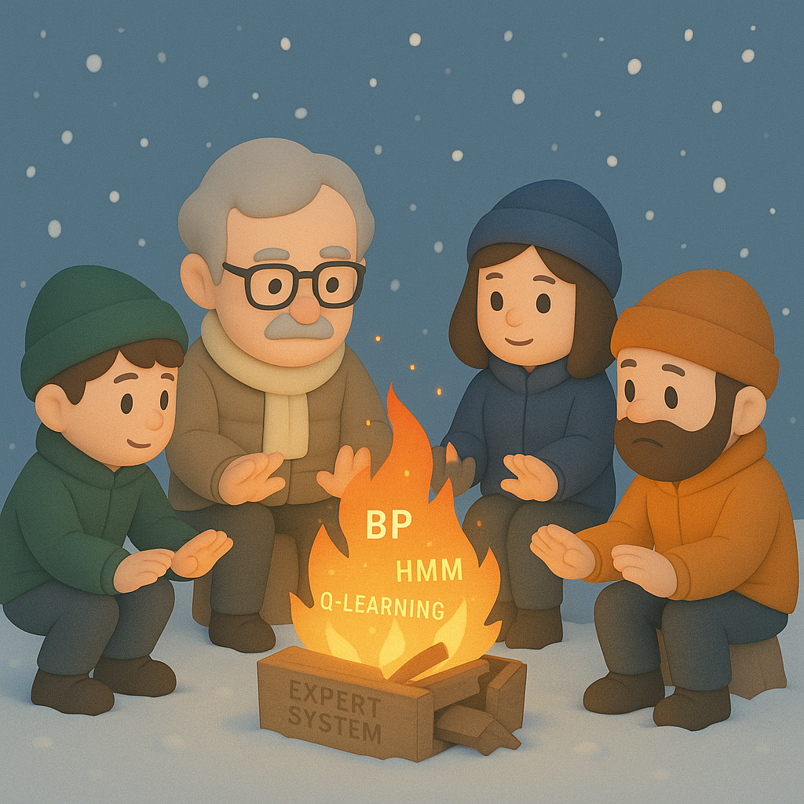

# 【AI】小白话系列——人工智能简史（十五）

## 现代人工智能的筑基期

* [1956年：现代「AI」 的诞生——达特茅斯研讨会](20250712【AI】小白话系列——人工智能简史（八）.md)

* [1958年：跑在机器上的神经网络——Frank Rosenblatt 与感知机（Perceptron）](20250714【AI】小白话系列——人工智能简史（九）.md)

* [1962年：机器学习的开端——Arthur Samuel和战胜人类冠军的跳棋程序](20250715【AI】小白话系列——人工智能简史（十）.md)

* [1966年：机器人元年——Shakey，首台通用移动智能机器人](20250717【AI】小白话系列——人工智能简史（十一）.md)

### AI寒冬（1967–1996）：技术理想与现实落差的漫长拉锯

1955 年到 1966 年这一段时间，被称为「AI 的黄金十年」。无论是逻辑推理、感知机，还是自然语言，博弈搜索都蓬勃地发展了起来。

于是，科学家们乐观地估计：

> 20 年内，人类将拥有能够翻译语言、玩游戏、写小说的机器……

你有没有从这里嗅到一丝熟悉的气味？记得马斯克去年就在一个访谈中说过：

> 我猜想，到明年年底，我们将拥有比任何一个人类都更聪明的**人工智能**。

然而，让我们把历史拉回到大约六十年前的 1966 年吧。在那一年，美国发布的 ALPAC （自动语言翻译评估）指出：

> 机器翻译「不如人工翻译，且效率低下」。

然后，美国政府立即砍掉了翻译研究经费。

而 1969 年，Minsky & Papert 的著作《Perceptrons》发表，书中系统性批判了 Rosenblatt 感知机的局限。书中指出：

* 单层感知机无法解决“异或（XOR）”问题，因其是非线性可分问题。
* 质疑其“可扩展性”——即使堆叠更多感知机，模型能力仍有限。

虽然，这只是理论上的数学分析，但因为 Minsky 的地位和影响力，这在当时，打击了整个「神经网络」研究。

DARPA 等多家研究机构撤资神经网络项目。研究重心重新回到前面说过的符号主义（Symbolicism），开始聚焦专家系统、逻辑推理、规划系统等等。

基于连接主义（Connectionism）的「神经网络」几乎成为边缘科学。

1972 年，法国法国图卢兹大学的 Alain Colmerauer 发明了 Prolog 逻辑编程。程序员可以不再写步骤，而是定义「规则」和「事实」。这成为了专家系统、自然语言处理的核心工具。

时间到了 1980 年，日本提出「第五代计算机」计划，再次带来一波全球 AI 热潮。「专家系统」大行其道，很多企业投入大量自己研发各领域的专家系统。

但是，没过多久，这些项目纷纷失败。那些用于制作 Lisp 机器（用于跑AI程序的专用硬件）的公司比如 Symbolics、LMI、Xerox 倒闭了，资本热潮瞬间退却。

AI 研究人员只好纷纷转行，开始去从事数据结构、操作系统、图形界面等等更「靠谱」的方向。

因此，斯坦福大学的 Nils J. Nilsson 教授，把这段时间定义为 AI 寒冬，只因为在这期间——

>AI继续取得概念进展，但缺乏显著实用成果，导致资金和兴趣衰退。

在这段越来越少人关注的 AI 寒冬中，严肃地研究者们反而得以聚焦，进行深入的理论研究。

不止是前面提到过的 Prolog，到了 1986 年，[**Geoffrey Hinton**](https://en.wikipedia.org/wiki/Geoffrey_Hinton) —— 就是前两天刚被请到上海参加 WAIC 的「人工智能教父 Hinton」—— 和 **Rumelhart**、**Williams** 提出**[反向传播算法（Backpropagation）](https://www.jiqizhixin.com/graph/technologies/7332347c-8073-4783-bfc1-1698a6257db3)**，为多层神经网络训练打开新大门，他们证明：

- 「XOR 问题」在多层网络中是可解的，只要用正确的方法训练。这直接挑战了当年 Minsky & Papert 的批评核心，并逐渐重燃学界对神经网络的兴趣。

几乎是于此同时，由于专家系统的失败，[贝叶斯（Bayes）方法](https://zhuanlan.zhihu.com/p/36545000)开始复兴。隐马尔可夫模型（HMM）开始被用于语音识别，这引发了整个 NLP 领域的转型 —— 从规则驱动转向数据驱动。

1988年，当时还在卡耐基梅隆大学读书的[李开复](https://baike.baidu.com/item/%E6%9D%8E%E5%BC%80%E5%A4%8D/294500)，开发了第一个「非特定人连续语音识别系统」，就是[基于 GMM-HMM 框架](https://houbb.github.io/2020/01/20/nlp-asr-02-history)。

而1989年，Chris Watkins 提出 Q-learning，这也奠定了早期强化学习理论的基础。

星星之火，可以燎原。走出寒冬，迎来春天，只差一声惊雷！

<待续>
