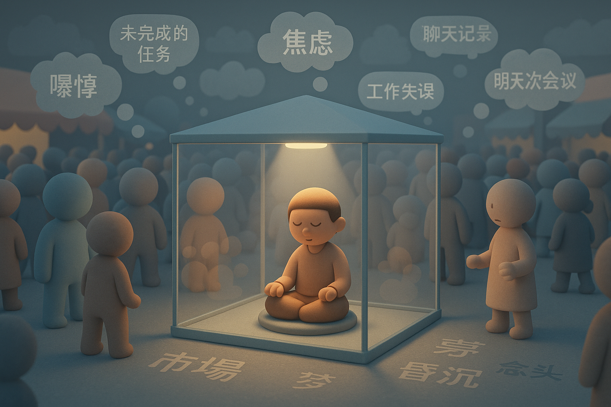

# 【生命⋅修行】吵闹喧嚣的心

那天和大宝视频，她问我咋样。我说，还有这个事儿没做，那个事儿没做，吧啦吧啦吧啦吧……

还没说完脑海中的待办事项清单，她就打断了我：

> 我回来后，你可不能这样！
>
> 必须专心陪我，不能总想着要做这个事情、那个事情！！！

我不由得开始回顾最近的状态。

很多很多时候，自己都能感觉到自己脑子里响着如同电脑风扇一般的嗡嗡声。而在睡觉的时候，这种感觉更加明显。

尤其是午睡。躺在午休床上，我蒙住眼睛，试着把注意力放到呼吸上、或者身体的感受上。但不消一个呼吸，自己就被一个念头牵走，然后有一个：尚未完成的工作，刚刚完成却不满意的某件事情，和谁说过的话，看过的文章，看过的聊天……一个叠加着一个，汹涌而澎湃。

也许会经历许久，再次回到呼吸上。或许，这次能把注意力留在呼吸上多几秒中，但就在关注着呼吸的同时，也能「看见」自己心中各种各样的念头风起云涌地翻腾。

午休的时间短，经常来不及安静地数到十次呼吸，来不及感觉到休息之后的清明，还只是渐渐在纷纷扰扰的念头中，觉察到一丝困意悄悄升起，闹钟就响了！

只好打着哈欠爬起来……

而晚上和早上，则能完整地感受到，自己在吵闹喧嚣的念头中，渐渐升起困意。

就好像一种昏沉沉的黑暗，渐渐笼罩了集市一样。其实，集市依旧喧嚣，只是自己渐渐地进入了昏沉而已。

这其中还会有几次三番的拉锯：某些念头会让自己腾地清醒过来，然后忽然觉察到，便再次把注意力放回到呼吸和身体的感受上。不超过三秒，心再次被新的念头带走。某些时刻，会完全地陷入对当下感受的不耐烦——或者热，或者痒，或者就是骨子里冒出来的某种「烦躁」，于是辗转反侧……

但，神奇的是。

有些时候，自己能觉察到自己纷纷扰扰的念头，在昏沉中变成梦境，然后就完全睡着了……

或者说，陷入「昏沉」。

夜里，或者清晨的某些时候。觉察再次在梦中升起，发现自己那吵闹喧嚣的心根本就没有停下来过。

而那些吵闹喧嚣的念头，与梦境其实没有什么明显的界限。有时，我能意识到自己在梦中，便会发现，自己的在梦境中的想法渐渐变得和清醒时那些念头的浪花没什么区别；有时候，不知道自己在梦中，偶尔还是想起觉察念头，直到某一个时刻，才意识到这些念头有那么点不真实；更会有些时候，贪恋梦中某一刹那的感受，自愿地沉溺进去，在「真实」、「虚幻」之间浮浮沉沉。

直到天越来越亮，几番拉扯之后，梦境渐渐散去，心的喧嚣却从未停止，只是天马行空的念头变少，实实在在的焦虑与慌张变多。心念的大海，波涛从未平息，但却又变成了白天的颜色与模样。

……

不得不感概，人类的心，真是一种神奇的存在！

